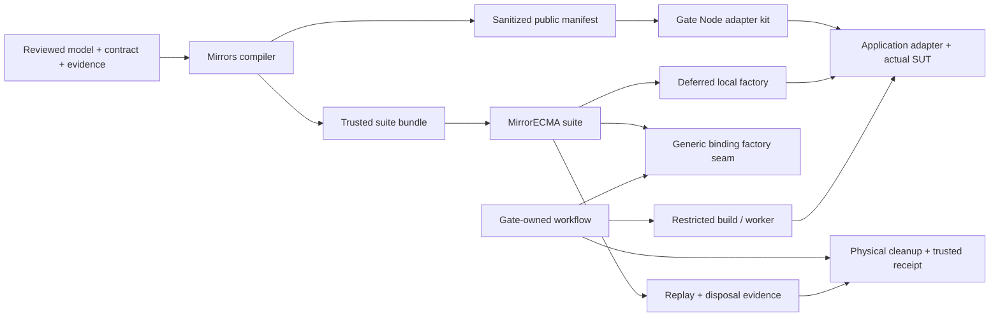

# Application integration with less framework knowledge

Status: **implementation and local acceptance delivered, 2026-09-16–17, including
fresh actual authors and an automated unfamiliar-evaluator onboarding study.**
See the [execution record](application-integration-progress.md) for current
implementation and acceptance evidence; delivery claims are limited to the gates
recorded there.
This work does not authorize package publication or imply a support claim.

Baseline inspected: Mirrors `616f5a1`, MirrorECMA `008234d`, MirrorGate
`67e70b9`. The [three-application validation program](application-validation-program.md)
provided the evidence motivating this design. The subsequently delivered
interfaces and their gates are recorded separately in the execution record.

The [implementation plan](application-integration-implementation-plan.md) assigns
dependency-ordered work packages and acceptance gates. The earlier AIT labels
are historical; the execution record tracks the recovered baseline and current
delivery. Task preparation alone is not runtime acceptance.

## 1. Problem and intended outcome

Before this delivery, an application integration repeated knowledge that belongs
inside the framework: exact registry keys, generated export names, descriptor
construction,
tool locations, binding lifetime, build mount conventions, report variants and
receipt serialization. Shared example helpers reduce repetition inside that
example directory, but are not supported installed-library interfaces.

The intended outcome is a deep module at each existing seam. An application
author implements operations and observes the real SUT. A model author declares
behavior, abstraction and coverage. The framework derives interface identity,
converts representations, negotiates admission, owns execution lifetimes and
produces evidence. Operator choices about isolation, credentials and disclosure
remain explicit and reusable across applications.

The first supported path is Node ESM, asynchronous generated bindings, checked
trace replay, and the existing Linux/Bubblewrap Gate profile. A local suite must
remain usable without Gate packages. Fresh model generation is a separate
explicit operation. The implementation must preserve existing low-level callers.

Suite definitions, replay plans and acceptance requirements are first-class
MirrorECMA concepts. Applications declare the experiment; MirrorECMA
supplies its execution and acceptance semantics through the existing replay
implementation. Section 7 defines these concepts and their ordinary data shapes.

### 1.1 Baseline gaps and delivered owners

| Observed baseline | Former application work | Delivered owner |
| --- | --- | --- |
| Mirrors emits typed bindings, semantic locks and public manifests | Assemble generated exports and descriptor into a runnable model handle | Mirrors compiler bundle emitter |
| MirrorECMA has exact registries and compiled async replay | Repeat registration keys, factory adaptation and report handling | MirrorECMA suite module |
| Gate already converts nested set/map/record/tuple/variant values | Author an adapter without matching generated Node-side declarations; adapt local native collections by hand | Gate adapter kit; compiler-generated local bridge |
| Gate already owns preparation, workers and physical cleanup | Choose low-level build commands and explain mount paths in every brief | Gate approved build profiles and environment descriptor |
| Product pins and executable overrides exist | Know sibling paths, several build commands and compatibility assumptions | MirrorECMA project tools; Gate capability probe |
| Reports and trusted/public Gate receipts exist | Normalize report variants and persist private receipts in application scripts | MirrorECMA result view; Gate integration receipt writer |

In particular, recursive conversion is already implemented in
[Gate's public-model module](../../MirrorGate/sdk/node/public-model.mjs).
This design reuses it on the Gate path. It does not replace it with the shallow
`Set` conversion used by the recent local example helper.

## 2. Scope, constraints and retained responsibilities

Required outcomes:

- One declared replay suite runs against local implementations and Gate providers.
- No application-written digest/profile tuples, descriptor reconstruction,
  framework lifecycle controllers or collection-conversion loops on the default path.
- A generated implementation kit supplies exact operation/observation types,
  an editable skeleton and public structural self-tests.
- A standard Node ESM build profile needs an entry point and approved source
  selection; an application-specific build script is optional.
- Installed-consumer execution needs no sibling source checkout, library rebuild
  or per-run package packing. Prepared offline installations are supported.
- Passing and failing runs preserve independent model and cleanup evidence.

The application still owns operation semantics, the mapping to real resources,
observation fidelity, test-service setup and teardown, model bounds and scenario
selection. A generated skeleton cannot infer business behavior or validate that
an observer reads the real SUT. Mutating the actual SUT remains an acceptance
requirement for each integration.

Out of scope: a new model language, automatic sealing of scaffold proposals,
complete TLA+ support, new OS isolation backends, aggregate cgroup guarantees,
distributed session adoption, durable supervisor recovery, automatic repair
feedback, unrestricted dependency installation and package publication itself.
These interfaces do not broaden the Lean proof claim.

## 3. Ownership and module interfaces

| Module | Owner | Interface responsibility |
| --- | --- | --- |
| Trusted suite bundle | Mirrors | Publish a validated immutable model handle and local binding constructors from an existing semantic lock |
| Public Node adapter kit | MirrorGate | Generate implementation declarations, skeleton and codec self-test from only a validated public manifest |
| Suite definition | MirrorECMA | Validate immutable model, replay-plan and acceptance declarations without executing a run |
| Suite runner | MirrorECMA | Derive exact selection, defer construction, run existing replay, collect matched evidence and join binding disposal |
| Acceptance evaluation | MirrorECMA | Pure evaluation of declared coverage requirements against complete, authoritative execution evidence |
| Project tools | MirrorECMA development tooling | Read declarative project input, resolve approved toolchain, orchestrate existing compiler/check/replay operations |
| Build profiles/environment | MirrorGate | Resolve operator-approved toolchains, supply public environment facts, freeze/build/execute under existing policy |
| Suite-to-Gate integration | `mirrorgate-mirrorecma` | Adapt a suite to the existing workflow while retaining the original control owner through cleanup |
| Trusted receipt persistence | `mirrorgate-mirrorecma` | Persist combined evidence safely and expose only approved public projections |

MirrorECMA core does not import Gate, launch authors, read agent credentials or
decode Gate frames. Gate's supervisor does not resolve model semantics or compare
states. No fourth repository or all-encompassing runtime is required. Optional
CLI/development entry points can live in their owning packages without adding
runtime dependencies to ordinary MirrorECMA consumers.



The diagram presents alternative local and restricted execution paths. A Gate
evaluation never imports the submitted adapter in the trusted evaluator.

## 4. What each caller needs to know

| Caller | Supplies | Does not assemble |
| --- | --- | --- |
| Model author/evaluator | Reviewed specification, contract, evidence, predicates, bounds, corpus and coverage requirements | Registry tuple or target codec plumbing |
| Implementation author | Public operation handlers, observations and domain cleanup | TLA+ paths, private traces, expected states or binding internals |
| Application integrator | Suite reference, implementation factory or submission reference | Negotiation/disposal loops, process controllers or raw report conversion |
| Operator | Installed compatible tools, Gate/agent profile, resource and disclosure policy | Per-application model-to-worker conversion |

These can be the same person, but their configuration and artifacts have
different access requirements. Documentation follows these roles rather than
introducing every protocol before the first replay.

## 5. Trusted suite bundle

### 5.1 Generation and contents

The delivered `model_interface_gen bundle` publication operation's first
profile composes the existing `mirrorecma-async-v1` output with companion files;
it is not a replacement target or a new registry target-profile identity.

```text
model_interface_gen bundle --lock Transfer.mirror-interface.lock.json \
  --target mirrorecma-async-v1 --out .mirrors/evaluator/transfer
```

Inputs are a valid sealed semantic lock and, for freshness verification, the
same reviewed source/contract/evidence inputs used by existing `check`. A
scaffold proposal is never silently promoted to a sealed contract. Trace
generation and model checking remain separate operations.

The output contains unchanged async target files, a companion `Transfer.suite.ts`,
canonical descriptor data, the sanitized public manifest, and an owned-file
manifest tagged `mirrors.suite-bundle/v1`. Generated output has deterministic
ordering, content hashes and write/check behavior consistent with existing
compiler publication. Regeneration may replace compiler-owned files only.

The companion exports a `SuiteModel<Port>` handle: validated metadata, descriptor,
generated binding constructor, supported local representations and exact target
identity. Applications import this handle instead of reconstructing descriptors
from lock JSON or indexing dynamically named generated exports.

No generated module imports an application adapter or starts a process at module
load. Generated evaluator code is trusted executable input; bundle hashes check
identity/freshness, not the trustworthiness of an arbitrary supplied module.

### 5.2 Identity rules

The existing semantic digest and exact registry tuple remain authoritative.
Bundle schema, native-adapter representation, compiler provenance, model source
revision, corpus digest, runtime profile and implementation artifact identity
remain separate fields. A semantic digest does not identify hidden invariants
or selected traces. The suite derives target profile and computer contract from
its handle; callers may choose a stable adapter ID once, with a documented local
default, but cannot override derived identity fields independently.

Before replay, validate bundle schema/capabilities and model/corpus provenance.
Server-side required negotiation still makes the final interface admission
decision. Local freshness checks do not substitute for negotiation.

### 5.3 Local native adapter bridge

Existing generated TypeScript ports retain their array-shaped set/map types.
The bundle companion additionally adapts a Node-native public operation object
to that generated port. Its structural shape matches the current worker adapter:
`actions`, `observe`, and optional domain `dispose`; it contains no Gate session,
worker or transport object.

The compiler emits the conversion bridge from the same resolved type shapes.
This keeps ordinary local use Gate-free and preserves existing target bytes.
Gate already converts worker-native values through its trusted proxy; its
provider supplies the existing compiled binding directly, so this local bridge
must not run a second time on a Gate binding.

The supported subset is the current Node worker portable subset: bigint,
boolean, string, null, sequence/tuple arrays, native sets, string-key maps,
closed records and declared variants. Opaque values or unsupported key shapes
fail bundle/kit preflight explicitly. Do not widen the underlying target or
silently stringify integer keys.

The local bridge and Gate proxy must share executable conformance vectors for
deeply nested collections, semantic duplicate rejection, tuple arity, variants,
ordinary record keys including `__proto__`, and arbitrary-precision integers.
JavaScript reference equality alone is insufficient for composite set elements.
Validation must reject all malformed inputs before any SUT action executes and
validate the complete observation before reporting state.

## 6. Public Node adapter development kit

Gate generates this kit from the validated sanitized public manifest, not from
the semantic descriptor, raw lock or full generated evaluator source. The kit
accepts separately approved behavior prose; structural generation cannot supply
the application's semantics.

Proposed output:

```text
public/
  PUBLIC-CONTRACT.md          # evaluator-approved behavior requirements
  port.json                  # existing public manifest, exact stable IDs/types
  adapter.d.ts               # worker-native implementation declarations
  adapter.mjs                 # editable stub, explicit unimplemented operations
  check-adapter.mjs           # public structural/codec checks
  adapter-kit.json            # kit/profile/version and owned-file hashes
```

The stub imports no private module and reports an unimplemented-operation error
until the author writes real mappings. It must never keep a shadow expected
state to make a generated check pass. Generated declarations/helpers are owned;
the editable adapter and behavior prose are seeded only when absent. A check
operation detects stale declarations without overwriting authored source.

Native declarations use exact stable IDs and the current Node worker value
representations. Preserve names safely as string keys; do not infer identifiers
from private model paths or wire labels. Kit identity uses a distinct version
plus public-manifest identity; equal interface digests do not establish equal
kit or toolchain versions.

Structural self-tests use only public type shapes and public sample inputs.
They validate import shape, handler/observer shape, codecs, reset invocation
contract and disposal where explicitly exercised. They do not certify business
semantics or model conformance. Execute submitted adapter imports/self-tests in
the approved development sandbox for restricted work, never in the trusted
evaluator simply to inspect exports. A trusted local developer can explicitly
run their own adapter locally.

Disclosure exclusions are executable acceptance rules: no model source/name/path,
wire action aliases, projection paths, invariant selection, trace coordinates,
expected values, provenance paths or evaluator credentials may enter the kit.
Approved public stable IDs and type fields are permitted, including record field
names that are already part of the public value contract. The generator rejects
unknown manifest fields; it does not copy arbitrary source objects wholesale.

## 7. Suite, replay plan and acceptance in MirrorECMA

These are first-class MirrorECMA concepts with ordinary declarative inputs.
They do not introduce a configuration language, mutable global registry or
another protocol/comparison engine. The application chooses what to evaluate;
MirrorECMA provides the reusable evaluation mechanics.

### 7.1 Default application interface and file origins

These interfaces are delivered for the supported Node path. Project tools load
the evaluator's configuration; the application does not write a
`trusted-project.js` helper.

```ts
import { defineSuite, runSuite } from "mirrorecma";
import { loadProject } from "mirrorecma/project";
import { TransferModel } from "./.mirrors/evaluator/transfer/Transfer.suite.js";

const project = await loadProject(
  new URL("./mirror.project.json", import.meta.url),
);

const suite = defineSuite({
  id: project.suiteId,
  model: TransferModel,
  replay: project.replay,
  acceptance: project.acceptance,
});

const result = await runSuite(suite, {
  mirror: project.execution.mirror,
  timeouts: project.execution.timeouts,
  implementation: async () => {
    const { createAdapter } = await import("./transfer-adapter.js");
    const adapter = await createAdapter();
    return { port: adapter, dispose: () => adapter.dispose?.() };
  },
});
```

The adapter import is inside the deferred factory so its module initialization
also happens after required match. This local path deliberately executes the
caller's trusted application code. Gate evaluation uses a provider and does not
import submitted code into this process.

| File or export | Who produces it | Who completes or selects its contents |
| --- | --- | --- |
| `mirror.project.json` | `mirrorecma init` creates a declarative template | Evaluator selects model/run configuration, corpus, acceptance and approved toolchain |
| `loadProject` | Installed MirrorECMA project-tools export | Framework reads/validates config and resolves approved tools; callers do not implement a loader |
| `Transfer.suite.ts` | Mirrors compiler bundle operation | Compiler derives the model handle and bridge from reviewed inputs |
| `Transfer.suite.js` | Application build compiles the generated TypeScript companion | No handwritten changes to generated output |
| `transfer-adapter.ts` or `.mjs` | Gate adapter kit seeds a typed skeleton | Application author implements actual operations, observations and domain cleanup |
| `transfer-adapter.js` | Application TypeScript build, when using `.ts` | Emitted application code; a JavaScript kit instead uses its `.mjs` entry directly |

The example uses a local TypeScript application build. Gate's first standard
Node ESM profile consumes JavaScript; compiling authored TypeScript still needs
an explicitly approved build profile. This example does not extend that profile.

`loadProject` performs explicit configuration/tool I/O and returns `suiteId`,
`replay`, `acceptance` and `execution`. It does not import the adapter, start
Mirrors or an author, generate traces, install packages or execute a build.
Relative paths resolve against the project file, not the process working
directory. Its `execution` settings are passed to the runner, not stored as
mutable state inside the suite. Direct library callers can construct these
values themselves without using project tools.

### 7.2 Meaning of a suite

A suite is a reusable definition of a conformance experiment:

```text
SuiteDefinition = (Model, ReplayPlan, AcceptanceRequirements)
Run             = execute(SuiteDefinition, ImplementationFactory, ExecutionOptions)
```

The model handle identifies the generated observation/operation interface. The
replay plan also retains the specification/run configuration and corpus
identities; the interface digest alone does not identify the experiment.
Acceptance requirements express additional evidence the evaluator requires.
The implementation, transport and timeout policy are supplied per run.

`defineSuite` validates and snapshots inert inputs into an immutable
`SuiteDefinition`. Its model handle may reference trusted generated functions,
so the runtime definition need not be JSON-serializable; the project declaration
is serializable. The definition owns no live SUT, process, connection, timer,
mutable registry or accumulated coverage. A suite ID is a human-facing label,
not a substitute for recorded model/corpus/configuration identities.

For a selected trace, the suite requires the following relation at initialization
and after each operation, under the declared codecs and observation projection:

```text
encode(observe(actualImplementationState[t, i]))
    = project(modelState[t, i])
```

Mirrors establishes the comparison result. MirrorECMA drives operations and
reports observations; it does not implement a second model comparator. The
adapter receives public operation inputs and returns actual state observations.
Expected model states and replay metadata remain evaluator-side.

A passing run means agreement for the selected observations and traces,
satisfaction of the declared coverage requirements, and completion of applicable
cleanup. It establishes neither exhaustive implementation correctness nor the
truthfulness of an arbitrary observer.

### 7.3 Replay plan: what to execute

The first `ReplayPlan` is a checked corpus plus the model run configuration.
For example, in a hypothetical consumer project:

```ts
const replay = {
  kind: "corpus",
  config: {
    specPath: "./model/Transfer.tla",
    initPredicate: "Init",
    nextPredicate: "Next",
    invariant: "Safety",
    lengthBound: 20,
    paramVars: "parameters",
  },
  traces: [
    "./traces/resume-after-restart.itf.json",
    "./traces/reject-stale-session.itf.json",
    "./traces/cancel-and-start-again.itf.json",
  ],
};
```

The configuration preserves the existing `ApalacheConfig` semantics. Model
predicates, parameter variables and bounds are declared, not guessed. A
`lengthBound` in that configuration is not an operation timeout, does not
truncate a checked trace and does not cause replay to explore further states.
The selected corpus retains its own generation provenance, which may have used
a dedicated witness transition or intentionally violated generation objective.

The plan's semantics are fixed for this first profile:

1. Resolve an ordered, nonempty corpus and verify its declared identity and
   interface preflight before constructing the implementation. A missing trace
   is an error; it never triggers implicit generation.
2. Run those trace occurrences in their declared order. Intentional repetition
   is allowed and counted as repetition, not additional distinct behavior.
3. At each trace boundary, invoke its declared generated initializer against
   the SUT and check the resulting initial observation.
4. Execute transitions serially, await each operation and complete observation,
   and await the model's comparison result before proceeding.
5. Stop on the first mismatch or execution failure, retaining completed-prefix
   evidence and the unfinished-corpus status.

Initialization before each trace is an existing replay obligation, not a
configurable `initialization` option. Every new `runSuite` execution gets fresh
run state and invokes its factory at most once after match. Within that run,
multiple traces normally reuse the returned implementation through initialization;
its initializer must reset state. A factory-per-trace mode is not introduced.

Fresh trace generation is a separate explicit operation that produces a corpus
and provenance. It may be followed by this same replay plan. The first plan
interface introduces no generation strategy language or implicit live fallback.

### 7.4 Acceptance requirements: what evidence is required

`AcceptanceRequirements` starts with stable action and adjacent-pair coverage:

```ts
const acceptance = {
  requiredActions: [
    "Begin", "Chunk", "Pause", "Resume", "Restart", "Commit", "Cancel",
  ],
  requiredPairs: [
    ["Pause", "Restart"],
    ["Restart", "Resume"],
    ["Cancel", "Begin"],
  ],
};
```

These are stable transition operation IDs from the generated interface, not
wire labels, aliases or JavaScript method-name guesses. The suite validates
requirement IDs and bounded list sizes against its model handle before acquiring
application resources. Initializer coverage is mandatory per selected trace;
initializers are not entries in these transition-action requirements. No
arbitrary assertion callbacks or temporal-assertion language are added initially.
Omitted requirements mean no extra coverage conditions, not permission to skip
replay or initialization.

The following conditions are mandatory rather than optional acceptance flags:

- The selected corpus is nonempty and every selected trace completes.
- Every initialization and transition observation matches the model projection.
- No operation, observer, codec, negotiation or transport failure occurs.
- Binding disposal and other applicable cleanup obligations succeed.

MirrorECMA measures coverage of **matched** operations. An action contributes
only after its observation has been definitively accepted by Mirrors under the
existing protocol. A required pair contributes when both adjacent transitions
match within the same trace. The tracker resets adjacency at initialization;
it never joins the last transition of one trace to the first of another.

Current progress reports count some actions as reported before the server
accepts their observations; generated binding coverage likewise is not a server
acknowledgement. Neither can be reused as matched coverage merely by renaming
its fields. Preserve those existing diagnostic counters and collect the new
acceptance evidence at definitive acceptance points in the existing replay
implementation. Convert wire labels/aliases to stable IDs using the negotiated
immutable descriptor. Unknown or ambiguous mapping is an evidence error.

Required counters must remain exact within the validated requirement limits,
including when optional general-purpose diagnostic coverage is truncated. Missing
or uncertain coverage evidence cannot be interpreted as zero, nor as success.
The design does not manufacture matched progress absent authoritative evidence.

### 7.5 Acceptance evaluation and result semantics

MirrorECMA owns a pure function, conceptually
`evaluateAcceptance(requirements, evidence)`, with no SUT, transport or Gate I/O.
The runner supplies corpus-completion facts and authoritative matched coverage.
The result records requirements met/unmet and enough bounded evidence to explain
that decision to the trusted evaluator:

| Acceptance assessment | Meaning |
| --- | --- |
| `met` | Full selected replay completed and all requested coverage is established |
| `unmet` | Full replay completed with exact evidence proving a requested action/pair was absent |
| `incomplete` | Replay was interrupted, or evidence needed for a requested check is unavailable/uncertain |
| `not_evaluated` | Execution did not enter replay, for example because negotiation failed |

For example, all observations may match while no trace contains `Restart ->
Resume`. With that pair required, conformance for the completed corpus is
`matched`, acceptance is `unmet`, and the overall suite result is `failed` with
kind `acceptance` and code `coverage_unmet`. It is not a behavioral mismatch and
cannot count as killing a mutant. Changing a requirement does not alter the
trace or comparison semantics.

A mismatch, timeout or cancellation retains its original primary outcome and
records the incomplete acceptance assessment. If replay completed but essential
coverage evidence was lost, report an evidence failure rather than a proven
missing action. A cleanup failure independently prevents overall success even
when conformance is matched and coverage requirements are met. Section 11 defines
the normalized result and the additional physical cleanup supplied by Gate.

### 7.6 Runner and generic provider seam

MirrorECMA separates suite definition, execution and acceptance evaluation into
three modules. They can be tested through their public interfaces independently:
validation/snapshotting, real runner lifecycle, and pure coverage decisions.
The default entry points are `defineSuite(...)` and `runSuite(suite, options)`.
A suite is a definition, not a mutable runner object with accumulated state.

Execution options contain the implementation factory, model transport and
optional timeouts, for example:

```ts
await runSuite(suite, {
  mirror,
  implementation: createLocalImplementation,
  timeouts: {
    registrationMs: 30_000,
    actionMs: 5_000,
    receiveMs: 30_000,
    cleanupMs: 10_000,
  },
});
```

These budgets affect execution and cleanup, not the selected experiment or
coverage definition. A timeout means the experiment was not completed; it is
not evidence of disagreement with the model. The high-level `actionMs` maps to
the existing compiled step deadline, covering the operation and observation.

The runner derives exact registration, creates the generated bridge, uses the
existing negotiated replay, evaluates matched coverage and joins disposal. The
local factory receives only public lifetime controls, never expected/model
state. Its returned handle's `dispose` is the one cleanup obligation transferred
to the runner; it must not also invoke `port.dispose` and release the same
resource twice. Gate's existing worker shim separately retains its at-most-once
adapter-disposal rule.

`runSuiteWithFactory(suite, context, factory)` supports existing generic
compiled `AsyncAdapterFactory` providers. Local adapters and Gate's prepared
provider already vary at this seam. It derives the same exact selection and
returns the same normalized suite result, retaining the compiled report for
trusted consumers. Privileged matched authority is passed only to the trusted
generic factory after negotiation; it is not forwarded to implementation-side
operations. Factory and transport ownership follow section 8.

The initial high-level suite covers compiled async replay only. Existing dynamic,
synchronous, explorer and low-level runners remain available with their current
interfaces and result semantics. MirrorECMA remains independent of Gate. The
Gate integration passes its existing provider through the generic factory seam
and subsequently joins its own physical cleanup obligations.

## 8. Lifetime and failure contract

The invariant is unchanged: exact match precedes SUT construction and evaluation
worker acquisition. Restricted authoring/build may precede model negotiation.

```text
validate inert inputs
  -> acquire owned evaluation connection
  -> required model match
  -> invoke deferred binding factory once
  -> serial action / complete observation / model comparison
  -> seal further operations
  -> assess corpus completion and matched coverage
  -> join binding disposal
  -> Gate owner joins physical cleanup, when present
  -> persist trusted receipt / project allowed public result
```

| Event | Required result |
| --- | --- |
| Invalid configuration or unsupported representation | Fail before acquiring application resources |
| Digest mismatch, denied or unavailable required negotiation | Zero SUT factory/action/observer calls and zero evaluation worker launches |
| Factory throws after allocating partial resources | Factory owns its unreturned resources; generated factory helper provides a scoped cleanup registration mechanism for staged construction |
| Factory returns a binding after cancellation/deadline | Never admit replay; join its disposal, or report unconfirmed cleanup when bounded waiting expires |
| Action/observer rejects or output is invalid | Poison binding, retain primary failure, admit only cleanup; never count as detected behavioral mismatch |
| Model mismatch | Retain model evidence, stop replay and dispose |
| Cancellation or timeout | No automatic action retry, no late observation/report; cleanup gets its own bounded budget |
| Disposal also fails | Retain both primary and cleanup failures; never relabel the run successful |
| Cooperative local code ignores cancellation | Report unconfirmed cleanup unless quiescence is established; a timer cannot terminate arbitrary local JavaScript |

The suite exposes one optional timeout policy with separate registration,
action, receive and cleanup budgets; it does not require callers to configure
timers in each underlying module. Initial replay defaults reuse the existing
compiled runner's documented defaults. The cleanup budget must be explicit in
the implementation contract and independent of the aborted replay budget.
Operator Gate limits may tighten these budgets, never be widened by the suite.

The scoped construction helper registers a disposer immediately after each
successful resource acquisition and transfers those obligations to the returned
binding on success. It cannot recover a resource allocated by arbitrary user
code that never registers or returns it; documentation must state that limit.

Connections have explicit ownership: the convenient `mirror` option is an
owned per-run connection/binary target under the existing runner contract.
An existing server is never terminated by closing its evaluation connection.
Shared caller-owned transports require a separate explicit supported interface;
they are not inferred or silently reused concurrently.

For Gate, suite disposal releases its binding/worker proxy. The Gate integration
retains the original owner connection and joins final session/process cleanup,
including when negotiation prevented factory invocation. A provider handle is
not a transferable session token. The suite does not call arbitrary provider
`close` methods by duck typing or create a second owner.

## 9. Gate build profiles and integration

### 9.1 Standard Node ESM profile

The operator-selected `node-esm/v1` preparation profile
copies an explicit approved source selection into an immutable artifact and
uses an explicit entry point such as `adapter.mjs`. It requires no user build
script and performs no dependency installation, package lifecycle hook, adapter
import or model operation in the evaluator.

The profile names a pinned Node runtime and any approved preinstalled dependency
tree by content identity. Resolve dependencies only from those admitted roots;
do not mount an evaluator checkout's `node_modules` for convenience. Reject
missing dependencies, root escape, external symlink targets and unsupported
capabilities. Record the source, dependency, runtime and artifact identities.

Custom builds remain a separately selected approved profile. TypeScript
compilation and package installation recipes are deferred until their dependency
and hook policies have equivalent acceptance. The initial Node ESM profile does
not claim that a source copy handles every application's build.

### 9.2 Public environment descriptor

The admitted profile supplies a versioned public environment descriptor with
profile ID, logical stage paths, writable paths, entry-point expectations,
available public tools and advertised limits. The initial logical paths are
authoring `/workspace`, build read-only `/source`, build writable `/output`,
plus a profile-defined runtime writable area. A standard build environment may
expose `MIRRORGATE_OUTPUT=/output` consistently with its descriptor.

This descriptor contains no host paths, credentials, private mounts or model
configuration. It is generated by Gate from admitted policy, not by a submission
or a prose parser. Enforcement remains in the backend; declaring a writable
path cannot grant it. The host automatically includes it with `public_contract`
so each application brief need not repeat mount instructions.

Current control/public-task schemas are closed. Implement descriptor delivery
with an explicit negotiated hosting capability and versioned response extension
or a new schema version, updating all affected codecs and fixtures together.
Do not silently add fields to control v1, worker v1 or current closed records.
An older host may receive an explicitly selected legacy brief, but cannot claim
the new descriptor capability.

### 9.3 Suite evaluation convenience

The Gate-owned `evaluateSuite` convenience interface is built over the existing
`evaluateImplementation` workflow. It accepts a generic suite, operator-approved
environment reference, submission reference, optional approved author request,
and receipt options. It derives the descriptor/binding adapter from the suite
bundle and composes `runSuiteWithFactory(suite, context, factory)` with the
existing prepared provider. It preserves the suite's acceptance decision:
`coverage_unmet` remains a failed evaluation even if the underlying compiled
report says replay completed. It must not discard that assessment when adapting
to the existing workflow's compiled-report seam.

Normal callers do not construct `createSandboxCompiledModel`, a control client
or a cleanup loop. Existing advanced interfaces remain supported. Hosted-tool
evaluation retains its original owner through the existing handoff; the
convenience interface must also support that in-process owned context without
reconnecting to adopt a submitted session.

Source/model/corpus selection belongs to trusted evaluator configuration.
Agent-facing operations select approved references; they cannot submit arbitrary
evaluator modules, compiler paths, build commands or disclosure settings.

## 10. Project tools and toolchain discovery

Add declarative trusted `mirror.project.json` input for the default workflow.
It records project schema, model source/contract/evidence references, target,
generated directories, replay configuration/corpora, acceptance requirements,
suite ID, execution timeouts and a toolchain lock reference. The installed
`loadProject` interface in section 7.1 reads this declaration; no application-owned
`trusted-project.js` is required. Gate environment references are consumed by Gate tooling, not
MirrorECMA core. The file is evaluator configuration and is not exported to a
restricted author.

Installed commands, owned by MirrorECMA development tooling:

| Command | Effect |
| --- | --- |
| `mirrorecma init` | Create an explicit project skeleton without overwriting user files; leave model/contract choices visible |
| `mirrorecma doctor` | Read-only configuration/tool compatibility checks; report missing capabilities and exact repair guidance |
| `mirrorecma generate` | Invoke the compiler against reviewed inputs and publish owned artifacts; never silently generate a corpus or seal a proposal |
| `mirrorecma check` | Verify artifact freshness, input identities and corpus preflight without repair |
| `mirrorecma replay` | Run the declared checked corpus and write/print the selected result form |

Project commands use the same `SuiteDefinition`, `ReplayPlan` and
`AcceptanceRequirements` validation as the library interfaces. They do not
introduce separate CLI coverage semantics. Acceptance declarations remain
evaluator choices; a compiler or scaffold cannot infer sufficient scenario
coverage from the interface alone.

Fresh trace generation is explicitly selected and records predicates, bounds,
view, tool versions and seed where the tool supports one. It is not a fallback
when checked corpus files are missing. Generating the same deterministic witness
must be labeled accordingly.

Tool resolution order is explicit command-line selection, project lock, then
the installed tool registry. Each selected binary/package must satisfy the
project's identity/capability constraints; an incompatible explicit override
fails rather than falling through. Do not silently search sibling repositories
or substitute an arbitrary executable from `PATH`. The lock distinguishes
compiler, server, client packages, optional Apalache/JDK and Gate runtime; a
shared product version number is not proof of compatibility.

Checked local replay requires no Apalache/JDK installation. Remote model service
use has an explicit endpoint/credential reference and separately recorded server
capabilities; local binary identities are not fabricated for a remote server.
Remote corpus/spec references retain the existing transport's server-visible
path or inline-source semantics; tool discovery does not silently upload local
private files or assume that local paths exist on the server.
Installation or download is an explicit preparation operation, never a replay
side effect. Offline operation verifies already-installed artifacts against the
lock and fails with actionable missing-tool information.

Doctor does not import the submitted adapter, execute build hooks, start a
managed agent, print credential contents or alter policy. A separately selected
Gate backend probe may create bounded temporary resources and must verify their
cleanup. Report configuration, executable compatibility, namespace admission
and hosted-agent audit freshness as distinct checks rather than one green flag.

## 11. Results, coordinates and receipt persistence

Expose an additive `SuiteResult` view; keep existing wire messages, `ReplayReport`,
`CompiledReplayReport` and Gate receipt schemas unchanged. The new view uses
the existing Gate-style outcomes `passed`, `mismatch`, `failed`, `cancelled`,
`timedOut`, with failure stage/kind, interface/model/corpus identities, counts
and coverage, and separate cleanup evidence.

Keep `conformance` and `acceptance` separate in this new view. Conformance is
`matched`, `mismatch`, `incomplete` or `not_evaluated`; acceptance uses the
assessments in section 7.5. The overall outcome is `passed` only when conformance
is matched, acceptance is met and applicable cleanup succeeds. A complete
matching replay with insufficient coverage produces `failed` /
`acceptance.coverage_unmet`, preserving the matched conformance evidence.
Uncertain required coverage produces an evidence failure, not a proven unmet
requirement. These classifications are additive suite-layer semantics, not
changes to existing low-level status fields.

Canonical diagnostic coordinates in this view are zero-based trace index and
zero-based state index with initialization at state 0. Normalize one-based
progress-report trace indices explicitly; preserve original report schema and
coordinates in trusted raw evidence. Report matched transitions separately
from initial states and attempted/reported actions. Do not manufacture a
matched-progress count if the underlying report did not retain it.

Failure kinds distinguish configuration, negotiation, model generation,
transport, implementation execution, value/codec validation, acceptance,
evidence and cleanup.
Classify by the stage and structured failure source, not by message text.
An exception thrown by an adapter is not automatically an infrastructure error;
unknown/untrusted rejection values retain a bounded unknown classification.
Only an actual model comparison mismatch counts as killing a behavioral mutant.

Local binding disposal reports cooperative completion/failure/unconfirmed or
not-started, with its scope explicit. Gate contributes physical confirmed,
failed or unconfirmed cleanup and remaining resource evidence. Local completion
must never be relabeled physical isolation/cleanup confirmation. Overall success
requires a model pass, satisfied acceptance requirements and all applicable
cleanup obligations satisfied. Gate owns physical cleanup assessment; MirrorECMA
owns suite execution/acceptance and local binding disposal only.

For the high-level interface, ordinary operational failures resolve to this
structured result after cleanup. Invalid inert programmer/configuration input
may throw before any run is acquired. Low-level runners retain their current
exception behavior. Cancellation acknowledgement alone is not a final result.

The Gate integration supplies a shared receipt writer: exclusive-create,
owner-only permissions on the supported POSIX profile, no symlink following,
bounded cycle-safe serialization of arbitrary rejection values, and a complete
record or explicit write failure. Interrupted writes must not appear as complete
receipts. Use a validated parent and temporary-file/exclusive-publication strategy
with cleanup on failure; never overwrite a previous receipt silently.

Receipt persistence occurs after cleanup and preserves primary/model/cleanup
outcomes even if writing fails. CLI failure to persist a requested receipt is
nonzero and separately classified. Proposed new CLI exit codes are 0 for full
success, 1 for mismatch with satisfied cleanup, and 2 for other non-success;
existing command exit codes are unchanged.

Trusted local diagnostics may include expected/actual states. Gate-facing output
continues to use its existing allowlisted public projection by default. A new
normalized result does not grant permission to disclose trace coordinates,
private names, expected values or arbitrary exception text to an author.
Retrievable terminal cleanup after disconnect and durable supervisor restart
remain separate G4/future work; a receipt file does not implement those features.

## 12. Alternatives and migration

| Alternative | Assessment |
| --- | --- |
| Add more onboarding prose around current helpers | Helps navigation but preserves repeated ordering, identity and conversion obligations |
| Add one wrapper taking every existing low-level option | Shallow interface; callers still need essentially all framework knowledge |
| Put suite/coverage semantics in every example or in Gate | Duplicates ordinary MBT rules and couples local conformance testing to application glue or orchestration |
| Put Gate hosting in MirrorECMA | Violates the accepted ownership decision and makes ordinary replay depend on orchestration |
| Change all existing TypeScript ports to native Set/Map | Breaks current generated profiles and consumers unnecessarily |
| Generate a full behavior implementation or expected-state observer | Cannot supply the application mapping and undermines observation-fidelity evidence |
| Compose a generated bundle, generic suite and Gate-owned integration | Selected: existing responsibilities become deeper modules with independently testable interfaces |

Migration is additive. Preserve synchronous generated bytes and existing async
port semantics, exact tuple matching, public worker/control protocols and low-level
runner behavior. Publish companion/kit/result schemas with their own versions.
Runtime compatibility is checked explicitly; no silent legacy negotiation
fallback or isolation downgrade is allowed on the new default path.

Migrate WorkQueue first, preserving its nine-mutant and failure-control evidence.
Then migrate transfer and lease to the same suite/kit interfaces. Remove example
registry reconstruction, shallow set conversion and lifecycle plumbing only
after installed-package acceptance passes. Keep thin example commands for domain
configuration and intentional faults; library tests should cover reusable
mechanics through the same interfaces as callers.

## 13. Delivery slices and acceptance

These dependency-ordered slices are the implemented delivery decomposition.
Their evidence and remaining publication boundary are recorded in the
[execution record](application-integration-progress.md).

| Slice | Owner | Dependencies | Required evidence |
| --- | --- | --- | --- |
| I0: public shapes and compatibility contract | All three owners | None | Freeze bundle/kit/result and suite/plan/acceptance interfaces, matched-coverage semantics, supported native subset and cross-language vectors |
| I1: suite bundle and local bridge | Mirrors | I0 | Deterministic generation/check, existing output stability, unsupported-shape rejection and recursive conversion vectors |
| I2: Node adapter kit | Gate | I0; public manifest already exists | Typechecked skeleton, public-only output, stale checks and real restricted structural tests |
| I3: suite definition, runner and acceptance evaluation | MirrorECMA | I1 | Immutable definition, nonempty ordered corpus, matched action/pair coverage, pure acceptance tests, factory deferral, exact match, late-factory/disposal failures and Gate-free installed consumer |
| I4: Node profile/environment descriptor | Gate | I0 | Fresh author succeeds without application mount prose; forbidden writes/imports/dependency escapes denied by actual backend |
| I5: Gate suite convenience and receipt writer | Gate integration | I2–I4 | Same suite through original provider owner; negotiation-failure cleanup, crash/hang/cancel, receipt-write failure and disclosure negatives |
| I6: project commands and doctor | MirrorECMA tools, Gate probe | I1–I5 | Offline and relocated installed consumers; missing/incompatible tools diagnosed without hidden side effects |
| I7: application migration and onboarding | All three owners | I6 | All existing matrices retained, fresh restricted authors and measured independent onboarding |

Acceptance must include:

1. **Mechanical simplicity:** the default application contains domain adapter,
   model/corpus choices and declarative configuration; zero handwritten registry
   tuple construction, descriptor reconstruction, native collection-conversion
   loops, Gate control controllers or duplicate cleanup aggregation.
2. **Installed consumers:** run outside the framework checkouts using compatible
   installed/packed public packages and explicit approved tools, with no source
   imports, sibling assumptions, per-run library compilation or per-run packing.
   Also run with a prepared offline cache.
3. **Representation conformance:** nested sets/maps/records/tuples/variants,
   semantic duplicate negatives, string-key map limits, bigints and ordinary
   special record keys across local bridge and real Gate worker. Unsupported
   shapes fail before adapter construction or source import.
4. **Admission/lifetime:** digest denial gives zero factory and worker calls;
   partial and late factory failures retain cleanup obligations; cancellation
   during each stage, a CPU-bound worker, stalled disposal and cleanup failure
   never produce a false pass. No action is retried automatically.
5. **Information control:** kit/public task/output snapshots contain no private
   material; build/worker attempts to read oracle canaries fail; malformed
   manifests or environment requests cannot grant permissions.
6. **Existing behavior:** retain the 17 local behavioral mutants, all 23 Gate
   source/control cases, fresh-witness generation and fixed-evaluator actual
   restricted-author acceptance for all three applications. Preserve expected
   first mismatches and distinguish local versus physical cleanup.
7. **Report correctness:** mappings preserve trace/state bases and counts;
   primitive/cyclic/throwing rejection values, unwritable receipt destinations,
   existing files and interrupted publication retain honest outcomes and privacy.
8. **Suite and acceptance semantics:** reject empty/missing corpora and unknown
   requirement IDs; preserve intentional trace repetitions and reset every trace;
   never count an unacknowledged/rejected action as matched coverage; reset pair
   adjacency across traces; normalize aliases to stable IDs; distinguish matched
   replay with `coverage_unmet` from mismatch, incomplete evidence and interrupted
   execution. Exact required counters survive optional diagnostic truncation.
   Exercise the pure evaluator and the runner through the same public interfaces
   used by local and Gate callers, including Gate's preservation of an unmet
   acceptance result.
9. **Measured usability:** a fresh evaluator unfamiliar with internal modules
   follows only the role-oriented guide. Record elapsed setup/first replay,
   manual configuration steps, handwritten integration code and time to diagnose
   a seeded defect. Define the start as prerequisites installed and repository
   checkout available; record prerequisite installation separately. Publish the
   actual measurements, not an assumed time saving or a line-count depth score.

Run owning-repository focused and aggregate gates, compiler golden/freshness
checks, relevant interop and actual Bubblewrap tests for the supported toolchain.
Skipped or unavailable gates remain distinct from passes. Documentation-only
creation of this design requires link/format validation, not those runtime gates.

## 14. Adopted decisions and follow-ups

The adopted decisions are: compiled async as the first ergonomic path; a
compiler-owned companion bundle with an opt-in native adapter bridge; a
Gate-owned public kit and Node ESM profile; first-class Gate-free MirrorECMA
suite definitions, replay plans, acceptance requirements and their runner;
Gate-owned workflow/receipt convenience; explicit installed toolchain selection;
and additive normalized results with preserved low-level contracts.

This selects G1, G2 and G5 from the existing
[restricted workflow follow-ups](../../MirrorGate/docs/sandbox/restricted-workflow-followups.md)
and includes G7-style recursive collection conformance. Generic repair lineage
(G3), terminal cleanup retrieval (G4) and additional public mismatch disclosure
(G6) retain their own designs and are not implied by this delivery.

Implementation resolved the hosting capability as
`hosting.public-environment-v1`, the build profile as `node-esm/v1`, the compiler
operations as `bundle` / `check-bundle`, and the application entry points as
`defineSuite`, `runSuite`, and Gate-owned `evaluateSuite`. Future naming or schema
changes must preserve the lifetime, compatibility, and disclosure decisions above.

Related authorities:

- [Architecture](architecture-overview.md), [compiler design](model-interface-compiler/design.md),
  [generated interface specification](generated-model-interface-spec.md), and
  [negotiation/distribution](model-interface-runtime-distribution-design.md).
- [MirrorECMA implementation ownership](../../MirrorECMA/docs/implementation-boundary-design.md),
  [reusable harness](../../MirrorECMA/docs/mbt-harness-design.md), and
  [replay/async contracts](../../MirrorECMA/docs/replay-and-async.md).
- [Gate managed workflow](../../MirrorGate/docs/managed-workflow-design.md),
  [Node worker](../../MirrorGate/docs/node-worker.md), and
  [public evaluator integration](../../MirrorGate/integrations/mirrorecma/README.md).
