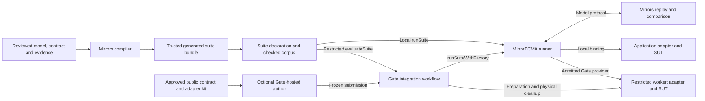

# Integrating an application

For a non-Node application, start with the [language/repository map](framework-map.md)
and [Gate SDK/facade selection](../../MirrorGate/docs/client-language-support.md).

Deploying or using a server on another machine? Read the [remote server runbook](remote-server-guide.md)
for setup, mTLS, async validation, suite path rules, and troubleshooting.

The supported first path is Node ESM, generated asynchronous bindings and a
checked trace corpus. Local execution uses MirrorECMA with a compatible Mirrors
server and requires no Gate package. Restricted execution adds MirrorGate's Linux/Bubblewrap environment and its optional MirrorECMA
integration. Prepare compatible packages and tools once; package publication is
separate from the implementation and installed-consumer tests described here.

## Framework map and ownership

This is the entry point for application integration. Choose an execution path
below, then follow the role sections for the work your team owns. One person may
fill several roles. Detailed client APIs belong to the client repository;
restricted execution and hosting configuration belong to MirrorGate.



The model, traces, generated evaluator bundle and results stay on the trusted
side. A restricted author or worker receives only approved public material and
application inputs, not the private oracle. The diagram shows ownership and data
flow; components need not share a process or machine.

| Component / role | Owns | Authoritative reading |
| --- | --- | --- |
| Application team | Real system under test (SUT), domain setup, adapter operations, actual-state observations, reset and resource disposal | [Implementation author](#implementation-author-map-the-actual-application) |
| Model author / evaluator | Behavioral abstraction, TLA+ model, reviewed interface contract, corpus, acceptance requirements and disclosure choices | [Model preparation](#model-author-prepare-the-oracle-and-interface) |
| Mirrors | Source analysis, interface compilation, model execution and comparison with reported observations | [Architecture](architecture-overview.md), [compiler index](model-interface-compiler/README.md), [interface reference](interface-reference.md) |
| MirrorECMA client | Negotiation, deferred implementation construction, local replay, matched evidence, suite results and binding lifetime | [Application suites](../../MirrorECMA/docs/application-suites.md), [project tools](../../MirrorECMA/docs/project-tools.md) |
| MirrorGate and its optional client integration | Policy, source preparation, worker isolation, managed authoring, physical cleanup and trusted receipt persistence | [Gate integration](../../MirrorGate/integrations/mirrorecma/README.md), [Gate architecture](../../MirrorGate/docs/architecture.md) |
| Operator | Compatible installed tools, approved runtime/dependency roots, credentials, server access and sandbox admission | [Operator preparation](#operator-prepare-compatible-tools-and-isolation) |

The application adapter maps model operations to real domain behavior. Generated
bindings own representation conversion and dispatch. A client transport connects
to Mirrors; a Gate provider connects the evaluator to a restricted implementation.
These connections have different protocols and owners. `evaluateSuite` is a
Gate-owned wrapper around the MirrorECMA runner; MirrorECMA core does not
depend on Gate. Reviewed model and trace inputs must also be available to the
Mirrors server under the selected local or remote path rules.

## Choose an integration level

For a new Node application, start with the first row. Add Gate only when the
application needs restricted execution or authoring. A remote Mirrors server
and a restricted application worker are independent choices.

| Goal | Reading order | Result |
| --- | --- | --- |
| Test a local Node application using a project file or CLI | [TypeScript walkthrough](mirrorecma-typescript-mbt-user-manual.md) → [project tools](../../MirrorECMA/docs/project-tools.md) → evaluator and author sections below | Generated async suite, prepared adapter, `check` and `replay` |
| Embed testing in an application's test runner or CLI | [Suite API](../../MirrorECMA/docs/application-suites.md) → [three application examples](../../MirrorECMA/examples/application-validation/README.md) | One `defineSuite` declaration invoked with `runSuite`; the application test runner asserts its result |
| Run the application in a restricted worker | [Gate integration](../../MirrorGate/integrations/mirrorecma/README.md) → [adapter kit and Node profile](../../MirrorGate/docs/application-integration-runtime.md) → [suite workflow](../../MirrorGate/integrations/mirrorecma/WORKFLOW.md) | The same suite passed to `evaluateSuite` with approved environment and submission references |
| Have an agent implement the application under restrictions | Restricted-worker path above → [managed hosting](../../MirrorGate/docs/agent-hosting-design.md) → [coordinator hosting tool](../../MirrorGate/integrations/agent-host/README.md) | Public brief and kit, audited authoring environment, frozen submission, trusted evaluation and joined cleanup |
| Connect to a remote Mirrors server | [Project remote-path rules](../../MirrorECMA/docs/project-tools.md) → [client transports](../../MirrorECMA/README.md#transports) → [Mirrors transport/CLI reference](interface-reference.md) | Explicit server access and corpus placement; remote mode does not upload private inputs automatically |
| Use direct bindings, custom providers, dynamic descriptors or low-level replay | [Client README](../../MirrorECMA/README.md) → [replay and lifetime reference](../../MirrorECMA/docs/replay-and-async.md) → [negotiation contract](model-interface-runtime-distribution-design.md) | Existing advanced client APIs; the caller accepts the additional binding and lifecycle responsibilities |
| Expose evaluation to another process through a service | [Gate evaluation service](../../MirrorGate/integrations/mirrorecma/service/README.md) → [service contract](../../MirrorGate/docs/evaluation-service-contract-v1.md) | Optional authenticated loopback service using approved evaluation callbacks; current examples use lower-level `evaluateImplementation` |
| Integrate another language or implement a new client | [Client coverage](client-test-coverage.md) → [client implementation guide](client-implementation-guide.md) → [wire reference](interface-reference.md) → [generated target specification](generated-model-interface-spec.md) | A verified supported client path, or a separately implemented and tested client/profile |
| Use a C++ evaluator | [MirrorCPP](../../MirrorCPP/README.md) → [Gate C++ integration](../../MirrorGate/integrations/mirrorcpp/README.md) when isolation is needed | Generated C++ bindings and exact verification; optional shared Gate controller |
| Use a Rust evaluator | [MirrorRust](../../MirrorRust/README.md) → [Gate Rust integration](../../MirrorGate/integrations/mirrorrust/README.md) → [accepted scope](../../MirrorGate/docs/rust-evaluator-sdk-status.md) | Reviewed binding registry and fallible replay; control-v1 Gate integration with a handwritten Counter fixture; no generated Rust target |
| Use Lean as the model client | [MirrorLean](../../MirrorLean/README.md) → [client contract](client-implementation-guide.md) | Synchronous replay and network async jobs; negotiated binding and Gate facade remain planned |

**Using a client is different from implementing one.** Most application authors
should read the client suite and project guides, not implement the wire protocol.
The client implementation guide is for transport, codec, negotiation and
conformance work. Consult its reference-client inventory and the coverage matrix
before selecting another language: base protocol support, generated bindings,
suite APIs and Gate worker support are separate capabilities. The Node suite
workflow here is not a claim of equivalent suites in every language. Rust/Lean
generated target profiles remain follow-up work; C++ has its documented generated
binding path. Gate's current isolation backend is Linux/Bubblewrap.

For the complete documentation catalogs, use the [Mirrors index](README.md),
[MirrorECMA index](../../MirrorECMA/docs/README.md), and
[MirrorGate index](../../MirrorGate/docs/README.md). Sibling links assume the
repositories are checked out beside each other. Package and release availability
is described separately in [versions and installation](versioning.md); prepare
compatible source or installed artifacts before following command examples.

## Prepare prerequisites and reach the first result

Before running `mirrorecma init`, prepare the components for your selected path:

| Path | Prerequisites and setup reference |
| --- | --- |
| Local Node suite | ESM application, compatible installed MirrorECMA and CLI, TypeScript, a suite-capable Mirrors compiler and local or remote Mirrors server; follow [tutorial preparation](mirrorecma-typescript-mbt-user-manual.md#2-prepare-installed-tools) and [Mirrors installation](versioning.md) |
| Framework packages built from source | [MirrorECMA install/build](../../MirrorECMA/README.md#install--build) and the [Mirrors build guide](../README.md); select compatible revisions and record resulting artifact identities |
| Restricted worker or author | Local evaluator prerequisites plus the Gate SDK/integration, admitted Linux/Bubblewrap runtime and operator policy; follow [Gate setup](../../MirrorGate/README.md) and [integration package checks](../../MirrorGate/integrations/mirrorecma/README.md#package-checks) |
| Fresh witness generation | Separately prepared model-checking tools and their prerequisites; use the [application generation workflow](../../MirrorECMA/examples/application-validation/README.md) rather than expecting replay to create a corpus |

For project CLI `check` and `replay`, pin the installed compiler for freshness
checks. Local replay also pins the server executable; remote mode identifies the
selected server and its capabilities instead. Direct suite-library callers have
an independent preflight path; see [project tooling](../../MirrorECMA/docs/project-tools.md).
Build-tool versions and backend requirements belong to the linked repositories;
record exact compatible artifacts instead of assuming matching package numbers.

The shortest complete path is: prepare tools → review model/contract/corpus →
initialize project → generate and compile bundle → implement the adapter →
check and replay → verify an intentional behavioral fault. The following role
sections explain each step. Establish this local baseline before adding Gate
when the application's environment permits local execution.

### Validate a local model on a remote server

The separate `ModelMirrors validate --host HOST --port PORT --spec ./Main.tla`
command sends local source contents inline, recursively resolving sibling
`EXTENDS`/`INSTANCE` dependencies. Use `--dep FILE` for modules in other
locations and add the TLS credentials required by the server. Add `--async`
to submit a server job and await it on the same open connection; output and exit
codes remain the same, and this does not detach the job. See
[validation source delivery](interface-reference.md#validate-cli-source-delivery)
for standard-module handling and the request-size limit. This checks a model;
application conformance still requires a suite and real SUT adapter. It does not
change the server-visible model/corpus rules of project suite replay.

## Model author: prepare the oracle and interface

Start with the behavior to test: observable state, operations and inputs,
initial/reset conditions, nondeterministic choices, and the finite bounds or
schedules that the experiment will exercise. Reuse a reviewed model when one
already exists. Record what the abstraction excludes, such as arbitrary crash
consistency, unselected interleavings, or external-service behavior.

Prepare these inputs before configuring a project:

| Input | Purpose and next reference |
| --- | --- |
| TLA+ model and its source dependencies | Defines the oracle; [supported language profile](model-interface-compiler/tla-language-profile.md) and [frontend inspection CLI](model-interface-compiler/tla-frontend-cli.md) explain what Mirrors accepts |
| Reviewed interface contract | Selects stable operation/observation IDs and mappings; [compiler design](model-interface-compiler/design.md) defines contract, evidence and resolution rules |
| Structural evidence and checked trace corpus | Supplies supported type evidence and replay scenarios; [trace generation/replay reference](interface-reference.md) and [application examples](../../MirrorECMA/examples/application-validation/README.md) describe the separate generation path |
| Acceptance requirements | Selects required actions and adjacent pairs; [suite acceptance](../../MirrorECMA/docs/application-suites.md#acceptance-evidence) defines matched counting and incomplete evidence |
| Public behavior contract, when using restricted authors | Gives enough information to implement operations without private expected states; [Gate disclosure requirements](../../MirrorGate/docs/sandbox/blind-validation.md) define the boundary |

A compiler scaffold is a proposal requiring review. Type evidence is not proof of
business correctness, and a generated port cannot infer how your application's
methods implement the model. The evaluator approves that mapping and corpus.
The [bundle contract](model-interface-compiler/suite-bundles.md) explains generated
files, provenance, ownership and read-only freshness checks. The executable
[TypeScript walkthrough](mirrorecma-typescript-mbt-user-manual.md) demonstrates
how reviewed inputs become a project and adapter.

Modeling the application's requirements and choosing an appropriate abstraction
remain domain work. This guide covers their framework boundary; the
[application validation program](application-validation-program.md) provides
concrete examples and explicitly bounded claims for queues, transfers and leases.

## Evaluator: declare the experiment

Start with `mirrorecma init DIRECTORY`. In the resulting `mirror.project.json`,
select the reviewed model, sealed interface contract, structural evidence,
checked traces, acceptance requirements and generated output locations. Pin the
approved installed compiler and, for local replay, server in the toolchain lock.
Remote replay instead uses explicit server identity, capabilities and paths. The
[project-tools guide](../../MirrorECMA/docs/project-tools.md) documents every
field, package/tool identity and the local versus remote path rules.

Run `mirrorecma generate --project FILE`, then compile the generated TypeScript
as part of normal application preparation. Point `model.module` to the compiled
companion and `implementation.module` to the real adapter. Generation does not
create traces, approve a scaffold proposal, implement behavior or install tools.
An optional `model.moduleSha256` pins the evaluator-approved compiled module;
generated executable code remains trusted input.

For an ESM application (`"type": "module"` in its package manifest) with
TypeScript already installed, a minimal explicit compilation is:

```sh
./node_modules/.bin/tsc .mirrors/evaluator/Example.suite.ts \
  --target ES2022 --module NodeNext --moduleResolution NodeNext \
  --strict --skipLibCheck --noEmitOnError
```

Use the generated model's actual filename. This emits the companion and imported
generated binding as `.js` files beside their `.ts` sources; configure
`model.module` accordingly. An existing application build may own this same step.

Run `mirrorecma check --project FILE` for read-only freshness and corpus preflight,
then `mirrorecma replay --project FILE`. The declaration uses ordered, nonempty
trace occurrences; repeated traces test reset but do not establish additional
distinct behavior. Coverage requirements name stable transition IDs, and pairs
are counted only within one trace after Mirrors accepts both observations.

For a library integration, import the generated `<Model>Model`, call `defineSuite`
with the same replay/acceptance data, then call `runSuite`. Put the adapter import
inside its implementation factory. See the complete
[suite API example](../../MirrorECMA/docs/application-suites.md). There is no
handwritten registry tuple, descriptor reconstruction or collection-conversion
loop on this path.

## Implementation author: map the actual application

For local integration, implement the generated `<Model>NativeAdapter` contract
from the trusted suite companion; the [TypeScript adapter walkthrough](mirrorecma-typescript-mbt-user-manual.md)
shows the factory and actual-state observer. This path needs no Gate tooling.
A restricted author receives public declarations and approved behavior prose
rather than importing the trusted evaluator companion.

The optional Gate development export `mirrorgate/adapter-kit` generates native
declarations, an editable stub and public structural checks from the sanitized
manifest. Read the [kit/profile guide](../../MirrorGate/docs/application-integration-runtime.md)
for its generation/check API. Generated declarations are owned; regeneration
preserves the editable adapter and approved behavioral prose.

Implement the declared `actions`, `observe` and optional domain `dispose`.
Actions complete with `undefined`. Await actual side effects before returning;
observe actual SUT state, using native `Set`, string-key `Map`, `bigint` and the
declared records/tuples/variants. Every trace's initializer resets the SUT. A
structural checker proves only public shape/codec/lifecycle obligations; it does
not prove business semantics or that an observer is honest.

Use the public contract to implement behavior. Do not reconstruct expected model
state in the observer. Validate the integration using deliberate mutations of
the real SUT with the same observer. For restricted authoring, perform imports,
builds and structural checks through admitted Gate tools; private evaluator
modules, traces, expected values and credentials are excluded.

## Integrator: choose the execution path

Local callers use `runSuite` and transfer one disposal handle. Register staged
resources through `context.deferCleanup`; use the returned once-only wrapper
when the final disposer adopts that resource. The runner owns registered
obligations on both success and failure. Arbitrary unregistered allocation
remains the application's responsibility.

Restricted callers use `evaluateSuite` from `mirrorgate-mirrorecma` with the same
suite, an operator-approved environment and submission reference. The
[workflow guide](../../MirrorGate/integrations/mirrorecma/WORKFLOW.md) specifies
direct and already-hosted ownership, receipts and result disclosure. The default
`node-esm/v1` build profile copies approved JavaScript sources and needs an entry
point, source selection and pinned runtime/dependency roots. TypeScript requires
separate explicit preparation; the profile does not install dependencies or run
submitted code in the evaluator.

Keep domain test-service setup and intentional faults in application code.
Binding/worker acquisition waits for required model match, and the original Gate
owner remains responsible for physical cleanup even if negotiation rejects.

## Operator: prepare compatible tools and isolation

Prepare packages and tool/runtime roots before running the suite. Tool overrides
must satisfy the same pinned identity and capability requirements as the lock;
an incompatible override fails without fallback. Local checked replay needs no
Java or Apalache. Fresh witness generation is a separately chosen workflow with
its own tool identities, bounds and provenance.

`mirrorecma doctor` is read-only. It reports file/package identities separately
from live executable/protocol capabilities, namespace admission and agent audit
freshness. Gate's existing control hello capability report performs its bounded
backend admission probe; use an explicitly opened and closed Gate control client
for that operator check. It creates temporary probe resources under the existing
supervisor and removes them before reporting admission. A successful configuration
check alone is not proof that Bubblewrap or a managed author is available.

Select the negotiated `hosting.public-environment-v1` capability for current
hosts. Gate delivers admitted logical paths/tools/limits through the public
contract response, so application briefs need not reproduce mount instructions.
Keep credentials in private operator configuration. Audited host support changes
invalidate old receipts; renew the approved agent-runtime audit before a new
actual restricted-author acceptance run.

## CI and changes after the first passing run

Prepare dependencies, compatible tool versions, generated TypeScript compilation
and any admitted Gate runtime before the evaluation step. In application CI,
run read-only project `check`, then replay the fixed suite against the built SUT.
Assert the overall result, including acceptance and cleanup. Run intentional SUT
faults with the same observer to verify that failures reach a model mismatch.
Keep fresh-witness generation as an explicit additional tier with recorded inputs
and tool identity; ordinary replay uses the reviewed corpus.

When the model or contract changes, explicitly regenerate the bundle, compile it,
review changed public declarations and update the adapter as needed. For Gate,
regenerate/check the public kit and prepare a new immutable submission. Preserve
compiler ownership files. For an implementation-only change, reuse the fixed
oracle and requirements so the comparison remains meaningful.

The application owns its CI workflow, domain-service provisioning and test-runner
assertions. [Project tooling](../../MirrorECMA/docs/project-tools.md) owns command
and exit semantics; [Gate workflow](../../MirrorGate/integrations/mirrorecma/WORKFLOW.md)
owns worker cleanup and receipt behavior. Framework maintainers changing clients
or protocols should additionally follow [interop prerequisites](../tools/interop/INTEROP.md)
and Gate's [required-backend checks](../../MirrorGate/AGENTS.md#build-and-verification).
Those framework gates complement application tests; they do not replace them.

## Interpret the result and reproduce the evidence

`passed` requires matched conformance, met acceptance and successful applicable
cleanup. A matched replay with missing required coverage is a failed evaluation,
not a model mismatch. Cancellation, timeouts, implementation/codec failures and
unconfirmed cleanup cannot count as killing behavioral mutants. Local cooperative
completion is distinct from Gate-confirmed physical cleanup. Local JavaScript
cannot preempt its own CPU-bound loop with a timer.

Gate persists requested trusted receipts exclusively with mode `0600`, after
cleanup. Receipt failure remains separate from model/cleanup outcomes and prevents
overall success. Author-facing output remains the approved public projection.
The project CLI exits 0 for full success, 1 for a genuine model mismatch with
satisfied cleanup, and 2 for other failures.

The migrated [three application suites](../../MirrorECMA/examples/application-validation/README.md)
provide correct and faulty WorkQueue, persistent-transfer and lease examples.
Their [migration evidence](../../MirrorECMA/examples/application-validation/results/2026-09-16-suite-migration.json)
records pinned first mismatches, local versus physical cleanup and separately
generated witnesses. For current gate results and their scope,
read the [execution record](application-integration-progress.md).

Independent onboarding measurement starts with prerequisites installed and a
checkout available. Record prerequisite installation separately, then setup and
first-replay time, manual configuration steps, handwritten integration code and
time to diagnose a seeded defect. The implementation team and automated test
driver are not substitutes for an evaluator unfamiliar with these internals.

## When the integration is ready

Use these checks before treating the integration as an application test gate:

- Reviewed model, abstraction limits, contract, corpus and acceptance requirements
  are identified and reproducible from the selected project or suite.
- Freshness/preflight passes; the adapter drives the real SUT, resets it for each
  trace, and reads actual observations. A known-good run passes and a deliberate
  SUT defect reaches a genuine model mismatch with the same observer.
- Timeouts, cancellation and disposal have application-appropriate budgets;
  overall success requires the relevant cleanup evidence.
- CI asserts the overall result and retains trusted diagnostics. A pass covers
  the selected observations and scenarios, not all possible application behavior.
- When using Gate, the actual configured backend admits the approved policy,
  the frozen submission is identified, physical cleanup completes, and private
  inputs stay outside author access. Managed authoring additionally needs a
  current runtime audit; worker-only success does not establish author isolation.

The [validation program](application-validation-program.md) explains how to
extend these checks with behavioral mutants, fresh witnesses and independent
onboarding measurements. Package release and production deployment require their
own operational validation.

## Find the right owner when integration fails

| Symptom | Inspect next |
| --- | --- |
| Model parse, resolve, contract or type-evidence rejection | [Frontend diagnostics](model-interface-compiler/tla-frontend-cli.md) and [compiler contract](model-interface-compiler/design.md) |
| Missing tool, stale bundle/corpus, bad path or module selection | [Project doctor/check and path rules](../../MirrorECMA/docs/project-tools.md) |
| Implementation factory never runs | [Suite preflight and negotiation](../../MirrorECMA/docs/application-suites.md); denial before acquisition is expected behavior |
| Action or observation codec failure | Generated native declarations, the [bundle representation contract](model-interface-compiler/suite-bundles.md), and [Gate native adapter contract](../../MirrorGate/docs/application-integration-runtime.md) if applicable |
| Model mismatch or unmet action/pair coverage | Trusted suite result, real SUT observations, selected corpus and [acceptance evidence rules](../../MirrorECMA/docs/application-suites.md#acceptance-evidence) |
| Timeout, cancellation or unconfirmed local disposal | [Client lifetime reference](../../MirrorECMA/docs/replay-and-async.md) and [suite cleanup](../../MirrorECMA/docs/application-suites.md) |
| Sandbox admission, mount, runtime or dependency failure | [Gate Node profile](../../MirrorGate/docs/application-integration-runtime.md), [policy](../../MirrorGate/docs/sandbox/control-policy-v1.md), and [backend limits](../../MirrorGate/docs/sandbox/linux-bubblewrap.md) |
| Hosting audit, authoring tools or original-owner handoff failure | [Hosting contract](../../MirrorGate/docs/agent-hosting-design.md), [MCP tool setup](../../MirrorGate/integrations/agent-host/README.md), and [suite ownership](../../MirrorGate/integrations/mirrorecma/WORKFLOW.md) |
| Worker cleanup or trusted receipt persistence failure | [Gate workflow and persistence](../../MirrorGate/integrations/mirrorecma/WORKFLOW.md#application-suite-result-and-persistence-details) |

Keep full diagnostic results with the trusted evaluator. Use Gate's approved
public projection when responding to a restricted author. For implemented versus
planned behavior and the exact scope of recorded validation, use the
[execution record](application-integration-progress.md) rather than inferring
support from a design proposal or a historical example.
