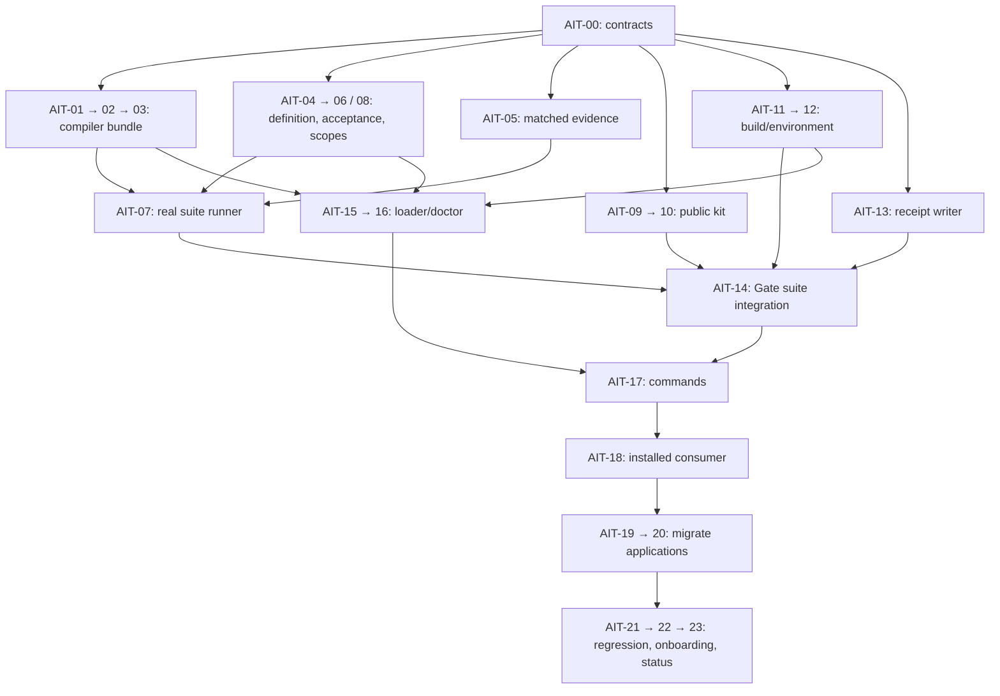

# Application integration implementation tasks

Status: **verified against destination trees, 2026-09-16; AIT-00 accepted;
AIT-05 partially implemented, acceptance pending; all other runtime tasks unaccepted.**
The user has authorized performing this dependency-ordered implementation plan.
The [design](application-integration-design.md) remains the authority; this plan
does not turn proposed interfaces or future test commands into existing features.

Planning baseline: Mirrors `424b68a`, MirrorECMA `008234d`, MirrorGate `67e70b9`.
Recheck revisions, dirty files and tool availability when execution begins.

## Current status snapshot (verified 2026-09-16)

The source inspection for this status refresh found no additional implementation
beyond the last execution record. Historical dispatch failures below describe
those attempts; they are not a fresh diagnosis of the current agent service.
This refresh does not dispatch workers or resume runtime implementation.

The table captures the status refresh before the subsequently authorized commits;
see section 10's commit validation for source delivery and newer test results.

| Repository | HEAD at status refresh | Relevant working-tree state |
| --- | --- | --- |
| Mirrors | `424b68a` | Modified `Docs/README.md` and design; untracked contracts and this ledger; no runtime edits |
| MirrorECMA | `008234d` | Modified `src/negotiated.ts`, `src/replay-core.ts`; untracked `src/matched-evidence.ts`, `test/matched-evidence.test.ts` |
| MirrorGate | `67e70b9` | Clean |

- **Accepted:** AIT-00, as recorded in the [contract status](application-integration-contracts.md).
- **Partial, not accepted:** AIT-05 has a tracker, replay/negotiation plumbing
  and 11 focused tests. Focused checks alone do not establish its full acceptance.
- **Not delivered:** AIT-01/04/09/11 have no implementation handoff or expected
  bundle emitter, suite-definition module, adapter-kit module or Node ESM profile.
  The remaining runtime tasks have no accepted handoffs; their dependency statuses
  in the register remain unchanged. Existing low-level Gate preparation and receipt
  helpers do not establish delivery of the new suite contracts.
- **Next dependency-ready work:** AIT-01, AIT-04, AIT-09, AIT-11 and AIT-13;
  complete/review AIT-05 in parallel only with non-overlapping ownership. AIT-13
  depends solely on accepted AIT-00, despite its later position in the register.

Fresh validation results are recorded at the end of section 10. Earlier build
and full-regression results remain historical evidence, not checks rerun during
this refresh. No task is promoted to accepted by this documentation update.

## 1. Assignment and dispatch record

The following is historical dispatch history, in order. Later dispositions and
the current status snapshot supersede earlier statements that a handoff is pending.

The original assignments used **`general-purpose-flash`**. The user's subsequent
request assigns all AIT-00–AIT-23 work packages to
**`specification_implementer`**; downstream tasks remain pending their dependencies. Ownership is per task and repository,
not permission to edit every repository at once. The coordinating parent owns
this ledger, integrates handoffs and records acceptance evidence.

An actual delegation was attempted to `/root/integration_task_breakdown` for
source-grounded MirrorECMA task decomposition while the parent mapped Mirrors
and Gate. That agent failed before producing a result:

> Your access token could not be refreshed because your refresh token was revoked.

The parent completed the original task plan directly. That failed attempt
produced no subagent-authored proposal, successful review or runtime evidence.
Do not silently substitute a different agent type or mark a queued assignment
as running.

On the user's explicit retry request, AIT-00 was dispatched to
`/root/ait00_contracts` using `general-purpose-flash`. The orchestration service
accepted the dispatch and reported the agent running, but no acknowledgement or
contract artifact was received. At the user's request, the parent interrupted
that agent and dispatched a fresh `general-purpose-flash` agent,
`/root/ait00_retry`, with a self-contained AIT-00 brief and no inherited history.
The new agent subsequently finished with a missing-task-payload report: it
received role/environment context but not the concrete brief or a usable task
identity. It performed read-only reconnaissance and made no edits. Its final
response confirms the contract file still does not exist. This retry is blocked
on task delivery, not currently running; no new authentication failure was
reported. The parent retains this ledger. No downstream runtime task was
dispatched by either retry.

The user then requested a different agent type. AIT-00 was dispatched to
`/root/ait00_specification` using `specification_implementer`, with the full
bounded brief and ownership of `Docs/application-integration-contracts.md` only.
It remained listed as running without acknowledgement or a contract artifact.
On the user's explicit second retry, the parent interrupted that agent and
dispatched `/root/specification_implementer_retry` with a fresh, self-contained
AIT-00 payload and no inherited conversation history. That dispatch was recorded
as running at the time; no accepted contract handoff is recorded. This explicitly
authorized role change does not count as a successful task result until evidence
arrives.

On 2026-09-16, the user requested assignment to `specification_implementer`.
The parent verified that no earlier child agents are active and the contract
artifact is absent. AIT-00 was dispatched to `/root/ait00_contracts` using
`specification_implementer` with a full task brief and inherited context. This
is a new dispatch, distinct from the historical same-named general-purpose
agent. Its ownership is restricted to `Docs/application-integration-contracts.md`;
the parent retains design and ledger edits. Acknowledgement and handoff are pending.
All remaining backlog assignments now use `specification_implementer`.

On the latest assignment request, the parent again verified that no earlier
child agents are active and the contract artifact is absent. The previous
dispatch above has no accepted handoff. A new AIT-00 dispatch was accepted as
`/root/ait00_contract_freeze`, using `specification_implementer` with the complete
bounded task brief and inherited context. It owns only
`Docs/application-integration-contracts.md`; acknowledgement and handoff are
pending. Mirrors remains at `424b68a`, with pre-existing README/design edits
and this untracked ledger; MirrorECMA `008234d` and MirrorGate `67e70b9` are
clean. AIT-01–AIT-23 remain assigned but undispatched pending accepted dependencies.

On the current assignment request, the parent verified that no earlier child
agents are active and discovered an existing 274-line contract draft ending
at matched-evidence semantics. It is not an accepted AIT-00 handoff. AIT-00
completion was dispatched to `/root/ait00_complete_contracts` using
`specification_implementer`, with inherited context and a complete bounded brief.
The agent owns only `Docs/application-integration-contracts.md` and must preserve
and review the existing draft, complete the missing contracts, and return source
and validation evidence. The parent retains this ledger and design edits.
AIT-01–AIT-23 remain assigned to `specification_implementer` but undispatched
pending accepted prerequisites. Dispatch acceptance is not task completion.

On this assignment request, the parent read the task register, verified that no
previous child agents are active, and confirmed the existing contract draft is
still 274 lines and ends at matched-evidence semantics. AIT-00 completion was
dispatched to `/root/ait00_contract_completion` using
`specification_implementer`, with a complete bounded brief and inherited context.
It owns only `Docs/application-integration-contracts.md`; the parent retains
this ledger and design. Dispatch was accepted; acknowledgement and reviewed
handoff remain pending. AIT-01–AIT-23 retain their assignments to
`specification_implementer` and remain undispatched pending accepted dependencies.

On the latest user request to assign the tasks and wait, AIT-00 completion was
dispatched to `/root/ait00_contracts` using `specification_implementer`, with
inherited context and the full bounded completion brief. The existing draft is
274 lines. The agent owns only `Docs/application-integration-contracts.md`;
the parent waited for its handoff and retains ledger/design ownership.
AIT-01–AIT-23 remain assigned to the same role, pending accepted prerequisites.

That agent has now returned an AIT-00 handoff: the contract document is 801
lines, with result/lifetime, bundle/kit, project and hosting contracts added.
The agent reports relative-link, table and whitespace checks passed; the parent
independently ran `git diff --check` successfully. Runtime gates were not run
for this documentation-only work. Handoff received is not contract acceptance:
full parent review remains pending, including the remote-corpus rejection and
the exact hosting-environment schema. No downstream task has been dispatched.

On the latest user request, assignment of AIT-00–AIT-23 returns to
`general-purpose-flash`. The parent verified the existing 801-line contract
draft and dispatched `/root/ait00_contract_review` using that requested role
with the full bounded review/completion brief and inherited context. The agent
owns only `Docs/application-integration-contracts.md`, including review of
remote-corpus handling and the exact hosting-environment schema against current
sources. The parent retains ledger/design ownership and contract acceptance.
Dispatch was accepted; review results remain pending. AIT-01–AIT-23 remain
undispatched until their prerequisites are accepted. This assignment does not
claim implementation or acceptance of the previous handoff.

While that dispatch was being recorded, the parent attempted a redundant CLI fallback (`codex exec -p opencode-go`) because this session does not expose the native `spawn_agent` tool. The sandboxed attempt could not initialize Codex state under the read-only `~/.codex`; the escalated retry was rejected by automatic approval review with "Your access token could not be refreshed because your refresh token was revoked" and was not executed. The fallback worker was terminated before it produced any output or edits. The dispatch above to `/root/ait00_contract_review` remains the authoritative assignment.

AIT-00 is the first dispatched work package. Later tasks require its contract
handoff and their other listed dependencies to be accepted.
Assignments are durable backlog ownership; they are not twenty-four running
agents. No commit, push, publication or credential change is part of this plan.

## 2. Rules for every work package

1. Read the owning repository's `AGENTS.md`, the cited design sections and
   relevant current contracts before editing behavior. Use existing models,
   generated fixtures and application evidence as oracles.
2. Work only in the task's owned files. Paths marked **new** are proposed file
   homes, not assertions that code exists. A necessary move to a neighboring
   module must be recorded in the handoff with the reason.
3. The worker is not alone: preserve unrelated changes and other task owners'
   edits. Shared barrels, package exports, schemas and gate drivers need one
   active owner at a time. Never revert a sibling task's work to make a test pass.
4. Generated targets/fixtures are compiler-owned. Regenerate and `check` them;
   do not hand-edit a lock, generated binding or owned-output manifest. Preserve
   existing synchronous generated bytes and async target semantics.
5. Retain exact negotiation before SUT construction/evaluation-worker launch,
   public-only worker inputs and the original Gate owner through physical
   cleanup. Local cooperative disposal is not physical sandbox confirmation.
6. Acceptance consumes matched evidence, not attempted action counts. Only an
   actual model mismatch kills a behavioral mutant. Missing coverage, timeout,
   infrastructure failure and failed cleanup are separate non-pass outcomes.
7. Record focused checks and applicable aggregate gates. Unavailable, skipped,
   failed and passed are distinct. A design, stub, test double or earlier dated
   log cannot satisfy an executable completion criterion.
8. Return changed paths, interface/schema decisions, commands and exit status,
   generated identities, regression evidence, limitations and next-task inputs.
   Task completion requires accepted destination-tree changes, not a temporary
   prototype or an unintegrated patch.

## 3. Task register and dependency order

Assignee for every row AIT-00–AIT-23: **general-purpose-flash** (latest user request; historical dispatch records above retain their original roles).
The Owner column specifies the repository and responsibility boundary.
`Pending` means assigned but not dispatched; it does not mean implemented.
The prior failures and the new role-specific retry are recorded above.

| ID | Design slice | Owner | Depends on | Status |
| --- | --- | --- | --- | --- |
| AIT-00 | I0 | Shared contract record in Mirrors Docs | — | Accepted by parent after corrections; see execution record below |
| AIT-01 | I1 | Mirrors bundle representation | AIT-00 | Blocked: returned wrong-task report; isolated retry received no payload |
| AIT-02 | I1 | Mirrors native bridge | AIT-01 | Pending |
| AIT-03 | I1 | Mirrors publication and CLI | AIT-02 | Pending |
| AIT-04 | I3 preparation | MirrorECMA suite definitions | AIT-00 | Stopped without handoff after task-delivery failure; latest agent `/root/ait04_definition` |
| AIT-05 | I3 preparation | MirrorECMA matched evidence | AIT-00 | Partial implementation; acceptance pending; see dated validation records |
| AIT-06 | I3 preparation | MirrorECMA acceptance evaluator | AIT-04 | Pending |
| AIT-07 | I3 | MirrorECMA suite runner/results | AIT-03, AIT-05, AIT-06, AIT-08 | Pending |
| AIT-08 | I3 preparation | MirrorECMA construction/disposal scopes | AIT-04 | Pending |
| AIT-09 | I2 | Gate public adapter kit | AIT-00 | Stopped without handoff after task-delivery failure; latest agent `/root/ait09_kit` |
| AIT-10 | I2 | Gate kit validation and restricted self-test | AIT-09 | Pending |
| AIT-11 | I4 | Gate Node ESM preparation profile | AIT-00 | Stopped without handoff after task-delivery failure; latest agent `/root/ait11_profile` |
| AIT-12 | I4 | Gate public environment delivery | AIT-11 | Pending |
| AIT-13 | I5 preparation | Gate trusted receipt writer | AIT-00 | Pending |
| AIT-14 | I5 | Gate suite evaluation convenience | AIT-07, AIT-10, AIT-12, AIT-13 | Pending |
| AIT-15 | I6 preparation | MirrorECMA project loading | AIT-03, AIT-04 | Pending |
| AIT-16 | I6 | MirrorECMA doctor and Gate probe | AIT-12, AIT-15 | Pending |
| AIT-17 | I6 | MirrorECMA project commands | AIT-09, AIT-14, AIT-16 | Pending |
| AIT-18 | I6/I7 | Installed/relocated/offline consumers | AIT-17 | Pending |
| AIT-19 | I7 | WorkQueue migration | AIT-18 | Pending |
| AIT-20 | I7 | Transfer and lease migration | AIT-19 | Pending |
| AIT-21 | I7 | Cross-repository regression gate | AIT-20 | Pending |
| AIT-22 | I7 | Independent onboarding measurements | AIT-21 | Pending |
| AIT-23 | I7 | Final status and release-readiness documentation | AIT-22 | Pending |

AIT-04/05/06/08 can develop against the AIT-00 frozen model-handle/evidence
contract before the compiler bundle ships. Their fixtures are test scaffolding;
the integrated I3 gate at AIT-07 requires real AIT-03 compiler output. Likewise,
the Gate kit can start from the already-implemented sanitized public manifest.
This refines the design's coarse slice ordering without bypassing integration.



Scheduling is additionally constrained by files: AIT-04 owns initial
MirrorECMA public type exports; AIT-07 takes over `src/index.ts` after that
handoff. AIT-05 owns replay internals until AIT-07 integration. AIT-09 owns the
Gate adapter-kit package export; AIT-12 owns control/hosting declarations and
all associated schema clients. AIT-15/17/18 serialize MirrorECMA package export
and packaging edits. Do not run two owners of the same file concurrently even
when their semantic dependencies would permit it.

## 4. Contract and compiler work

### AIT-00 — Resolve and freeze implementation contracts

- **Design:** sections 3, 5–11, 14. **Owned output:** new
  `Docs/application-integration-contracts.md`, plus precise cross-references or
  decision resolutions in the design; no runtime source changes.
- Define the exact `SuiteModel`, `SuiteDefinition`, `ReplayPlan`,
  `AcceptanceRequirements`, matched-evidence and `SuiteResult` shapes; specify
  bounds, unknown-field behavior, identities and version axes. Preserve all
  four acceptance assessments and matched-versus-reported semantics.
- Resolve bundle/check command grammar, owned artifact names, public kit profile,
  construction-scope interface, project schema and local/remote trace-reference
  handling. `mirror.project.json` is evaluator-authored; generation supplies a
  template, not policy or acceptance choices.
- Choose the explicit hosting capability/schema extension for environment
  delivery. List Python, Node, C++ and schema consumers affected by that choice;
  do not add fields to closed v1/v2 records by assumption. Freeze the default
  replay and independent cleanup budgets and who may tighten them.
- **Acceptance:** every exported type/example has an owner and producer; no
  undefined `trusted-project.js` glue, duplicate cleanup owner, semantic-digest
  overclaim, silent source upload or Gate import in the core. Resolve ambiguous
  first-initializer/terminal-ack evidence against current code, not prose alone.
- **Handoff:** versioned contract tables, open issues resolved or explicitly
  blocking a named dependent task, reusable positive/negative fixture inventory.
  Parent review accepts this handoff before dependent implementation begins.

### AIT-01 — Represent and emit the trusted suite bundle

- **Design:** 5.1–5.2. **Owned paths:** new
  `Shell/ModelInterface/Emit/Suite.lean`; narrowly required shared emitter
  helpers in `Shell/ModelInterface/Emit/TypeScript*.lean`; bundle representation
  in the appropriate existing pure/codec modules only if needed.
- Compose the existing async generated target with companion model-handle,
  canonical descriptor, sanitized manifest and bundle identity/ownership data.
  Retain `mirrorecma-async-v1` as registry target identity.
- **Acceptance:** deterministic bytes for identical inputs; distinct model,
  corpus, interface and artifact identities; zero adapter imports or runtime
  effects at module load; reject unsupported bundle/target/schema combinations.
  Existing synchronous and async outputs remain byte-stable.
- **Checks:** extend `tools/ModelInterfaceSpec.lean` or add a focused bundle spec
  wired into `lakefile.lean`; compile generated declarations against the AIT-00
  contract fixture. Run M gates from section 8.
- **Handoff:** emitted fixture tree and its hashes for AIT-02/03 and AIT-04.

### AIT-02 — Emit the local native adapter bridge

- **Design:** 5.3. **Owned paths:** bundle emitter from AIT-01 and shared type
  lowering helpers; new public synthetic fixtures under
  `test/fixtures/model-interface/application-integration/`.
- Generate recursive native-to-generated conversion and input/output validation
  for the supported portable subset. Gate retains its existing recursive proxy
  conversion; never run the local bridge on an already-bound Gate provider.
- **Acceptance:** nested sets/maps/records/tuples/variants, semantic duplicates
  with distinct JS object identities, string-key map limits, large integers,
  `__proto__`, malformed closed records and unsupported opaque values. Invalid
  input causes zero action calls; an invalid observation causes no state report.
- **Checks:** compiler golden tests plus an executable Node vector consumer;
  compare the same fixture semantics through Gate's public-model functions.
  Fixture data is public synthetic data, not a copied private application oracle.
- **Handoff:** exact native representation/behavior vectors and regenerated
  compiler-owned fixtures; M plus focused E/G conversion checks.

### AIT-03 — Publish/check bundles through the compiler CLI

- **Design:** 5.1, 10. **Owned paths:** `tools/ModelInterfaceGen.lean`,
  `Shell/ModelInterface/Compiler.lean`, focused CLI specs, `lakefile.lean`, and
  compiler command documentation.
- Add AIT-00's bundle grammar and read-only freshness check. Reuse conservative
  owned-file publication and checked source/contract/evidence resolution.
- **Acceptance:** deterministic fresh/repeated generation; stale detection
  without repair; preserve unowned files; reject malformed ownership manifests,
  path escape and unsupported shapes; interrupted publication leaves no falsely
  complete bundle. A scaffold proposal cannot be treated as a sealed lock.
- **Checks:** actual CLI subprocess cases, TypeScript consumption of fresh
  output, old target freshness, M aggregate gate. No new proof axioms or `sorry`.
- **Handoff:** real generated Counter/WorkQueue bundle usable by AIT-07, command
  diagnostics/exit semantics and read-only check arguments for project tools.

## 5. MirrorECMA suite work

### AIT-04 — Define immutable suites and validate declarations

- **Design:** 7.1–7.4. **Owned paths:** new `src/suite-definition.ts`, public
  type exports in `src/index.ts`, new `test/suite-definition.test.ts`.
- Implement `defineSuite` against the frozen generated-handle contract. Snapshot
  evaluator declarations and validate operation IDs, bounded requirements and
  nonempty ordered corpus references without creating a SUT/transport/timer.
- **Acceptance:** mutation of caller inputs does not change a suite; repeated
  trace references are retained in order; missing/invalid references are never
  implicit generation; unknown/initializer IDs in transition requirements fail;
  unsupported representations and forged identity overrides fail before effects.
- **Checks:** pure validation tests, E typecheck. All configuration values have
  documented producer/ownership; no global registry or Gate dependency.
- **Handoff:** runtime/type contract for AIT-06/08/15 and validated fixture handles.

### AIT-05 — Collect authoritative matched coverage

- **Design:** 7.4–7.5, 11. **Owned paths:** `src/replay-core.ts`, only necessary
  negotiated replay/evidence plumbing, new internal matched-evidence module and
  focused tests; preserve `src/replay-report.ts` existing report semantics.
- Identify definitive server acceptance events, including initialization and
  terminal success, from the frozen protocol. Add bounded per-run evidence
  collection to the existing replay loop; do not implement a second comparator.
- **Acceptance:** sent-but-rejected or unacknowledged observations do not count;
  stable IDs normalize aliases through the matched descriptor; adjacent pairs
  require two matched transitions in the same trace; initialization clears
  adjacency; cancellation/EOF/malformed sequencing never invent completion.
- Exact required counters survive truncation of optional diagnostic coverage.
  Unknown or ambiguous ID mapping is evidence failure, not zero coverage.
- **Checks:** focused protocol-sequence tests and real mirror correct/mismatch
  cases; regression of old reports, sync timing and counters under E gates.
- **Handoff:** documented evidence event semantics and collector consumed by
  AIT-07; no unmatched counter renamed into an acceptance counter.

### AIT-06 — Evaluate acceptance requirements as a pure module

- **Design:** 7.4–7.5. **Owned paths:** new `src/acceptance.ts` and
  `test/acceptance.test.ts`; exports coordinated with AIT-04/07.
- Implement the frozen pure requirements/evidence interface and bounded
  diagnostics for `met`, `unmet`, `incomplete`, `not_evaluated`.
- **Acceptance:** complete matched corpus with absent exact pair gives unmet;
  interrupted replay stays incomplete; unavailable required evidence is not
  zero; pre-replay rejection is not evaluated; empty extra requirements still
  require complete replay. No assertion callbacks, arbitrary code or I/O.
- **Checks:** table-driven semantic cases and properties such as adding a
  genuinely satisfied requirement cannot change met to unmet. Test actual
  counterexamples rather than reproducing implementation control flow.
- **Handoff:** pure decisions and `coverage_unmet`/evidence diagnostics for runner
  normalization and Gate integration.

### AIT-08 — Own partial construction and disposal scopes

- **Design:** 7.6, 8. **Owned paths:** new scoped-construction module and tests,
  narrowly required `src/async-replay.ts`/factory lifetime hooks. Coordinate
  shared exports through the AIT-04-to-AIT-07 ownership handoff.
- Register cleanup immediately after resource acquisition and transfer it only
  with a returned binding. Use an independent bounded cleanup budget; preserve
  both primary and cleanup failures and at-most-once disposal.
- **Acceptance:** first/second allocation failure, cancellation before return,
  late returned binding, stalled disposer and disposer rejection. Never call
  both handle `dispose` and `port.dispose` for one obligation. Unregistered
  arbitrary resources are explicitly outside the helper's recovery guarantee.
- **Checks:** focused asynchronous lifecycle tests under E gates; verify no
  swallowed late rejection or false cooperative quiescence.
- **Handoff:** construction/lifetime helper consumed by AIT-07, with closed
  ownership rules rather than application-written cleanup loops.

### AIT-07 — Run suites and normalize results

- **Design:** 7.1, 7.5–7.6, 8, 11. **Owned paths:** new `src/suite-runner.ts`,
  `src/suite-result.ts`, `src/index.ts`, focused tests, additive negotiated-runner
  plumbing only where required by AIT-05/08.
- Implement `runSuite` and `runSuiteWithFactory` over the existing compiled async
  runner with real AIT-03 output. Derive exact keys; defer imports/construction
  until required match; assess coverage; join binding disposal.
- **Acceptance:** zero factory/worker calls on mismatch/denial; one factory per
  run and reset per trace; fresh state between runs; model mismatch versus
  coverage unmet versus implementation/transport/evidence failure; cancellation,
  deadlines and independent disposal failures; correct result coordinate bases.
- Preserve low-level runner exceptions/reports. High-level operational failures
  resolve to structured results; invalid inert declarations fail before effects.
  Local disposal never claims physical Gate cleanup.
- **Checks:** E focused/aggregate checks; genuine generated Counter, queue and
  nested-collection replay, plus Gate-free packed-consumer declarations/runtime.
- **Handoff:** stable suite exports and normalized results for AIT-14/17;
  completed compiled replay cannot override a failed acceptance assessment.

## 6. MirrorGate and trusted integration work

### AIT-09 — Generate the public Node adapter kit

- **Design:** 6. **Owned paths:** new adapter-kit generator under `sdk/node/`
  or an explicit Gate development-tool module, Gate package export/CLI entry,
  public kit golden fixtures and Node tests.
- Consume only the validated sanitized public manifest and separately approved
  behavior prose. Generate native declarations, an explicit unimplemented
  skeleton, codec-check entry and kit ownership/version metadata.
- **Acceptance:** exact stable IDs/types, safe quoted names, deterministic
  output, owned-file freshness checking, unchanged authored adapter/prose on
  regeneration, unsupported-shape diagnostics. Reject arbitrary extra fields.
- **Checks:** declaration compilation, malformed-manifest negatives and output
  disclosure scan against model/wire/provenance/trace/credential canaries.
- **Handoff:** public kit and exact packaging interface for AIT-10/17; no model
  descriptor or full evaluator binding can enter an author kit.

### AIT-10 — Validate kits through actual restricted development

- **Design:** 5.3, 6, 13. **Owned paths:** kit checker from AIT-09, focused Node
  worker/codec tests, Gate conformance vectors and restricted-kit integration test.
- Reuse `sdk/node/protocol.mjs` and `sdk/node/public-model.mjs`; compare AIT-02's
  recursive vectors rather than creating another unrelated conversion contract.
- **Acceptance:** structural self-test success/failure, malformed returned
  values, semantic duplicates, disposal behavior and poison-after-failure.
  Self-test invokes submitted imports only in the approved sandbox for restricted
  work; public checks do not assert hidden business semantics.
- **Checks:** real Bubblewrap author/build/worker denied-file checks and G gates.
  A fake transport or plain child process alone is insufficient.
- **Handoff:** installable public kit and backend evidence for Gate convenience.

### AIT-11 — Add the approved Node ESM preparation profile

- **Design:** 9.1. **Owned paths:** `supervisor/mirrorgate/control_policy.py`,
  `preparation.py`, supporting artifact/source selection logic, affected policy
  schema and profile/preparation tests, profile documentation.
- Provide an operator-selected source-copy preparation profile with explicit
  entry point, admitted runtime/dependency identities and source selection.
  Reuse frozen source/artifact ownership; no application `build.py` required.
- **Acceptance:** honest Node ESM source prepares/runs; missing dependencies,
  escaping symlinks, unauthorized roots and unsupported permissions reject.
  No adapter import, package install or lifecycle hook executes in the evaluator.
- **Checks:** real source/build freeze and denial tests, no-author workflow and
  G required-backend gate. Custom build remains explicit and unchanged.
- **Handoff:** versioned profile configuration and public environment facts for
  AIT-12; record actual frozen dependency/runtime/artifact identities.

### AIT-12 — Deliver the public environment descriptor

- **Design:** 9.2. **Owned paths:** hosting/control schema and codec locations
  selected by AIT-00, `agent_policy.py`, authoring broker/MCP delivery,
  `sdk/node/control*`, affected C++ declarations/codecs and shared vectors.
- Derive stage paths, writable locations, allowed tools and limits from admitted
  policy. Supply through the negotiated hosting capability; never copy host
  paths or infer permissions from author input.
- **Acceptance:** new host delivery, older-client explicit compatibility behavior,
  unknown-field rejection, attempted policy widening, no private mount/credential
  disclosure. Descriptor claims cannot override actual backend enforcement.
- **Checks:** shared closed-schema positives/negatives, Node/C++ compatibility,
  fresh actual restricted author without task-specific mount prose, G gates.
- **Handoff:** exact public response/capability for AIT-14/16/17; no accidental
  additions to the existing frozen worker or model protocol.

### AIT-13 — Persist trusted receipts safely

- **Design:** 11. **Owned paths:** new writer beside
  `integrations/mirrorecma/src/receipt.ts`, its package exports and focused tests.
- Provide bounded, cycle-safe serialization and exclusive owner-only publication
  with no symlink following; preserve primary and cleanup outcomes when
  serialization or writing fails. Reuse existing public projection separately.
- **Acceptance:** existing destination, unsafe destination, unwritable parent,
  cyclic/primitive/throwing errors, truncation bounds, interruption before/after
  publication and cleanup of temporary files. No partial file claims completeness.
- **Checks:** filesystem failure injection and interface tests under I gates;
  public output never defaults to the trusted receipt.
- **Handoff:** receipt option consumed by AIT-14; no claim of supervisor restart
  durability or disconnected-session adoption.

### AIT-14 — Compose the suite with the existing Gate workflow

- **Design:** 9.3, 11. **Owned paths:** new convenience module under
  `integrations/mirrorecma/src/`, narrow changes to `workflow.ts`, `provider.ts`,
  hosted-tool integration and focused/installed workflow tests.
- Implement the frozen `evaluateSuite` interface over the existing original-owner
  workflow and `runSuiteWithFactory`; derive descriptor/binding plumbing from
  the trusted bundle. Reuse AIT-11/12 profiles and AIT-13 receipt persistence.
- **Acceptance:** same suite local/restricted; no worker on negotiation denial;
  model-matched but coverage-unmet stays failed; late factory, preparation failure,
  worker crash/hang/cancel and physical cleanup failure remain distinct. Hosted
  submission handoff must retain its owner instead of reconnecting/adopting.
- **Checks:** I plus G gates, real sandbox vectors, unchanged service/legacy
  consumers, raw/private versus public result projections.
- **Handoff:** supported convenience interface usable by ordinary installed
  applications, with separate conformance/acceptance/physical cleanup evidence.

## 7. Project tooling, packaging and application delivery

### AIT-15 — Load evaluator-owned project configuration

- **Design:** 7.1, 10. **Owned paths:** new MirrorECMA `src/project/` loader and
  schema modules, `mirrorecma/project` export and loader tests; package changes
  reserved to this task until handed to AIT-17/18.
- Read strict declarative `mirror.project.json`; return suite ID, replay,
  acceptance and execution settings. Resolve relative paths against that file.
  Preserve local versus explicit server-visible/inline reference semantics.
- **Acceptance:** malformed/unknown fields, illegal paths/reference kinds, bad
  bounds, missing corpus, incompatible tool lock and invalid coverage IDs fail
  honestly. No adapter imports, build execution, trace generation, download,
  connection or agent launch occurs during loading.
- **Checks:** filesystem/config tests, E checks and different-working-directory
  consumers; user-defined configuration is never silently rewritten.
- **Handoff:** shared CLI/library configuration contract and fixture projects.

### AIT-16 — Resolve tools and diagnose capabilities

- **Design:** 10. **Owned paths:** MirrorECMA project toolchain/doctor modules
  and tests; Gate-owned explicit capability-probe interface/test if required.
- Apply explicit override → project lock → installed registry precedence, verifying
  selected identity/capabilities. An incompatible explicit override must fail;
  never quietly search siblings or substitute an arbitrary PATH binary.
- **Acceptance:** missing/offline/wrong-version compiler, optional Apalache absent
  for checked replay, remote server identity, namespace denial, stale agent audit.
  Doctor never imports submissions or reads/prints credential contents.
- **Checks:** bounded fake-tool probes plus real approved tools. The explicit
  Gate probe verifies its own resource cleanup; missing capabilities are not green.
- **Handoff:** actionable structured diagnostics and runtime selections for CLI.

### AIT-17 — Provide the installed project workflow commands

- **Design:** 10. **Owned paths:** MirrorECMA CLI entry and package scripts/exports,
  project init/generate/check/replay modules and CLI tests; Gate kit tool invoked
  only via its public interface.
- Implement the AIT-00 grammar with existing compiler, suite and doctor modules.
  Seed non-overwriting templates; preserve evaluator-selected model/coverage;
  emit adapter skeletons, not business logic. Generation is explicit and owned;
  `check` never repairs; checked replay never falls back to live generation.
- **Acceptance:** CLI/library semantic equivalence, predictable exit codes,
  missing artifact and stale bundle diagnostics, preserved authored files,
  explicit fresh-witness provenance, failed receipt persistence and privacy.
- **Checks:** installed executable CLI tests and E/I checks. Actual new test
  names and exports must be added to the owning repository gate, not only docs.
- **Handoff:** complete role-oriented commands with no `trusted-project.js`,
  source-checkout imports or per-run library packing requirement.

### AIT-18 — Verify package and offline consumption

- **Design:** 12–13. **Owned paths:** MirrorECMA `scripts/check-package-boundary.mjs`,
  related package tests, Gate integration `scripts/packed-consumer.mjs` and
  `scripts/installed-workflow.mjs`, isolated consumer fixtures and packing metadata.
- Build/pack once, then exercise ordinary runs in fresh relocated consumers.
  Test core-only suite use with Gate packages absent and Gate use via installed
  public entry points. Repeat with a prepared offline tool/dependency cache.
- **Acceptance:** no hidden sibling/dist source imports, no per-run compiler
  build or packing, preserved old root imports, explicit compatible schema/tool
  rejection and no advertised registry-publication claim from a local archive.
- **Checks:** E/I installed consumers and real G backend for restricted mode.
- **Handoff:** exact package/tool/revision manifest and commands for migration.

### AIT-19 — Migrate WorkQueue through the new interfaces

- **Design:** 12–13. **Owned paths:** MirrorECMA `examples/work-queue/`, its
  acceptance tests and scripts; Gate application-runner queue integration;
  compiler-owned artifacts only through regeneration.
- Replace handwritten registry/descriptor/conversion/lifecycle glue with a
  generated kit, declared suite and evaluator-owned project file. Keep genuine
  persisted observations and the existing model unless a separately explained
  defect requires a model correction.
- **Acceptance:** retain 9 local mutants and their pinned first mismatches,
  local failure controls, required action/pair coverage, fresh witnesses,
  rejected-negotiation zero effects and 7 real Gate cases. Test explicit
  coverage-unmet and evidence-incomplete cases without changing the SUT.
- **Checks:** focused queue gates, compiler `check`/preflight, E/G/I applicability,
  and an actual fresh restricted author using generated kit/environment delivery.
- **Handoff:** first integrated default-path example and measured removed glue;
  accept it before migrating the other applications.

### AIT-20 — Migrate persistent transfer and leases

- **Design:** 12–13. **Owned paths:** MirrorECMA `examples/persistent-transfer/`,
  `examples/lease-service/`, shared application-validation helpers, Gate application
  runner and their documentation/evidence. Serialize edits of shared runners.
- Reuse the same suite/provider interfaces and public kit with no app-specific
  framework orchestration. Remove redundant shallow conversions only after
  replacement evidence passes.
- **Acceptance:** retain four actual-SUT mutants per application, their first
  mismatches, local crash/hang/cancel controls, fresh witnesses, bounded model
  safety and 8 real Gate cases per application. Record real native collection
  observations and source/submission/artifact identity; preserve stated
  orderly-restart and selected-serialized-schedule limits.
- **Checks:** application gates, E/G/I checks and actual fresh restricted authors
  against fixed private evaluators; never use a development subagent as blind evidence.
- **Handoff:** all three applications runnable through installed default interfaces.

### AIT-21 — Run the compatibility and release-candidate matrix

- **Design:** 12–13. **Owned paths:** only gate wiring and evidence ledgers needed
  for the delivered features: `lakefile.lean`, owning package/gate scripts and
  documented cross-repository matrix. Changes to unrelated clients are not implicit.
- Run M/E/G/I/X gates and the migrated application matrices at exact recorded
  revisions/tool identities. Verify original sync generated output, low-level
  runner/report semantics, Node/C++ control compatibility and local Gate-free use.
- **Acceptance:** 17 local behavioral mutants, 23 real Gate source/control cases,
  all required new negative tests and actual-author gates pass. A skipped
  required backend/interop leg remains an open gate, not overall green.
- **Handoff:** reviewed command logs, exit codes, code/artifact identities and
  remaining limits; no automatic commit, baseline pin update or publication.

### AIT-22 — Measure independent onboarding

- **Design:** 13.9. **Owned paths:** new dated onboarding protocol/evidence
  document, isolated public consumer setup and minimal documentation corrections.
- Use a fresh evaluator session unfamiliar with internal modules and only the
  role-oriented guide. Predeclare task, start/end timestamps and prerequisite
  state; distinguish a fresh session from a genuinely independent human study.
- **Acceptance:** record first replay time, prerequisite installation separately,
  manual configuration steps, handwritten integration code, and diagnosis time
  for a seeded defect. Record every intervention or undocumented instruction.
  Compare observed setup requirements, not an invented historical timing baseline.
- **Checks:** replay the participant's consumer and verify its evidence/cleanup.
  If no independent participant/session is available, leave that study unperformed
  rather than replacing measurements with developer estimates.
- **Handoff:** measured friction and any follow-up defects, with no silent claim
  of universal usability or fresh-install support from cached reproduction.

### AIT-23 — Reconcile documentation and completion status

- **Design:** 13–14. **Owned paths:** this ledger, design status, `Docs/README.md`,
  owning package guides and selected G1/G2/G5/G7 status references.
- Replace proposed labels only for delivered interfaces with linked code and
  executable evidence. Record package/source versions independently of publication;
  retain G3/G4/G6, durability and other excluded work as follow-ups.
- **Acceptance:** every feature claim has an owner, current command and evidence;
  every skip/block remains visible; public/private file origins and suite semantics
  agree across guides. No implementation is marked complete from assigned status.
- **Checks:** links, commands against installed artifacts, `git diff --check`,
  and review of the full task register/dependency/evidence matrix.
- **Handoff:** final reviewable destination-tree delivery report. Commit/push
  is a separate user-authorized delivery step.

## 8. Validation profiles and execution environment

These commands describe implementation acceptance, not tests run for this
documentation-only planning turn. Future focused test filenames above are part
of their task deliverables and are not yet executable commands.

| Profile | Repository and required checks |
| --- | --- |
| M | Mirrors: `lake build`; focused model-interface executables and new registered specs; `APALACHE_MC=/absolute/apalache-mc lake test`; old/new compiler `check` and `preflight` |
| E | MirrorECMA: `pnpm run check`, `pnpm run check:model-interface`, `pnpm run check:examples`, relevant Jest tests, full `pnpm run test --runInBand --no-watchman`; Gate-free packed consumer; focused CI with explicit full `MIRRORS_REF` |
| G | MirrorGate: `bash scripts/test.sh` with its pinned Node/Rust and required real backend; schema/codec and shared Node/C++ checks for affected contracts |
| I | Gate `integrations/mirrorecma`: build/check/tests, packed/installed workflows and real evaluator application gates; use public APIs, exact compatible peer packages |
| X | Mirrors: read `tools/interop/INTEROP.md`, then `bash tools/interop/run.sh` with its external clients/tools and explicit compatible revisions; Gate shared orchestration remains a separate matrix |

Use current owning-repository pin files. At this planning baseline Gate and
coordinated application runs require Node 24.15.0, Gate Rust 1.96.0 and the
recorded Apalache 0.61.0 toolchain for live tiers. The local pinned Node tree was
previously available at `MirrorGate/.build/toolchains/node-v24.15.0-linux-x64`;
recheck it rather than treating an ignored local directory as a distributable
dependency. `pnpm` must match MirrorECMA's pin for its official focused CI gate.

For coordinated MirrorECMA CI, pass `MIRRORS_ROOT` and the actual full
`MIRRORS_REF` SHA; do not change a published baseline to an uncommitted future
compiler. Compiler generation may use a working tree for focused development,
but receipt provenance must include that fact and its artifact hashes.

Real Bubblewrap, loopback and external-process tests may need execution outside
the enclosing development sandbox. Use authorized escalation and preserve
denied/unavailable outcomes if escalation cannot run. Never fall back to a
weaker backend and label it the required isolation profile.

## 9. Copyable dispatch brief and handoff record

Use the requested agent type for each ready work package. A bounded dispatch
brief should contain the complete task, not just a link or the phrase
"implement the design":

```text
Assignee: general-purpose-flash
Task: AIT-NN from Docs/application-integration-tasks.md
Authority: Docs/application-integration-design.md and accepted AIT-00 contracts
Prerequisites: accepted handoffs [IDs, revisions, artifacts]
Owned paths: [copy this task's paths and reserve shared files]
Deliverables and negatives: [copy this task's requirements]
Validation: [focused checks plus applicable M/E/G/I/X profiles]
You are not alone: preserve other edits; report conflicts to the coordinator.
Do not implement other task IDs, weaken guards or change unrelated contracts.
No commit/push/publication unless separately authorized.
Return changed files, commands/results, evidence identities and remaining limits.
```

If a dispatched agent lacks the task payload or fails authentication, record
that actual failure and stop treating the assignment as running. Resend only
when the failure condition has been resolved or a materially different supported
delivery route exists; do not spend repeated attempts on the same revoked token.

Per-task acceptance record to fill during execution:

```text
Task / assignee / actual agent ID:
Start and finish / base revisions / dirty-tree disclosure:
Accepted prerequisite handoffs:
Changed paths and exported/schema decisions:
Focused checks (exact command, exit, log):
Aggregate checks (passed / failed / unavailable / skipped):
Generated/package/model/corpus identities:
Primary and cleanup evidence / public disclosure checks:
Open issues and next-task handoff:
Parent review disposition:
```

This planning turn changes documentation only. Completion of the plan document
does not mark AIT-00–AIT-23 implemented or the blocked agent dispatch successful.

## 10. Current execution record (2026-09-16)

The user explicitly requested performing the plan. Runtime implementation is
authorized; commit, push and publication remain separate. Baselines verified:
Mirrors `424b68a`, MirrorECMA `008234d`, MirrorGate `67e70b9`. Mirrors had
pre-existing README/design edits and untracked contracts/tasks; siblings were clean.

The prior general-purpose-flash contract agent remained listed as running but
returned no acknowledgement or edits. The parent interrupted it and completed
AIT-00 review locally, explicitly reporting the fallback. Accepted corrections:
non-circular bundle identity, exact hosting-environment shape, SuiteLocalBinding
name avoiding an existing export collision, concrete transport target, optional
raw report before replay, and normalized acceptance input. Remote corpus replay
remains explicitly unsupported until remote byte verification exists.

`lake build` passed (610 jobs; existing warnings). This is a baseline, not
acceptance of new runtime work. Pinned Node 24.15.0 exists under MirrorGate's
ignored toolchain directory; default Node is 24.19.0.

AIT-01/04/09/11 were dispatched to the requested general-purpose-flash role with
separate file ownership. Parent owns AIT-05 matched evidence and this ledger.
Acceptance requires reviewed destination changes and checks, not dispatch status.

### Latest requested-role dispatch and parent review

On the subsequent user request to assign this document to `general-purpose-flash`
and review the outcomes, the parent re-read the contracts and current destination
trees. The three repository HEADs remain the baselines above. MirrorECMA already
contains partial AIT-05 edits in `src/negotiated.ts`, `src/replay-core.ts`,
`src/matched-evidence.ts` and `test/matched-evidence.test.ts`; these are preserved
as pre-existing work, not attributed to the new workers.

Four fresh bounded dispatches were accepted with full inherited context and
explicit task, architecture, contract, ownership, negative-case and validation
briefs:

| Task | Actual agent | Reserved responsibility |
| --- | --- | --- |
| AIT-01 | `/root/ait01_bundle` | Bundle emitter and focused compiler tests |
| AIT-04 | `/root/ait04_definition` | Suite definitions, tests and initial public exports |
| AIT-09 | `/root/ait09_kit` | Public kit generator, packaging and tests |
| AIT-11 | `/root/ait11_profile` | ESM preparation policy, implementation and tests |

At dispatch, acknowledgements and reviewable handoffs were pending; final
dispositions follow below. Downstream tasks remain dependency-blocked; dispatch
acceptance alone is not implementation evidence.
The parent owns this ledger and independent review, including the existing
AIT-05 work. Parent checks completed against the pre-existing AIT-05 tree:
`pnpm run check` exited 0; `MIRROR_BIN=/home/nzsn/Repos/Mirrors/.lake/build/bin/mirror
pnpm run test --runInBand --no-watchman test/matched-evidence.test.ts` exited 0
with all 11 tests passing, including the real-mirror correct/mismatch case.
These checks required authorized escalation because the sibling repository is
read-only in the development sandbox. They are focused evidence, not acceptance
of the entire integration plan.

### Parent disposition of the first returned handoff

AIT-01 returned a coordination report instead of implementing its assigned
emitter. A corrective follow-up explicitly identified it as the implementation
worker, but its second response again claimed it needed delegation tools.
The parent rejects both responses as non-delivery. The worker also appended an
incorrect ledger claim that the assigning session had no native collaboration
tools; the parent removed that claim because this session did dispatch all four
workers using those tools. No current authentication failure was established.
The observed failure is task/role confusion; its underlying cause is unknown.
No AIT-01 source artifact was produced, and its dependent tasks remain blocked.

Independent parent regression check of the existing MirrorECMA tree:
`pnpm run test --runInBand --no-watchman` exited 0, with 25 suites / 447 tests
passing and 1 suite / 12 tests skipped. The separate focused run above enabled
and passed the real-mirror evidence test. These results do not validate missing
bundle, suite, kit or preparation implementations.

### Final dispatch review for this request

The parent tried one materially different delivery route: a fresh-context
`general-purpose-flash` worker, `/root/ait01_isolated`, with the complete AIT-01
brief and explicit instruction to implement directly without delegation.
It returned: "I did not receive a task" and reported that its context lacked
any task payload. It made no edits. This is direct evidence of task-delivery
failure; no current token or authentication diagnosis is established.

The parent stopped `/root/ait04_definition`, `/root/ait09_kit` and
`/root/ait11_profile` after they supplied no acknowledgement or handoff.
Final destination-tree inspection found no bundle emitter, suite-definition
module or adapter-kit module; MirrorGate remained clean and MirrorECMA retained
only its pre-existing AIT-05 changes. None of the newly delegated implementation
tasks is accepted. The parent corrected the wrong-task worker's ledger edits
and preserved all pre-existing source work. No commit or push was performed.

AIT-00–AIT-23 retain requested-role backlog assignment. Actual dispatch was
limited to ready work, and downstream tasks were not launched without their
prerequisites. Further dispatch requires working delivery of the concrete worker
brief; repeating the same failed route does not provide implementation evidence.

### Status refresh verification (2026-09-16)

Rechecked all three HEADs and working-tree inventories against the snapshot
above, inspected the existing AIT-05 source/tests, and searched runtime sources
for the proposed suite, bundle, kit and hosting APIs. No additional accepted
implementation was found. No runtime files were changed by this refresh.

Fresh checks from `MirrorECMA/` using default Node `v24.19.0`:

- `./node_modules/.bin/tsc --noEmit` — exit 0.
- `NODE_OPTIONS=--experimental-vm-modules MIRROR_BIN=/home/nzsn/Repos/Mirrors/.lake/build/bin/mirror ./node_modules/.bin/jest --runInBand --no-watchman test/matched-evidence.test.ts`
  — exit 0; 1 suite, all 11 tests passed, including real-mirror correct/mismatch.

The initial `pnpm run check` and focused `pnpm run test` attempts each exited 1
with `unable to open database file` before running their scripts. The subsequent authorized escalated retry of `pnpm run check` followed by
`MIRROR_BIN=/home/nzsn/Repos/Mirrors/.lake/build/bin/mirror pnpm run test --runInBand --no-watchman test/matched-evidence.test.ts`
also exited 0, with all 11 tests passing. These focused checks used the default
Node version; the official pinned CI gate was not run.
Full regression, compiler build, M/E/G/I/X aggregate gates and installed-consumer
checks were not rerun for this documentation refresh. AIT-05 remains partial
and unaccepted; the earlier full-regression totals remain historical.

### Commit validation (2026-09-16)

The user subsequently authorized commit and push of the integration work.
The pre-commit source bases remain Mirrors `424b68a` and MirrorECMA `008234d`,
with the working-tree changes listed in the snapshot above. Documentation index
and design status labels now agree with accepted AIT-00 and partial AIT-05.
This delivery does not promote AIT-05 or downstream tasks to accepted.

- `lake build` — exit 0, 610 jobs (existing warnings).
- From MirrorECMA, with Node `v24.15.0` first on `PATH`, pnpm `11.22.0`,
  `MIRRORS_ROOT=/home/nzsn/Repos/Mirrors`,
  `MIRRORS_REF=424b68a35e65d42b141a35886eeac2bbc7b5d627`, and
  `MIRROR_BIN=/home/nzsn/Repos/Mirrors/.lake/build/bin/mirror`, `pnpm run ci`
  — exit 0 before and after the review fix below. Final Jest result: 25 suites /
  457 tests passed, with 1 suite / 4 opt-in tests skipped. All three typechecks
  passed. Compiler freshness, generated Counter,
  packed core consumer, async Counter and WorkQueue gates passed. This command
  did not request live generation (`--live`).
- `APALACHE_MC=/home/nzsn/.local/bin/apalache/bin/apalache-mc lake test`
  — the first invocation exited 1 because the TLA differential acquisition test
  requires Java `25.0.4+7`, while the default was `17.0.20+8`. The printed
  `acc-precedence` mismatch was expected corruption-rejection output, not the
  failing assertion. Earlier gates passed; later gates were not reached in that
  invocation. Local log: `/tmp/mirrors-integration-precommit-lake-test.log`.
- Rerunning that Lean command with
  `/home/nzsn/Repos/Mirrors/.golden-build/tla-differential/jdk/jdk-25.0.4+7/bin`
  first on `PATH` — exit 0, `ALL LAKE TESTS GREEN`. The differential Python
  suite ran 60 tests with 4 optional tests skipped. Local log:
  `/tmp/mirrors-integration-precommit-lake-test-jdk25.log`.
- Documentation local links and whitespace checks passed.

The full cross-client interop matrix and Gate aggregate gate were not rerun for
this MirrorECMA runtime / Mirrors documentation delivery. No overall matrix-green
or complete application-integration claim follows from the focused CI result.

Independent pre-commit review found and corrected one AIT-05 protocol-sequencing
defect: a `step_mismatch` without a pending reported observation now fails with
`evidence_invalid` and protocol uncertainty, preserving established prefix counts.
Two regression cases cover rejection before any report and after acknowledgement.

The final MirrorECMA CI rerun passed after the review fix (13 matched-evidence
tests included). Local log: `/tmp/mirrorecma-integration-precommit-ci.log`.
The implementation is committed and pushed as MirrorECMA `ff3a214`; AIT-05 acceptance
remains pending despite this source-delivery milestone.
