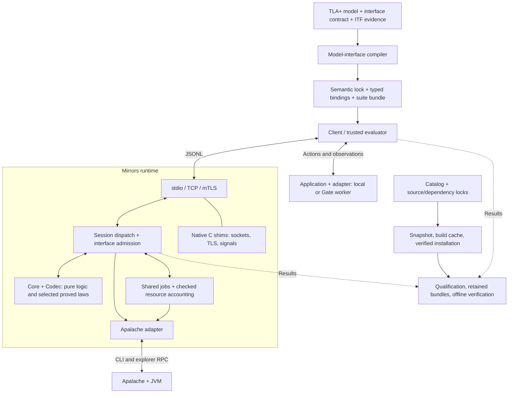

# Mirrors — Architecture Overview

Source architecture reviewed 2026-10-03 against base `6abd893` plus the current
compiler/client working-tree changes. This describes
implemented responsibilities and boundaries; acceptance remains attached to
its recorded source, distribution, and evidence identities.

Use the [interactive diagram](architecture-overview.html) for focused views
([diagram data](architecture-overview.json)), and [architecture details](architecture-details.md)
for the module map. Application ownership is defined in the
[integration guide](application-integration-guide.md).

## System shape

Mirrors connects an application's reported behavior to a TLA+ model through a
JSON-lines protocol. It has three connected parts:

1. **Conformance runtime:** replay, state comparison, validation, trace generation,
   exploration, and asynchronous jobs.
2. **Model preparation:** a bounded TLA+ frontend and model-interface compiler
   producing semantic locks, typed bindings, and trusted suite bundles.
3. **Distribution and evidence:** explicit component/dependency identities,
   snapshots, verified installations, retained results, and offline qualification.

The production runtime executes the same pure functions used in its Lean proofs.
Those proofs cover stated laws and transition models; they do not prove the
whole executable, effectful shell, native shims, external tools, or application.

The dotted result edges describe qualification collection around the processes,
not automatic persistence of every wire session. Compiler products are inputs
to the selected clients; equivalent suite/Gate capabilities are not implied for
every client language.

## Runtime: admission, execution, comparison

[Main.lean](../Main.lean) selects default synchronous stdio, TCP `--serve`,
`--server` with optional mTLS, or the `validate` and `trace-gen` client commands.
The latter connect to a selected Mirrors endpoint; model checking runs behind
that endpoint. [Shell.Cli](../Shell/Cli.lean) constructs transports, authorization
contexts, the model-interface service, and network-server job stores.

[Shell.Mirror.Session](../Shell/Mirror/Session.lean) strictly decodes and dispatches
messages. The replay path admits registration, obtains generated or supplied ITF
traces, sends initialization/action inputs, and compares each `report_state`
through [Core.Diff](../Core/Diff.lean). Its match/last-step decisions drive
[the pure `step` function](../Core/Protocol.lean) (Lean `_root_.step`); the shell
constructs wire replies.
A mismatch returns expected/actual states and ordered hints, then stops replay.

Validation, trace generation, exploration, and asynchronous dispatch have their
own shell paths. They are not all one pure protocol `step` call per wire message.
[Shell.Apalache.Runner](../Shell/Apalache/Runner.lean) owns source preparation,
per-run directories, child processes, and cleanup. Validation and trace generation
invoke the Apalache CLI; exploration uses an Apalache explorer process and
HTTP/JSON-RPC.

Both network transports use a bounded connection queue and persistent connection
workers. `--jobs N` defaults to 4 and uses `max 1 N` for connection workers and
live-job capacity. One process-shared [job store](../Shell/Jobs/Store.lean) retains
job IDs, phases, results, promises, and cancellation tokens. Connections track the
jobs they submitted for cancellation/eviction when the connection ends; job lookup
itself uses the shared store. Async requests return `job_accepted`, with separate
query, await, and cancellation operations. Synchronous registrations may run
inline on an async-capable connection.

Logical terminal status is distinct from physical cleanup: a worker keeps its
permit until its body unwinds. The concurrency limit does not establish a global
bound on retained terminal-result bytes. See the [worker-pool design](worker-pool-design.md)
and [async resource proof scope](async-resource-lean-proofs.md).

## Trace capture and delivery

[TraceDelivery](../Shell/Transport/TraceDelivery.lean) checks the exact encoded
reply against the 65,535-byte JSONL payload limit. Inline trace results are used
when they fit. Synchronous path-only fallback requires explicit shared-filesystem
scope and paths that survive cleanup; ordinary remote paths are not local files.
Explicit allowlisted mTLS shared-root configuration supports that scope.
Unsupported oversized delivery returns a bounded error.

The `trace-gen` client uses [Shell.TraceCapture](../Shell/TraceCapture.lean) to
retain delivered ITF bytes, request/reply data, source text, and a hash receipt
in a newly reserved local capture directory. This is separate from the framework
qualification evidence store.

## Model preparation and runtime descriptors

The frontend separates [source acquisition and module resolution](../Shell/Tla/Frontend.lean)
from [pure syntax and elaboration](../Core/Tla/Parser.lean). Its current bounded
[language profile](model-interface-compiler/tla-language-profile.md) is revision 5.
It supplies source, declaration, name/arity, and expression-level facts; it is
not an implementation of full TLA+ evaluation or model checking.

The [compiler](../Shell/ModelInterface/Compiler.lean) combines the root model,
strict interface contract, and typed ITF evidence. Pure resolution creates a
semantic descriptor and provenance, with separate canonical identities.
Implemented generated targets are synchronous and asynchronous TypeScript,
C++ (`mirrorcpp-v1` and `mirrorcpp-v2`), Rust (`mirrorrust-v1`), and Lean
(`mirrorlean-v1`). The initial Lean SDK registry requires exact matched
verification before constructing a binding. Async suite
bundles add trusted evaluator material and a sanitized public worker interface.
The application still supplies its implementation, adapter, reset, and observations.

The runtime [interface service](../Shell/ModelInterface/Runtime.lean) supports
exact digest verification and inert descriptor delivery before replay admission.
Authorization and cache scope are explicit: local stdio has configured local
authority, plain TCP has none for descriptor operations, and mTLS requires an
allowlisted verified peer, with descriptor-read authority separately enabled.
Descriptors contain data, not downloaded executable adapters. Source, compiler,
negotiation, and publication contracts are linked from the
[compiler index](model-interface-compiler/README.md) and
[runtime distribution design](model-interface-runtime-distribution-design.md).

## Repository and trust boundaries

| Area | Owns | Boundary |
| --- | --- | --- |
| `Core/` | Values, traces, diffs, protocol/jobs/resources, frontend, interface resolution and catalog rules | Pure definitions with theorem-specific premises and coverage |
| `Codec/` | Wire, ITF, RPC, descriptor, and catalog representations | Pure serialization/validation; proof coverage is stated per codec |
| `Shell/` | CLI, transports, sessions, jobs, external tools, file access, authorization/cache and publication | Trusted orchestration; some emitters here are pure functions |
| `Ffi/` | OpenSSL TLS, sockets, signals, polling, and native ownership | Native trusted boundary; testing/review is not a Lean proof |
| MirrorECMA and other clients | Protocol participation; supported bindings, replay, reports and application lifecycle | Client-specific contracts and acceptance |
| MirrorGate | Optional policy, worker isolation, snapshots and physical cleanup | Separate repository and backend qualification |
| Apalache/JVM | Model validation, generated traces, exploration | External model-checking dependency |
| Optional registry/Consul | Service registration and discovery | Separate discovery dependency |

The protocol refinement theorem relates successful pure transitions to a
Lean-encoded tag-level relation, including marked extensions. It abstracts
payloads, admission and comparison outcomes. Checked async-resource transitions
constrain acknowledged resource events; they do not prove successful OS resource
acquisition or release. Correct application observations remain an adapter and
evaluator obligation. [Detailed proof boundary](architecture-details.md).

## Distribution and qualification

The [framework catalog](framework-catalog-contract.md) records component identities,
capabilities, combinations and evidence references. The
[distribution tools](../tools/distribution/) freeze source inputs, build locked
caches, verify bytes and runtime trees, and activate versioned installations.
Checked-replay profiles use prepared corpora; fresh model generation is an
explicit separate dependency path.

[Evidence tooling](../tools/evidence/) collects registered commands and required
artifacts, finalizes immutable bundles, and verifies hashes and qualification
relationships offline. Installed runs bind to the matching distribution audit;
reproduction and reduction retain their origin/dependency links. Behavior,
cleanup and persistence are separate outcomes. Planning changes are recorded in
a private audit outside C0; implementation and Git revision changes remain
identity-bearing. The interop gate checks declared verdict/exit contracts and
pins the actual ECMA SDK and Node bytes before and after execution.

See [durable evidence](durable-evidence-design.md) and the
[qualification harness](qualification-harness-design.md). The
[2026-10-03 readiness record](../Plans/q3-integrity-fixes-2026-10-03.md) describes
one exercised WSL2/client and native-Windows/oracle deployment. Its acceptance
is tied to the recorded C0 and profile, not automatically to later commits or
documentation edits. That topology is not a requirement of the general runtime.

## Validation entry points

The current gate definitions are [lakefile.lean](../lakefile.lean),
[the local non-model runner](../tools/run-local-no-model-check.sh), and
[the registered evidence commands](../tools/evidence/commands.json).
They cover pure/domain behavior, codecs, compiler freshness, frontend behavior,
transport/resource integration, distribution, and evidence contracts.

`lake test` can probe a developer-local model checker when `APALACHE_MC` is unset.
Use the explicit non-model runner on the current coordinator and run model
operations separately through the designated oracle. The [interop guide](../tools/interop/INTEROP.md)
distinguishes the selected remote profile from the legacy full transport matrix.
Dated fixture counts, reviews, and acceptance results remain historical evidence;
consult their pinned inputs and declared limits before reusing a claim.
