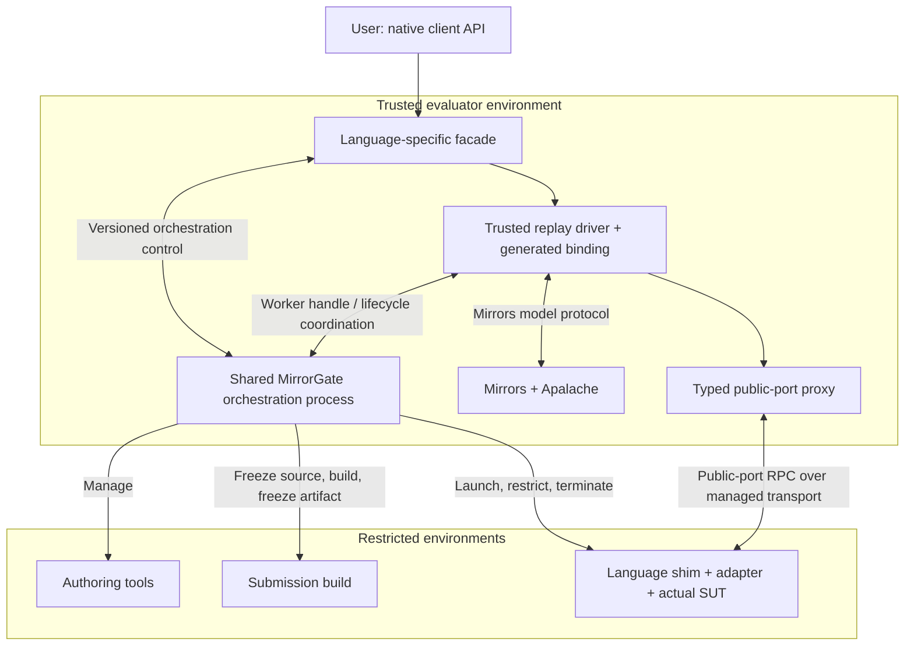

# Mirrors — Client Implementation Guide & Conformance Specification

> Testing an application with the existing TypeScript client? Start with the
> [MirrorECMA MBT user manual](mirrorecma-typescript-mbt-user-manual.md).

> Explanatory types and judgments use the [shared semantic notation](https://github.com/NzSN/Mirrors/blob/main/Docs/semantic-notation.md).

> How to implement a client of the Mirrors mirror server, and the
> normative rules a conforming client must obey.
> Companion docs: `interface-reference.md` (exact wire shapes — the
> message catalog is NOT repeated here),
> `model-interface-runtime-distribution-design.md` (runtime negotiation),
> `generated-model-interface-spec.md` (portable generated bindings),
> `model-interface-compiler-design.md` (build-time compiler), `cutover.md`
> (Haskell divergences), `worker-pool-design.md` (server concurrency model),
> and `tls-ffi-review.md` (TLS policy details).
> Wire truth is pinned by `test/fixtures/*.jsonl` (the golden corpus,
> frozen from the Haskell reference implementation); this document is the
> behavioral layer on top of it.
>
> Normative keywords **MUST / MUST NOT / SHOULD / MAY** are used as in
> RFC 2119. Numbered rules **C1–C27** are the base conformance checklist —
> a client that satisfies every MUST is wire-compatible with both the Lean 4
> mirror and the Haskell reference (`ModelMirros@3496251`). Rules prefixed
> **MI** are additionally mandatory for a client that advertises version-1
> runtime model-interface support. The Haskell compatibility statement applies
> to registrations without that optional extension.
> Rules prefixed **SO** in §13 define the shared sandbox-orchestration profile.
> Its experimental implementation and local acceptance scope are recorded in
> §13.1; these requirements do not imply released support for every client or
> change the existing Mirrors wire protocol.

## 1. Where a client can attach

| Endpoint | Transport | Session model | Use for |
| -------- | --------- | ------------- | ------- |
| `mirror` (default) | stdin/stdout of a spawned process | **sync only**, one register flow per process | local MBT, tests |
| `mirror --serve <port> [--bind A] [--jobs N]` | plain TCP | async-capable, one session per connection, concurrent | LAN daemons, CI |
| `mirror --server <port> --tls --cert C --key K --ca A [--jobs N]` | mTLS (TLS 1.3 only) | async-capable, one session per connection, concurrent | production |
| registry-discovered peers | mTLS + Consul-style registry | as above, with fingerprint pinning | discovery deployments |

A single physical connection carries exactly one logical session.
Multiple sessions require multiple connections (the server's worker pool
and shared job store exist precisely to make that cheap — see §7).

## 2. Framing

- **C1.** Every message, both directions, is exactly **one JSON object
  per line**, UTF-8, terminated by `\n`. No length prefixes, no
  concatenated JSON, no blank lines (the mirror never emits them; a
  read that returns an empty line is EOF).
- **C2.** Clients **MUST** enforce the uniform **65,535-byte payload** limit
  (not counting the terminating newline) on raw UTF-8 bytes before JSON
  parsing and after final encoding. They **MUST NOT** emit a larger line or
  use an unbounded receive accumulator. Keep individual messages small; ship
  TLA+ sources via the `spec.sources` array (§5) rather than inventing side
  channels.
- **C3.** All protocol messages are discriminated by the string field
  `"proto_step"`. Clients **MUST** dispatch on `proto_step` and
  **MUST** tolerate (ignore) unknown additional fields in mirror
  messages — the wire contract is field-additive.

## 3. Session lifecycle

- **C4.** A replay, validation, trace-generation, or exploration flow **MUST**
  begin with a `register*` message (`register`, `register_traces`,
  `register_trace_gen`, `register_validate`, `register_explore*`, or the async
  variants). Server-mode `query_job`, `await_job`, and `cancel_job` may operate
  on an existing job ID without a new registration on the querying connection;
  unknown IDs return `job_status` with phase `unknown`. Stdio rejects async
  operations with `register_error`. The pure phase-indexed session machine
  constrains successful transitions; malformed inputs remain representable
  and are rejected at the shell/codec or protocol boundary.
- **C5.** After a terminal mirror message (`all_steps_done`,
  `gen_traces_done`, `spec_validated` for validate-only,
  `explorer_session_done`, `step_mismatch`, `register_error`, or
  `protocol_error`), the flow is over. A
  client **MUST NOT** send further flow messages on that session; start
  a new connection instead.
- **C6.** A client **SHOULD** close connections cleanly and **MUST**
  tolerate the server closing first. On connection end the server
  cancels and evicts exactly that session's async jobs (Haskell
  `endSession` semantics) — jobs submitted on other connections are
  unaffected, but a dropped connection loses its own in-flight work.
- **C7.** There are no pings, heartbeats, or idle timeouts at the
  protocol level (the server's 10 s `SO_RCVTIMEO` applies only to the
  TLS handshake window, not to established sessions). A client that
  needs liveness **MAY** poll with `query_job` or simply open a
  probe connection.

## 4. The synchronous replay contract (`register`, `register_traces`)

The full-MBT flows are a **call-and-response loop**; the mirror drives,
the client executes the system under test and reports:

```
client → register / register_traces
mirror → spec_validated                 (register_traces: immediate, no check run)
mirror → initial_state {state}          (per trace)
client → report_state {state}           (MUST answer)
mirror → step_ok | step_mismatch
mirror → next_step {action, parameters}
client → report_state {state}           (after executing the action)
…
mirror → all_steps_done
```

- **C8.** The client **MUST** answer every `initial_state` and
  `next_step` with exactly one `report_state`. Staying silent wedges
  the session (the mirror's read blocks; on the worker-pool server a
  silent connection parks a pool worker — this is a documented
  accepted-divergence DoS surface on plain TCP).
- **C9.** `report_state.state` **MUST** contain the full observable
  state as ITF values. The mirror diffs it against the expected trace
  state with `filterMeta` semantics: keys starting with `#` plus
  `action_taken` and `parameters` are excluded from comparison.
  Everything else is compared deeply — extra keys are reported as
  `extra` hints, missing ones as `missing`.
- **C10.** On `step_mismatch` the session ends **without** a trailing
  `all_steps_done` (spec-faithful; the Haskell server sends one —
  documented divergence). Clients **MUST** treat `step_mismatch` as
  terminal. Hints are capped at 50 plus one `truncated` hint, in
  sorted-key order; see `interface-reference.md` §3.1 for the hint
  schema.
- **C11.** Integers in state **MUST** be encodable as
  `{"#bigint": "<decimal>"}`. The mirror also *accepts* bare integral
  JSON numbers on decode (Haskell parity), but a conforming client
  **SHOULD** always emit `#bigint` — that is what every encoder in
  the ecosystem produces.
- **C12.** Trace length and stride choices are nondeterministic
  (apalache search order). Clients **MUST NOT** hardcode expected step
  counts; drive the loop until a terminal message.

## 5. Specs: path vs. inline

- `apalacheConfig.specPath` is interpreted **server-side** — it names
  a file on the server's filesystem (or, when `spec` is given, the
  module's basename within the materialized temp dir).
- **C13.** To keep a client server-filesystem-independent, ship specs
  inline: `"spec": {"sources": ["---- MODULE M ----\n…", …]}`. The
  client **MUST** include the full `EXTENDS`/`INSTANCE` closure in
  `sources`; the server materializes them into a per-session owned
  temp dir (never the server's cwd — run-dir isolation is gated by
  `counter_spec`).
- **C14.** `ApalacheConfig` optional fields follow Haskell `.:?`
  semantics: absent ≡ explicit `null`. Defaults on decode:
  `invariant` and `paramVars` `""`, `lengthBound` 10, the rest
  `null`. A client **MAY** omit optional keys (JS clients do) or send
  explicit nulls (Haskell clients do); both are conforming.
- **C15.** Specs declaring `CONSTANTS` **MUST** set `constInit`.
  `paramVars` names a spec variable lifted out of state comparison
  into step parameters (see `tools/CounterSpec.lean` for the
  resulting `{"parameters":{"parameters":{"stride":N}}}` shape after
  resplit).
- **C16.** `register_validate`/`register_validate_async` take
  `bound` ∈ [1, 100]; out-of-range bounds are rejected synchronously
  at registration before any state change.

## 6. Asynchronous job interface (server modes only)

Available on `--serve`/`--server` connections. Submitting an async
message on a stdio session is rejected (`register_error` — tag
divergence, §10).

```
client → register_validate_async | register_trace_gen_async
mirror → job_accepted {jobId, kind}      (synchronous; full queue → register_error)
client → query_job {jobId}               → job_result {outcome} | job_status {phase}
client → await_job {jobId[, timeoutSecs]} → job_result {outcome} | job_status
client → cancel_job {jobId}              → job_result | job_status
```

- **C17.** `jobId`s are process-unique and **cross-connection
  visible**: any connection may query/await/cancel any live job.
  Clients **MAY** submit on one connection and await on another, but
  note C6: the submitter's disconnect cancels and evicts its jobs
  regardless of who is awaiting.
- **C18.** `await_job` **MUST** be treated as long-polling: without
  `timeoutSecs` it blocks until the job terminates; with it, a
  timeout returns `job_status` (non-terminal), never an error.
  Terminal results are idempotent — re-awaiting a finished job returns
  the same `job_result` until eviction.
- **C19.** Cancellation is cooperative but lethal to the apalache
  child: `cancel_job` on a running job terminates the spawned
  `apalache-mc` process. A client **SHOULD** cancel jobs it no longer
  needs rather than dropping the connection (which cancels anyway, per
  C6).
- **C20.** A completed validate job's `outcome.validate` payload is
  **identical** to what the synchronous `register_validate` flow
  would have answered for the same config (machine-proven congruence,
  `async-enablement-design.md` §6.4) — clients **MAY** share result
  handling between sync and async paths.
- **C21.** `job_status.phase` `"unknown"` is answered exactly for
  never-submitted or evicted ids. Clients **MUST NOT** retry-loop on
  `unknown` expecting the job to appear.

## 7. Concurrency expectations

- The server is a bounded worker pool (`--jobs N`, default 4, both
  server modes): N connection workers plus a job store of capacity N
  with N apalache worker slots.
- **C22.** A client **SHOULD** size its own connection pool ≤ the
  server's `--jobs` when driving sustained load (the 300-cycle stress
  harness uses exactly 4 against `--jobs 4`). Oversubscribing
  connections is legal — excess connections queue at the accept
  backlog — but oversubmitted *jobs* are rejected at submit with
  `register_error` ("job queue full"), and clients **MUST** handle
  that reply.
- **C23.** Clients **MUST NOT** assume any ordering between jobs
  submitted on different connections.

## 8. mTLS conformance

When the endpoint is `--server --tls`:

- **C24.** TLS 1.3 only; the client **MUST** present a certificate
  chaining to the server's CA (`--ca`). No client certificate →
  handshake failure (server logs `tls: handshake rejected` 1:1).
- **C25.** Server identity is verified by **SAN only** (hostname or
  IP-literal SAN; CN is ignored). Clients **MUST** connect using a name
  present in the server cert's SAN — e.g. the production cert carries
  `IP:192.168.150.219` only, so a loopback `127.0.0.1` connect fails
  verification even though it is the same machine.
- **C26.** Fingerprint pinning: when the deployment pins (registry
  discovery, `--pin`), the client **MUST** verify the server's
  SHA-256 certificate fingerprint (case-insensitive compare). A wrong
  pin **MUST** fail the connection before any protocol bytes flow.
- **C27.** Client key files **MUST** be `0600` on POSIX (enforced;
  Windows ACLs govern there). Wildcard server certificates match the
  leftmost label only (OpenSSL semantics — stricter than the Haskell
  `tls` package; accepted divergence, fail-closed).

## 9. Runtime model-interface support (optional negotiated profile)

The model-interface extension verifies that a local generated binding describes
the exact interface Mirrors resolved from the registration's spec, contract,
typed trace evidence, and run profile. It distributes **data**, never an
implementation adapter or executable code.

The Mirrors server, MirrorECMA's compiled-verification and dynamic-descriptor
paths, and MirrorCPP's static compiled-verification path are implemented.
MirrorRust and MirrorLean static registries are planned. Implement only the
profile your client can honestly advertise:

| Client profile | Request | Local executable behavior | Version-1 use |
| --- | --- | --- | --- |
| Legacy stepping | no `modelInterface` field | caller supplies `StateComputer` | Existing, unchanged entry points |
| Compiled verification | `verify` | precompiled generated binding plus application adapter | Default production profile; implemented in MirrorECMA and MirrorCPP |
| Dynamic descriptor | `descriptor` | local handler/observer registry interpreted by MirrorECMA | Development-only; implemented in MirrorECMA |

The three artifacts have deliberately different owners:

```text
Mirrors compiler -> canonical ModelInterfaceDescriptor + semantic digest
target emitter   -> GeneratedBinding implementing StateComputer
application      -> local ImplementationAdapter for the real SUT
```

- **MI1.** Existing non-negotiated entry points **MUST** remain
  source-compatible, send no `modelInterface` field, and retain their existing
  replay behavior. The extension is allowed only on `register` and
  `register_traces`; version 1 does not extend validate, trace-generation,
  async-job, or explorer registrations.
- **MI2.** A client **MUST** treat a descriptor and generated metadata as inert
  interface data. It **MUST NOT** evaluate or compile received content, load a
  module/plugin/symbol named by it, retrieve an executable adapter, or expose
  expected trace state to the application adapter.

### 9.1 Build and register a compiled binding

Static clients obtain their binding before deployment. A typical build pipeline
is:

```sh
/path/to/Mirrors/.lake/build/bin/model_interface_gen resolve \
  --spec specs/Counter.tla \
  --contract specs/Counter.mirror-interface.json \
  --evidence traces/counter.itf.json \
  --param-var parameters \
  --lock generated/Counter.mirror-interface.lock.json

/path/to/Mirrors/.lake/build/bin/model_interface_gen generate \
  --lock generated/Counter.mirror-interface.lock.json \
  --target mirrorcpp-v1 \
  --out generated/mirrorcpp
```

The implemented targets are `mirrorecma-v1` and `mirrorcpp-v1`; new target
profiles must obey `generated-model-interface-spec.md`. Check the generated
tree in CI instead of repairing it there:

```sh
/path/to/Mirrors/.lake/build/bin/model_interface_gen check \
  --spec specs/Counter.tla \
  --contract specs/Counter.mirror-interface.json \
  --evidence traces/counter.itf.json \
  --param-var parameters \
  --lock generated/Counter.mirror-interface.lock.json \
  --target mirrorcpp-v1 \
  --out generated/mirrorcpp

/path/to/Mirrors/.lake/build/bin/model_interface_gen preflight \
  --lock generated/Counter.mirror-interface.lock.json \
  --trace traces/counter.itf.json \
  --require-all-actions
```

`resolve` produces the reviewed semantic lock. `generate` produces an owned,
deterministic source tree whose metadata exports the semantic digest and the
complete normalized companion contract. The application implements the
generated port and registers a factory that combines that adapter with the
generated binding. The contract, lock, descriptor, generated binding, and
implementation adapter are not interchangeable.

For MirrorCPP, add the generated directory to the application include path,
implement the generated `<Model>Port`, and register an `AdapterFactory` under
the exact `{semanticDigest, adapterId, "mirrorcpp-v1",
"mirrors.state-computer/v1"}` key. The factory owns the port and generated
binding for one session and returns their generated `StateComputer` through a
`LocalBinding`. Call `run_client_negotiated` or
`run_client_with_traces_negotiated`; do not send the extension manually or use
the descriptor APIs. A complete Counter construction is exercised by
MirrorCPP's `test/integration/real_mirror_test.cpp`.

- **MI3.** A compiled client **MUST** embed the compiler-produced semantic
  digest and normalized contract, select a precompiled binding, and perform no
  runtime descriptor interpretation, code generation, dynamic loading, or
  artifact retrieval. Generated files **MUST NOT** be hand-edited.
- **MI4.** The build and runtime configurations **MUST** agree on the effective
  `paramVars` value and `mirrors.state-computer/v1` behavior. A configuration
  mismatch is a local failure before any application handler or observer runs.

### 9.2 Encode the registration extension

The generated metadata supplies the two variable parts of a compiled request:

```text
q ≜ ⟨
  schema = "mirrors.model-interface-negotiation/v1",
  request = "verify",
  policy = "require",
  acceptDescriptorSchemas = ["mirrors.model-interface-descriptor/v1"],
  expectedSemanticDigest = renderWire(metadata.semanticDigest),
  contract = ⟨inline=metadata.contract⟩
⟩

Γ ⊢ metadata : GeneratedMetadata
──────────────────────────────────────
Γ ⊢ q : CompiledVerificationRequest
```

This is an inert semantic record expression. Its labels and strings are the
existing wire fields; encoding renders that record as the strict version-1
request. The typing assumption concerns verified generated metadata, not an
arbitrary object read from the network.

`renderWire` emits exactly `sha256:` followed by 64 lowercase hexadecimal
characters. Parse it into a branded 32-byte/native digest value and compare
that value; do not compare permissively normalized strings. The generated
target may expose the payload as 64 lowercase hex characters and let the client
codec add the `sha256:` wire prefix.

| Field | Compiled `verify` | Dynamic `descriptor` |
| --- | --- | --- |
| `schema` | Exactly `mirrors.model-interface-negotiation/v1` | Same |
| `request` | `verify` | `descriptor` |
| `policy` | `require` by default; `prefer` only by explicit caller choice | Same |
| `acceptDescriptorSchemas` | Nonempty, unique, ordered; at most 8 | Same |
| `expectedSemanticDigest` | Required | Optional; a mismatch is still fatal |
| `ifNoneMatch` | Forbidden | Optional cache validator |
| `contract` | Exactly `{ "inline": <complete ContractV1> }` | Same |

- **MI5.** The outer protocol stays field-additive, but every versioned
  negotiation, failure, companion-contract, and descriptor object **MUST** use
  strict duplicate-aware decoding: reject duplicate keys, unknown fields,
  invalid field combinations, noncanonical digests, and resource-limit
  violations. Optional fields accept absent or explicit `null`; encoders omit
  absent values.
- **MI6.** A client **MUST** send the complete generated `ContractV1` inline.
  The reserved contract-digest reference is unsupported in version 1, and the
  client **MUST NOT** infer a companion file from the server-side `specPath`.
- **MI7.** The contract and expected digest **MUST** come from the same verified
  generated metadata. The client **MUST NOT** substitute a model name,
  `interfaceVersion`, provenance digest, version range, or “compatible” digest
  for exact semantic identity.

### 9.3 Gate replay on the first reply

Negotiation adds no protocol phase. It extends the existing first reply:

```text
client -> register or register_traces + modelInterface
mirror -> spec_validated + modelInterface   -> validate, then create binding
       -> register_error + modelInterface   -> terminal, create nothing
```

The server may have already queued `initial_state` after `spec_validated`.
That does not authorize the client to read it into the replay loop, invoke the
adapter, or send `report_state` until the negotiation extension is validated.

| Reply seen by client | Required action |
| --- | --- |
| `matched` for `verify` | Require supported descriptor schema and an exact returned-digest match, then construct the selected binding |
| `resolved` for `descriptor` | Validate the complete envelope and descriptor, recompute identity, then validate local handlers |
| `not_modified` for `descriptor` | Use only an existing byte-valid, digest-valid cache entry |
| `unsupported`, `unavailable`, or `too_large` | Under `require`, expect terminal `register_error`; under `prefer`, continue only through an explicit permitted fallback |
| `mismatch` | Terminal under both policies; never fall back |
| missing extension from an old server | Fail under `require`; under `prefer`, use only an explicit fresh fallback factory |
| malformed, contradictory, or mode-inappropriate extension | Close the session as a client-side protocol/negotiation failure |

- **MI8.** Under `require`, a missing reply, required failure, malformed reply,
  unsupported schema, unexpected status, or digest mismatch **MUST** close the
  flow before any adapter factory, SUT constructor, action, observer, or other
  application callback runs. No `report_state` may be sent.
- **MI9.** A `verify` client **MUST** accept normal negotiated replay only from
  a strictly valid `matched` reply whose descriptor schema is accepted and
  whose parsed semantic digest exactly equals the embedded digest. It **MUST**
  reject descriptor bytes on `matched` and any status/field combination not
  allowed by `model-interface-runtime-distribution-design.md` §9.
- **MI10.** `prefer` **MUST NOT** weaken a digest pin. It may continue after an
  old-server omission or a permitted non-pin failure only when the caller
  explicitly supplied a separate legacy fallback factory. Libraries
  **MUST NOT** silently change `require` to `prefer` or reuse the negotiated
  factory as an implicit fallback.

### 9.4 Select and own the local binding

A semantic digest identifies an interface, not a unique application adapter.
Compiled clients therefore use an immutable local registry keyed by:

```text
AdapterKey ≜ Prod[
  semanticDigest:SemanticDigest, adapterId:AdapterId,
  targetProfile:TargetProfileId,
  stateComputerContractVersion:StateComputerContractVersion]
```

Registry lookup may occur before opening the connection, but it is pure: it
returns a factory without constructing the SUT. After `matched`, the runner
invokes exactly that factory to create one fresh session-local binding:

```text
LocalBinding ≜ Prod[
  semanticDigest:SemanticDigest, computer:StateComputer,
  assertCompatibleConfig:EffectiveConfig → Comp[1],
  coverage:Option[1 → Comp[Coverage]],
  dispose:1 → Comp[1]]
```

`Coverage` is the profile's coverage-report type. Configuration validation and
disposal are commands with explicit failure outcomes. Freshness and disposal
are runner obligations in addition to this product shape.

- **MI11.** Registry lookup **MUST** use the exact four-part key and return
  exactly one factory. It **MUST NOT** guess “latest”, search version ranges,
  choose the closest digest, or try several adapters until one works.
- **MI12.** The selected factory **MUST** run only after successful negotiation
  (or an explicit permitted legacy fallback), return a fresh binding for that
  session, and perform no remote artifact retrieval. The runner **MUST** recheck
  the binding digest and effective configuration before entering replay.
- **MI13.** Negotiated and legacy entry points **SHOULD** converge on the same
  replay loop after binding selection. After construction, the runner **MUST**
  attempt `dispose` exactly once on success, `step_mismatch`, decode or
  transport failure, a thrown `StateComputer`, and binding-validation failure.
  A cleanup failure is secondary to an earlier primary failure.

The runner can be expressed as this command term. `Authorization` is a
checked sum whose alternatives carry either `Matched(σ,ι)` or an explicit
legacy `FallbackPermit(σ)`:

```text
factory ← lookupExact(registry, key(metadata, localAdapterConfig));
withConnection(target; σ, connection.
  _ ← sendRegistration(connection, baseRegistration, metadata, policy);
  first ← receiveBoundedFirstReply(connection);
  authority ← validateFirstReply(connection, first, policy, metadata, explicitFallback);
  withLocalBinding(
    case authority of
      matched(k) . createBinding(factory, k, config)
      fallback(k) . createFallback(explicitFallback, k, config);
    binding.
      _ ← checkBindingIdentityAndConfig(binding, metadata, config);
      replay(connection, binding.computer)))
```

`case` enters exactly the branch of the validated sum. The first reply cannot
introduce a fallback permit after a digest mismatch, malformed response, or
authorization denial, and cannot do so without the caller's separate fallback
factory. A fallback permit is not a `Matched` witness and supplies no sandbox
authority. Lookup is pure; checked acquisition and replay are sequential.
The binding scope registers cleanup during construction and attempts disposal
exactly once after a binding is returned, including validation or replay
failure. The connection scope closes the transport on every terminal path.

Keep failure families distinct: structured server negotiation failures,
client-local selection/configuration failures, generated-binding conversion or
lifecycle failures, transport failures, and ordinary Mirrors `step_mismatch`
are not interchangeable verdicts.

For sandboxed evaluation, the local port is a proxy to a restricted worker.
The factory acquires that worker through the shared orchestration process in
§13; it does not implement its own sandbox workflow. The model-facing binding
and replay driver remain trusted, and MI8–MI13 still gate their application calls.

- **MI14.** Client-local negotiation failures **SHOULD** expose stable codes
  such as `negotiation_missing`, `descriptor_digest_invalid`,
  `adapter_not_registered`, `adapter_ambiguous`, `binding_digest_mismatch`,
  `binding_config_mismatch`, `adapter_factory_failed`, and
  `legacy_fallback_unavailable`. A structured `register_error.modelInterface`
  code remains a server failure and **MUST NOT** be collapsed into those local
  codes or into a conformance mismatch.

### 9.5 Implement descriptor mode only for a local interpreter

`descriptor` mode is implemented by MirrorECMA's development handler registry.
It is not the runtime path for C++, Rust, Lean, or normal production TypeScript
clients.

- **MI15.** Before caching or using `resolved`, a descriptor client **MUST**
  validate its strict schema, exact `descriptorBytes`, structural limits, and
  canonical semantic digest. It **MUST** enforce the 32,768-byte inline
  descriptor limit and the 65,535-byte final line limit; it must never accept a
  truncated, chunked, compressed, or partially decoded descriptor.
- **MI16.** `not_modified` succeeds only when a local cache entry exists and
  its bytes recompute to the advertised digest under the same byte, depth, and
  node limits. A missing or corrupt entry aborts the session; retry on a new
  connection without `ifNoneMatch`.
- **MI17.** A dynamic handler registry **MUST** match every stable initializer,
  action, and observation ID exactly, contain no extras, accept input records
  keyed by the declared stable input IDs, and declare the same semantic digest
  as the verified descriptor. It **MUST** support every descriptor type and map
  aliases only to their primary action. It validates all inputs before mutation,
  performs exactly one observation pass after an action, and permanently
  poisons the binding after an invalid observer value. It never constructs
  handler bodies from descriptor content.

### 9.6 Transport authorization is separate from identity

| Transport | Version-1 model-interface authority |
| --- | --- |
| Local stdio | Explicit local principal; verification and descriptor read allowed |
| Plain TCP | None by default; requires an operator-configured trusted-deployment policy |
| mTLS | Legacy registration alone after CA validation; negotiation additionally requires the client leaf fingerprint in `--model-interface-allow-client` |
| mTLS descriptor read | Also requires server option `--model-interface-descriptor-read` for that allowlist |

- **MI18.** A semantic digest **MUST NOT** be treated as authentication or
  authorization. Clients retain C24–C27 server authentication, SAN validation,
  and pinning. An authorization failure is terminal and must cause zero SUT
  calls; clients **MUST NOT** retry it by silently dropping negotiation.

Full request/reply/failure schemas, status precedence, descriptor identity,
limits, and security rationale are normative in
`model-interface-runtime-distribution-design.md`. Generated port, binding,
adapter, value-conversion, and lifecycle semantics are normative in
`generated-model-interface-spec.md`.

## 10. Errors and divergences a client must absorb

| Reply | Meaning | Client obligation |
| ----- | ------- | ----------------- |
| `register_error` | registration/submit failures: bad spec, apalache infra failure, queue full, bad bound, async-in-stdio, or required model-interface failure | **MUST** treat as terminal for that register attempt; the base `error` is human-readable, while negotiated failures may also carry stable structured `modelInterface` data |
| `protocol_error` | decode failures, out-of-phase messages | **MUST** treat as a client bug; the connection is unusable for that flow |
| `step_mismatch` | implementation diverged from the spec trace | terminal; consume `expected`/`actual`/`hints` for diagnosis |
| `infraError` inside a job outcome | apalache died without output (e.g. loader failure) | **MUST NOT** confuse with a spec verdict; retryable |

Known Haskell divergences (full list: `cutover.md` §3): no trailing
`all_steps_done` after `step_mismatch` (C10); out-of-phase job
messages answered `register_error` vs Haskell's `protocol_error`;
stricter wildcard SAN scope; case-insensitive `--pin`.

## 11. Testing a client implementation

1. **Wire corpus**: `test/fixtures/*.jsonl` — 63 golden transcripts
   frozen from the Haskell implementation, plus `decode_only.jsonl`
   pinning JS-client shapes (absent optional keys). Replay your
   client's encoders against them.
2. **Reference session driver**: `tools/CounterSpec.lean` is the
   canonical conforming MBT client (Counter echo loop, corrupt-count
   and extra-key negative scenarios) — copy its message discipline.
3. **Live harness**: `tools/interop/run.sh` shows an unmodified real
   client (MirrorECMA, TypeScript) exercising stdio + TCP + mTLS +
   registry + negatives end-to-end; `tools/interop/INTEROP.md` lists
   the matrix.
4. **Load shape**: `stress300v2.py` (on r-windev,
   `D:\ModelMirrors\tmp\`) is the reference concurrent driver: a
   4-connection pool, mixed submit/await/cancel, 300 cycles — the
   exact workload the server is stress-gated against.
5. **Self-check against the mirror's own client**: `mirror validate
   --host … --spec …` is a minimal conforming client of the sync
   validate flow; diff your client's exchange against it.
6. **Negotiation codec and gate**: `tools/ModelInterfaceSpec.lean` and
   `tools/ModelInterfaceDistributionSpec.lean` cover strict objects, all policy
   statuses, legacy byte identity, authorization, caching, resource limits,
   required-failure gating, and in-memory replay. Both are always-on parts of
   `lake test`.
7. **Generated-binding safety**: consume the language-neutral fixtures named by
   `generated-model-interface-spec.md` and prove zero SUT/factory calls for
   missing, malformed, unauthorized, and wrong-digest replies. Also test one
   behaviorally wrong observer after a successful match so ordinary
   `step_mismatch` remains reachable.
8. **Implemented client references**: MirrorECMA's
   `model-interface-protocol.test.ts`, `model-interface-descriptor.test.ts`,
   `model-interface-dynamic.test.ts`, `model-interface-runner.test.ts`, and
   `model-interface-counter.smoke.ts` demonstrate MI5–MI18 over scripted
   transports plus real stdio and allowlisted mTLS. They cover exact canonical
   descriptor identity, verified cache reuse, zero-callback failures, dynamic
   lifecycle poisoning, descriptor-read denial, and ordinary
   `step_mismatch`. The top-level `tools/interop/run.sh` gate includes both D3
   compiled verification and D4 dynamic descriptor replay. MirrorCPP's
   `model_interface_test.cpp`, `generated_model_interface_test.cpp`, and
   `real_mirror_test.cpp` cover the static D5 codec/registry/binding path,
   portable generated types, stdio/mTLS authorization, cleanup, and ordinary
   `step_mismatch`.

For a client claiming the compiled-verification profile, the minimum negative
matrix is: duplicate/unknown nested fields, noncanonical and wrong digests,
missing extension from an old server, every unexpected status, structured
`register_error`, unauthorized mTLS, unregistered/ambiguous adapter, binding
digest/config mismatch, factory failure, replay failure, and dispose failure.
Every pre-match case must assert zero SUT and zero adapter-factory calls.

Clients implementing shared sandbox orchestration additionally run the
cross-language lifecycle and isolation acceptance matrix in §13.6. Passing this
section's Mirrors wire tests alone does not establish sandbox support.

## 12. Reference clients

| Client | Language | Exercises |
| ------ | -------- | --------- |
| `mirror validate` (this repo) | Lean 4 | sync validate over TCP/mTLS, registry discovery, pinning |
| MirrorECMA (`test/smoke.test.ts`, `test/model-interface-*.ts`) | TypeScript | stdio/TCP/mTLS, registry, TLS negatives, D3 compiled verification, D4 dynamic descriptor/cache replay |
| MirrorCPP (`test/unit/model_interface_test.cpp`, `test/unit/generated_model_interface_test.cpp`, `test/integration/real_mirror_test.cpp`) | C++23 | stdio/TCP/mTLS, registry/TLS negatives, D5 static exact-digest verification and generated Counter replay |
| Haskell `ModelMirrors validate` | Haskell | the reference wire consumer |
| `tools/CounterSpec.lean` | Lean 4 | full MBT replay incl. mismatch negatives |
| `stress300v2.py` | Python | async jobs, connection pooling, cancel |

<a id="13-shared-sandbox-orchestration-design-profile"></a>

## 13. Shared sandbox orchestration (experimental profile)

### 13.1 Status and architectural decision

Users enter through their chosen Mirrors client, such as MirrorECMA or
MirrorCPP. Shared orchestration belongs to a language-neutral MirrorGate process;
each client supplies a native facade over that process. MirrorECMA must not
become the mandatory orchestration runtime for clients in other languages.

This section defines the orchestration profile and its acceptance obligations.
The experimental implementation includes MirrorGate control v1 over owned
stdio and attached Unix connections, managed Node and C++ SDKs, Node and Rust
workers, and MirrorECMA's native `evaluateSandboxed` facade. Mirrors emits the
additive `mirrorecma-async-v1` generated binding used by that facade. A native
MirrorCPP acceptance integration drives the same Gate controller through the
existing compiled C++ binding and real Mirrors comparison.

The [MirrorECMA acceptance ledger](https://github.com/NzSN/MirrorECMA/blob/main/docs/shared-orchestration-acceptance.md)
records local implementation evidence separately from hosted CI and released
package compatibility. The C++ integration is an acceptance fixture and
reusable integration seam, not a released generic MirrorCPP package API.
Existing worker support alone does not establish this orchestration profile;
a Rust worker can, for example, be driven by either evaluator language.

Implementation references in the MirrorGate repository:

- [Architecture](https://github.com/NzSN/MirrorGate/blob/main/docs/architecture.md): trust and repository ownership.
- [Sandbox walkthrough](https://github.com/NzSN/MirrorGate/blob/main/docs/sandbox-design.md) and
  [backend guide](https://github.com/NzSN/MirrorGate/blob/main/docs/linux-bubblewrap.md): implemented enforcement.
- [Worker protocol v1](https://github.com/NzSN/MirrorGate/blob/main/docs/protocol-v1.md): frozen public-port RPC.
- [Control v1](https://github.com/NzSN/MirrorGate/blob/main/docs/orchestration-control-v1.md): shared
  framing, authority, lifecycle, and cleanup contract.
- [Evaluator integration](https://github.com/NzSN/MirrorGate/blob/main/integrations/mirrorecma/README.md):
  packed-SDK acceptance and required compatible companion checkouts.

MirrorGate owns the shared control contract and conformance fixtures.
This section defines client obligations; it does not invent wire
operations or extend v1.

- **SO1.** A client advertising shared sandbox orchestration **MUST** delegate
  common stage transitions, sandbox admission, artifact handoff, worker lifecycle,
  cancellation, and cleanup to the shared MirrorGate process implementation.
  Native facades **MUST NOT** independently reimplement that state machine or
  embed a second language client's evaluator as an implicit prerequisite.
- **SO2.** A client **SHOULD** expose one native evaluation entry point that
  starts a compatible local orchestration process or connects to an explicitly
  configured trusted instance. A separate manual daemon-start step **SHOULD NOT**
  be necessary for local use. The facade **MUST** distinguish process ownership
  from session ownership: it closes its own sessions and terminates a process
  only when it owns that process. Sharing an implementation does not require
  all users or evaluations to share one global daemon.

### 13.2 Ownership and the three channels



The process boundary provides a reusable implementation, not isolation by itself.
The chosen backend must still enforce the restrictions on submitted code.

| Owner | Implements |
| --- | --- |
| Mirrors | Model-interface resolution/generation, model operations through Apalache, trace replay decisions, state comparison |
| Shared MirrorGate process | Authoring/build/execution workflow, approved tool mediation, snapshots and identities, backend admission, worker/resource ownership, cancellation and teardown |
| Language client facade | Native API, control-channel codec, compatible process startup/connection, native result/error mapping |
| Trusted client replay driver and binding | Existing Mirrors negotiation/replay, model-input projection, public-port proxy calls, observation encoding into `report_state` |
| Runtime shim and application adapter | Native invocation, supported value conversion, real SUT actions and observations inside the sandbox |
| Trusted operator/evaluator host | Private specification and credential custody, allowed profiles, public-context export, agent tool exposure, result-disclosure policy |

- **SO3.** Implementations **MUST** keep orchestration control, the Mirrors
  model protocol, and public-port worker RPC distinct. The control channel
  belongs to trusted callers; it is not an additional worker capability.
  Existing `GateSession` Python calls and administrative CLI flags are not a
  versioned cross-language control protocol. Worker `hello/create/invoke`
  messages **MUST NOT** be repurposed to select host mounts or private specs.
- **SO4.** The model-facing generated binding and replay driver **MUST** remain
  trusted. Only declared initializer/action inputs, actual observations, and
  permitted lifecycle controls cross the worker boundary. Raw Mirrors messages,
  `StateComputer`/`ReplayComputer` arguments, expected states, private trace
  coordinates, specifications, and credentials **MUST NOT** be forwarded to
  submitted code. Language clients retain their native binding/value conversion;
  this is not permission to duplicate shared orchestration policy.

### 13.3 Common evaluation lifecycle

The shared process coordinates stage transitions. The language client continues
to speak the existing Mirrors protocol through a trusted replay driver; worker
transport may be relayed by the shared process or provided as a session-scoped
channel. Neither arrangement transfers model comparison to MirrorGate.

The required lifecycle is the same across client languages:

1. The facade starts/connects to the trusted process and checks control-protocol
   compatibility and required backend/runtime capabilities before submission work.
2. The evaluator supplies trusted configuration and a verified public interface
   contract. If authoring is requested, the shared process provides a restricted
   authoring session; the agent host exposes only its approved tools and context.
3. The controller stops submission writers. The shared process freezes source,
   executes the submitted build in the build profile, and freezes the resulting
   artifact. For a prebuilt submission it admits and freezes that artifact
   directly. Dependency preparation also stays outside private evaluation data.
4. The trusted replay driver performs Mirrors registration and validates the
   model-interface reply under §9. It does not authorize worker startup merely
   because a reply or an artifact exists.
5. After successful required negotiation, the binding factory requests a fresh
   execution worker from the shared process for the selected artifact, public
   manifest, runtime, and policy. The proxy validates the worker handshake before
   managed adapter creation and public initialization.
6. The binding decodes a model step into public inputs, invokes the worker port,
   obtains the required observation, and sends `report_state` to Mirrors.
   Mirrors returns a verdict; the trusted driver reports completion/failure to
   orchestration without disclosing private diagnostics to the worker.
7. Every terminal path releases the binding and worker session, closes owned
   transports, and completes shared-process cleanup. The evaluator returns only
   the result permitted by its disclosure policy.

- **SO5.** Execution-worker launch **MUST** wait for successful required model
  negotiation and backend admission. This includes native artifact startup,
  whose loader/pre-main code can run before a shim handshake. The shim **MUST**
  additionally gate its managed adapter factory on valid `hello/create`.
  Authoring and build may precede negotiation only under their own restricted
  profiles; MI8's zero-callback requirement concerns evaluation binding/SUT
  construction, not separately authorized source preparation.
- **SO6.** Source/artifact handoff **MUST** use supervisor-owned snapshots with
  recorded identities, not a live writable authoring mount in evaluation.
  Protocol version, public semantic digest, artifact hash, runtime profile,
  backend policy, and private model revision **MUST** remain separate identities.
  A worker echoing an interface digest **MUST NOT** be treated as artifact
  authenticity, caller authorization, or proof of honest observations.

Conceptual client integration, expressed as a small typed command language:

We follow the distinction between **syntax**, **statics**, and **dynamics** in
Robert Harper's [Practical Foundations for Programming Languages](https://www.cs.cmu.edu/~rwh/pfpl/).
The command notation follows his
[Modernized Algol supplement](https://www.cs.cmu.edu/~rwh/pfpl/supplements/ma-derived.pdf).
The indexed interface types and resource scopes below are our own illustrative
extension. They are neither shipped APIs nor a completed formalization of §13.

First define the **metalanguage judgments** used to describe client programs:

```text
Γ ⊢ e : τ                    expression e has type τ under assumptions Γ
Γ ⊢ m ÷ τ                    command m produces a τ if it returns normally
⟨H; m⟩ ↦ ⟨H′; m′⟩          one execution step changes resource state H to H′
```

Here `Γ` is a typing context such as `s : Session(σ)`. `H` records actual
sessions, validated authorities, owned resources, and their lifecycle states.
Judgments and inference rules belong to the metalanguage; expressions `e` and
commands `m` belong to the small object language being specified.

The expression `cmd(m)` suspends a command and has type `τ cmd`. Executing it
can perform effects, fail, or wait; possessing that expression is not the same
as possessing a result of type `τ`. The basic typing rules are:

$$
\frac{\Gamma \vdash m \div \tau}
     {\Gamma \vdash \operatorname{cmd}(m) : \tau\;\mathrm{cmd}}
\qquad
\frac{\Gamma \vdash e : \tau\;\mathrm{cmd}
      \quad \Gamma,x:\tau \vdash m \div \tau'}
     {\Gamma \vdash \operatorname{bnd}(e;x.m) \div \tau'}
$$

Write `x ← m₁; m₂` for `bnd(cmd(m₁); x.m₂)`: execute `m₁`, then bind its
successful result to `x` in `m₂`. A failure does not enter that continuation.

Use the following abstract types. In this sketch, `σ` is a fresh name for one
evaluation session and its single Mirrors registration; `ι` identifies the
exact model interface. A multi-registration extension would need a separate
registration index. These names are specification indices, not wire fields.

| Type | Meaning |
| --- | --- |
| `Gate` | Compatible trusted process connection, recording whether the facade owns or attaches to the process |
| `Session(σ)` | Handle to that session under its fixed trusted policy and principal |
| `Artifact(σ)` | Supervisor-owned frozen submission snapshot |
| `Manifest(ι)` | Verified public interface manifest |
| `Replay(σ,ι)` | Trusted Mirrors connection and replay state for the registration |
| `Matched(σ,ι)` | Evidence that the required registration checks in §9 succeeded for that session and interface |
| `Admission(σ,ι)` | Supervisor-issued launch ticket fixing the admitted artifact, public manifest, runtime, and backend policy |
| `Worker(σ,ι)` | Restricted worker whose public-port handshake and managed creation succeeded |
| `Binding(σ,ι)` | Trusted generated binding over that worker's public port |

The client cannot construct `Matched` or `Admission` values from arbitrary
bytes. Their introduction operations belong to the trusted replay driver and
MirrorGate respectively. A digest alone introduces neither value. The admission
ticket retains the artifact hash, runtime, policy, and owner as distinct data;
they are not identified with `ι`.

The central **static requirement** for execution-worker acquisition is:

$$
\frac{\Gamma \vdash s : \mathrm{Session}(\sigma)
      \quad \Gamma \vdash k : \mathrm{Matched}(\sigma,\iota)
      \quad \Gamma \vdash d : \mathrm{Admission}(\sigma,\iota)}
     {\Gamma \vdash \operatorname{acquireWorker}(s,k,d)
       \div \mathrm{Worker}(\sigma,\iota)}
$$

The common indices require the same session and interface. The artifact and
launch configuration come from `d`; there is no independent caller-selected
artifact argument that could replace the admitted one. The runtime also checks
that the session is live and that the authorities and principal remain valid.
`acquireWorker` registers partial resources with the supervisor before they can
be orphaned, launches only inside the admitted backend, and returns a `Worker`
only after the handshake and managed creation checks. Failure during acquisition
releases partial resources through the same session.

The whole evaluation can now be written as an object-language command:

```text
withGate(requiredCapabilities; g.
  withSession(g, trustedPolicy; σ, s.
    a ← prepareSubmission(s, submission);
    d ← admit(s, a, publicManifest, runtime);
    withRequiredReplay(s, privateConfig, generatedMetadata; n, k.
      withWorker(s, k, d; w.
        withBinding(n, w, generatedMetadata; b.
          replay(n, b))))))
```

Each dot binds names in the following command. `withSession` generates `σ`
and binds `s : Session(σ)`. `withRequiredReplay` performs registration and
strict required negotiation before entering its body with
`n : Replay(σ,ι)` and `k : Matched(σ,ι)`; `publicManifest` and
`generatedMetadata` must describe that same `ι`. It retains the validated
first reply and connection for `replay`, so registration is not repeated.
`withWorker` scopes `acquireWorker`; `withBinding` checks and scopes the trusted
binding. The remaining operations implement the lifecycle already described
above. Preparation and admission may precede negotiation without launching an
execution worker. A negotiation failure never enters the `withWorker` body.

These `with...` forms are resource-management primitives, not abbreviations
for ordinary function application. Their **dynamic contract** installs cleanup
responsibility during acquisition, including before a handle is returned. Each
scope finishes its body or handles a terminal failure, then awaits its cleanup
before propagating the outcome. Worker release goes through the supervisor's
ownership table even when requested by binding disposal or an outer scope.
Disconnect and timeout also trigger the supervisor's cleanup path.

For example, logical release is an atomic transition:

$$
\frac{\operatorname{owner}_{H}(w)=s
      \quad \operatorname{state}_{H}(w)\in\{\mathrm{allocated},\mathrm{live}\}}
     {\langle H;\operatorname{release}(s,w)\rangle
       \mapsto
       \langle H[w\mapsto\mathrm{closing}];\operatorname{stopAndAwait}(w)\rangle}
$$

The update changes only the resource's lifecycle state; `stopAndAwait` initiates
its teardown and waits for completion or a cleanup deadline. A repeated release
of a closing resource joins the same cleanup; release of a closed resource has
no additional effect. A different owner is rejected before any resource mutation.
Only confirmed teardown marks the resource closed; an expired cleanup deadline
without confirmation is a cleanup failure. `withGate` closes owned connections
and terminates an owned process; attaching to a process grants no authority to
terminate it.

Let `ok(v)` and `fail(ε)` denote terminal outcomes, with distinct failure tags
for the families in SO7, including Mirrors mismatch. Cleanup combines with the
body outcome as follows; secondary cleanup errors remain in trusted diagnostics:

```text
finish(ok(v),   cleanup-ok)       = ok(v)
finish(fail(ε), cleanup-ok)       = fail(ε)
finish(ok(v),   cleanup-fail(δ))  = fail(δ)
finish(fail(ε), cleanup-fail(δ))  = fail(ε)
```

Thus `Matched` expresses the authority supplied to the original
`afterAuthorizedMatch` continuation, while the resource scopes express its
`try/finally` obligations. Ordinary typing here does not prohibit copying a
handle or establish exactly-once destruction: at-most-once logical release
comes from the supervisor transitions. The sketch also does not prove bounded
physical teardown, information-flow security, or honest SUT observations.
Those require backend, timing, and disclosure assumptions plus the acceptance
evidence in §13.6. All commands above execute in the trusted evaluator; only
the declared public port operations reach the worker.

### 13.4 Failure, authority, and cleanup

- **SO7.** Clients **MUST** preserve separate failures for control compatibility,
  backend admission, build failure, model negotiation, worker transport/protocol,
  application failure, timeout/cancellation, and Mirrors `step_mismatch`.
  Failure to establish requested isolation **MUST NOT** fall back to a raw
  subprocess. The model-interface `prefer` policy does not authorize a weaker
  sandbox, public disclosure, or retry of a failed mutation.
- **SO8.** The shared process **MUST** be the authority for session resource
  ownership and bounded forced teardown. Client disposal releases the session's
  worker handle; it does not create an independent competing cleanup loop.
  Success, mismatch, partial construction, callback failure, cancellation,
  disconnect, and timeout **MUST** converge on at-most-once logical release and
  bounded cleanup. Cooperative cancellation is not proof that code has stopped.
  Preserve the primary error if cleanup also fails. Closing one session **MUST
  NOT** terminate resources owned by another session or an attached shared daemon.
- **SO9.** A shared control endpoint **MUST** restrict administration to trusted
  callers and bind handles to the owning session/principal. Submitted artifacts
  and agent requests **MUST NOT** select or expand host mounts, permissions,
  credentials, or management access. A remote control transport requires its
  own authenticated authorization contract; Mirrors mTLS authorization does
  not automatically authorize MirrorGate control operations.
- **SO10.** The agent host **MUST** mediate every access-capable implementation
  tool and keep private data out of prompts, retrieval, and tool results.
  Detailed evaluator reports remain trusted unless explicitly released by
  policy. Ordinary client APIs that return private mismatch diagnostics are
  not suitable agent-facing tools without this disclosure boundary. Sandboxing
  **MUST NOT** be advertised as proving observation fidelity or preventing all
  information inference from permitted inputs and verdicts.

### 13.5 Implementing a language facade

- **SO11.** Before advertising support, each facade **MUST** implement the same
  versioned MirrorGate control contract and shared fixtures. MirrorGate control
  v1 specifies framing and bounds, version/capability negotiation, request
  correlation, session/handle ownership, events/results, stable error families,
  cancellation/disconnect behavior, and cleanup completion. SDKs **MUST NOT**
  independently invent command sequences or parse human CLI diagnostics as
  this contract. Backend capability reporting **MUST** distinguish enforced
  guarantees from unavailable features and per-process/UID limits from aggregate
  quotas. The existing frozen worker v1 contract remains independently versioned.

A facade may present futures, promises, callbacks, or blocking methods according
to its language. It must preserve the shared lifecycle and cancellation ordering.
This facade is separate from a runtime shim: a C++ client can drive a Node worker,
and a TypeScript client can drive a Rust worker when those combinations are
supported. Sharing a binary ABI or installing MirrorECMA is not required.

### 13.6 Acceptance matrix and support claims

- **SO12.** A client **MUST** pass common control/lifecycle fixtures and actual
  backend tests for every advertised profile. At least two language facades
  **MUST** demonstrate equivalent outcomes through the same orchestration
  implementation before it is claimed as verified across client languages.
  Record client language, worker runtime, control version, and backend separately.
  Existing Node/Rust worker conformance alone does not meet that criterion.

| Acceptance case | Required evidence |
| --- | --- |
| Same correct and faulty SUT through two facades | Equivalent public operations and observations; correct result passes and real defect reaches Mirrors mismatch |
| Missing/incompatible control version or backend | Terminal admission failure, no unrestricted fallback |
| Missing, malformed, unauthorized, or wrong-digest model negotiation | Zero evaluation-worker launches and zero binding/SUT factory calls |
| Worker handshake or native value mismatch | No managed adapter dispatch; submitted native startup remains sandboxed |
| Authoring/build/execution private-access attempts | Actual denial through each exposed tool/profile, including submission-controlled build hooks |
| Edits after source/artifact freeze | Active evaluation uses the recorded snapshot |
| Timeout, cancellation, EOF, client disconnect, partial factory failure | Bounded worker/descendant cleanup with the primary failure retained |
| Concurrent sessions and forged handles | No cross-session access or cleanup; attaching clients do not kill the shared process |
| Private canaries in model config/reports | Absent from worker traffic, public mounts, and agent-visible context/results |
| Missing platform or backend evidence | Unsupported or unavailable reported explicitly; no passing isolation claim |

Run the existing Mirrors client gates in §11 as well as MirrorGate's applicable
shared conformance and required-backend tests. Local results, hosted CI, release
availability, and future design requirements must be recorded separately.
