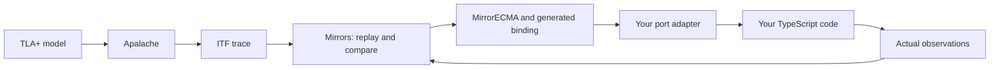

# Model-based testing of TypeScript with MirrorECMA

This manual shows how to test real TypeScript code against a TLA+ model using
MirrorECMA and Mirrors. Start with a working Counter example, then put the same
test structure into an application. Commands use Bash on Linux or WSL.

You need a behavioral model and an adapter that calls your implementation.
MirrorECMA does not infer a specification from TypeScript source code.
The main walkthrough uses the synchronous generated `mirrorecma-v1` profile.
See [asynchronous code and isolation](#6-asynchronous-code-and-isolation) for
promise-returning operations and MirrorGate.

- [Understand the test](#1-what-the-test-does)
- [Run the existing example](#2-run-a-known-working-test)
- [Integrate an application](#3-put-the-test-in-an-application)
- [Adapt your model and port](#4-adapt-the-model-and-port-to-your-own-application)
- [Generate fresh traces](#5-generate-fresh-traces-with-apalache)
- [Use async operations or isolation](#6-asynchronous-code-and-isolation)
- [Add CI checks](#7-keep-the-test-useful-in-ci)
- [Troubleshoot failures](#8-troubleshooting)

## 1. What the test does

**Model-based testing (MBT)** uses a model to choose operation sequences and
expected results. The **system under test (SUT)** is your actual application
code. A **trace** records a sequence of model actions, their inputs, and the
expected state after each action.



The generated binding translates model inputs into typed calls. Your adapter
maps those calls to application operations and reads actual application state.
Mirrors compares that observation with the expected trace state. Replay stops
on a mismatch.

| You maintain | Purpose |
| --- | --- |
| TypeScript implementation | The production behavior being tested |
| TLA+ model | Allowed actions and expected state transitions |
| Model-interface contract | Action IDs, input projections, and observations |
| Typed evidence and regression traces | Structural type declarations and selected test sequences |
| Port adapter and test runner | Calls into your code, observations, configuration, and cleanup |

The compiler maintains the interface lock, typed port, generated binding, and
generated-file ownership manifest. Do not edit the generated TypeScript.

A passing replay establishes agreement on the exercised traces. It does not
prove that the TypeScript implementation is correct for every possible input.
In particular, an adapter must not copy expected model state into its result:
that would test the adapter's ability to repeat the expected answer.

## 2. Run a known working test

### Prepare the tools

Use matching Mirrors and MirrorECMA checkouts. Install Node.js, pnpm, and the
[Mirrors build prerequisites](../README.md#requirements). Apalache is needed
for generating fresh traces; the supplied Counter replay runs without it.
MirrorGate is not required for this local synchronous walkthrough.

Set these paths for your machine, then keep the variables for later sections:

```bash
export MIRRORS_ROOT=/absolute/path/to/Mirrors
export MIRRORECMA_ROOT=/absolute/path/to/MirrorECMA
export MIRROR_BIN="$MIRRORS_ROOT/.lake/build/bin/mirror"
export MODEL_INTERFACE_GEN="$MIRRORS_ROOT/.lake/build/bin/model_interface_gen"

(cd "$MIRRORS_ROOT" && lake build mirror model_interface_gen)
cd "$MIRRORECMA_ROOT"
pnpm install --frozen-lockfile
pnpm run build
pnpm run check:examples
```

`MIRROR_BIN` must identify the current **Lean Mirrors** executable with
model-interface negotiation support. A separately installed `ModelMirrors`
may be an older implementation. For a current build, `--version` prints the
declared product version; also record the checkout commits. See
[versioning](versioning.md) for the `v0.0.1` tags, the later addition of
`--version`, and the distinction between Git tags and package manifest values.
This manual uses a local MirrorECMA checkout and does not assume an npm release
named `0.0.1` exists.

### Understand Counter's behavior

The [tutorial model](https://github.com/NzSN/MirrorECMA/blob/main/examples/generated-counter/specs/Counter.tla)
starts `count` at zero and permits increments by 2 or 3. Its implementation
contains ordinary TypeScript, with no MirrorECMA dependency:

```ts
export class Counter {
  count = 0n;
  reset(): void { this.count = 0n; }
  increment(stride: bigint): void { this.count += stride; }
}
```

The generated port and handwritten adapter connect the two descriptions:

| Model / contract | Generated method | Implementation |
| --- | --- | --- |
| `init` / `Initialize` | `initialize()` | `counter.reset()` |
| `tick` / `Tick`, input `parameters.stride` | `tick({ stride })` | `counter.increment(stride)` |
| `count` / `Count` | `observe()` | `{ count: counter.count }` |

`action_taken` selects the operation. `parameters` contains the stimulus, so
the runner sets `paramVars: "parameters"`; the implementation reports `count`,
not the input record. TLA+ `Int` values become native TypeScript `bigint`.
The generated binding handles ITF's `{"#bigint":"2"}` wire representation.

### Replay and inspect a failure

Run from the **MirrorECMA root**:

```bash
pnpm run example:counter
```

After compilation, the output is:

```text
Counter replay passed.
Action coverage: {"Initialize":1,"Tick":2}
```

The supplied trace performs reset, increment by 2, then increment by 3. The
observed values must be 0, 2, and 5. Initializers reset the implementation at
the start of each trace; do not let state from a previous trace leak into it.

Now run the deliberately faulty implementation:

```bash
pnpm run example:counter:broken
```

This demonstration is expected to exit **1**:

```text
step mismatch on action "tick" with param "[object Object]": at count: expected 2, got 1
```

The faulty operation adds `stride - 1n`. The adapter still observes the actual
Counter, so the first increment exposes the defect. A missing binary or model
also causes an error, but is not evidence of detecting an implementation bug.

Run the tutorial's automated positive and negative checks with:

```bash
pnpm run smoke:generated-counter
```

The [existing Counter tutorial](https://github.com/NzSN/MirrorECMA/blob/main/examples/generated-counter/README.md)
explains its checked-in files and compiler freshness checks in more detail.

## 3. Put the test in an application

This section builds a standalone ESM TypeScript example outside either
repository. For an existing application, retain its package settings and
production source; add the `mbt/` files and adapt the imports/configuration.
Use this sample Counter first to verify the integration, then replace the
adapter's calls with your application's operations.

### Create the project and copy model inputs

Create a **new directory** and set `MBT_APP` to its absolute path. The following
commands write a starter `package.json`; do not run them over an existing one.

```bash
export MBT_APP=/absolute/path/to/new-counter-mbt
mkdir "$MBT_APP"
cd "$MBT_APP"
mkdir -p src specs mbt
cat > package.json <<'JSON'
{
  "name": "counter-mbt-example",
  "private": true,
  "type": "module",
  "scripts": {
    "build:mbt": "tsc -p tsconfig.mbt.json",
    "test:mbt": "pnpm run build:mbt && node dist-mbt/mbt/run.js"
  }
}
JSON

pnpm add --config.auto-install-peers=false "$MIRRORECMA_ROOT"
pnpm add -D typescript@5.9.3 @types/node@22.19.19
cp "$MIRRORECMA_ROOT/examples/generated-counter/specs/Counter.tla" specs/Counter.tla
cp "$MIRRORECMA_ROOT/test/fixtures/model-interface/counter/Counter.mirror-interface.json" mbt/
cp "$MIRRORECMA_ROOT/test/fixtures/model-interface/counter/counter.itf.json" mbt/
```

The TypeScript/type-declaration versions above match the tutorial dependency
installation used to verify this guide. Commit your own lockfile. The local
MirrorECMA dependency uses its built `dist/` entrypoint, so complete its build
in section 2 first. A checkout dependency is convenient locally; CI must
prepare that checkout at an explicit compatible commit and build it too.

The copied ITF file provides explicit `#meta.varTypes` declarations as well as
the three regression states. For a different model, supply its own structural
evidence; example values alone do not establish types.

### Resolve and generate the interface

Run from the **application root**:

```bash
"$MODEL_INTERFACE_GEN" resolve \
  --spec "$PWD/specs/Counter.tla" \
  --contract "$PWD/mbt/Counter.mirror-interface.json" \
  --evidence "$PWD/mbt/counter.itf.json" \
  --param-var parameters \
  --lock "$PWD/mbt/Counter.mirror-interface.lock.json"

"$MODEL_INTERFACE_GEN" generate \
  --lock "$PWD/mbt/Counter.mirror-interface.lock.json" \
  --target mirrorecma-v1 \
  --out "$PWD/mbt/generated"
```

The resulting directory is compiler-owned. Its generated Counter interface is:

```ts
export interface CounterPort {
  initialize(): void;
  tick(input: TickInput): void;
  observe(): CounterObservation;
}
```

The complete generated file defines `TickInput`, `CounterObservation`,
`bindCounter`, and the metadata used for negotiation.

### Add the implementation and adapter

Save the Counter class from section 2 as **`src/counter.ts`**. Save the following
as **`mbt/adapter.ts`**. This imports the application implementation; it does
not implement a second state machine inside the test.

```ts
import {
  CompiledAdapterRegistry,
  MIRRORECMA_TARGET_PROFILE,
  STATE_COMPUTER_CONTRACT_VERSION,
  semanticDigestFromHex,
  type CompiledAdapterSelection,
  type LocalBinding,
} from "mirrorecma";
import {
  bindCounter,
  CounterModelInterface,
  CounterSemanticDigest,
  type CounterBinding,
  type CounterPort,
} from "./generated/CounterMirror.generated.js";
import { Counter } from "../src/counter.js";

export function createRun() {
  let binding: CounterBinding | undefined;
  const semanticDigest = semanticDigestFromHex(CounterSemanticDigest);
  const adapterId = "my-counter/v1";
  const key = {
    semanticDigest,
    adapterId,
    targetProfile: MIRRORECMA_TARGET_PROFILE,
    stateComputerContractVersion: STATE_COMPUTER_CONTRACT_VERSION,
  };
  const registry = new CompiledAdapterRegistry([{
    key,
    factory: (config): LocalBinding => {
      const counter = new Counter();
      const port: CounterPort = {
        initialize: () => counter.reset(),
        tick: ({ stride }) => counter.increment(stride),
        observe: () => ({ count: counter.count }),
      };
      const generated = bindCounter(port, config);
      binding = generated;
      return {
        semanticDigest,
        computer: generated.computer,
        assertCompatibleConfig: (candidate) => {
          if (candidate.paramVars !== "parameters") {
            throw new Error("Counter requires paramVars=parameters");
          }
        },
        coverage: generated.coverage,
        dispose: () => {}, // Counter owns no external resources.
      };
    },
  }]);
  const selection: CompiledAdapterSelection = {
    mode: "compiled",
    metadata: CounterModelInterface,
    ...key,
    registry,
    policy: "require",
  };
  return {
    selection,
    finish() {
      if (!binding) throw new Error("No negotiated binding was created");
      binding.assertAllActionsCovered();
      return binding.coverage();
    },
  };
}
```

The factory creates the Counter only after Mirrors validates the generated
interface and returns a matching negotiation result. Keep SUT construction
inside that factory, and avoid side effects at module-import time. With
`policy: "require"`, failed negotiation does not continue with an unverified
adapter. `adapterId` identifies your local mapping; the generated digest
identifies the model interface. They serve different purposes.

For resources such as temporary databases or child processes, implement
`dispose()` to release them. The runner owns disposal after creating a binding.
If factory construction fails partway through, the factory must clean up any
resources it acquired before returning a binding.

### Add the runner and compiler configuration

Save as **`mbt/run.ts`**:

```ts
import { resolve } from "node:path";
import { runClientWithTracesNegotiated, type ApalacheConfig } from "mirrorecma";
import { createRun } from "./adapter.js";

async function main(): Promise<void> {
  const binary = process.env.MIRROR_BIN;
  if (!binary) throw new Error("Set MIRROR_BIN to the Mirrors executable");
  const config: ApalacheConfig = {
    specPath: resolve("specs/Counter.tla"),
    invariant: "TraceComplete",
    lengthBound: 6,
    constInit: "CInit",
    paramVars: "parameters",
  };
  const run = createRun();
  await runClientWithTracesNegotiated(
    resolve(binary), config, [resolve("mbt/counter.itf.json")], run.selection,
  );
  const coverage = run.finish();
  console.log("Counter replay passed.");
  console.log(`Action coverage: ${JSON.stringify(coverage)}`);
}

main().catch((error: unknown) => {
  console.error(error instanceof Error ? error.message : String(error));
  process.exitCode = 1;
});
```

Use this **`tsconfig.mbt.json`** for the standalone project:

```json
{
  "compilerOptions": {
    "target": "ES2022",
    "module": "NodeNext",
    "moduleResolution": "NodeNext",
    "rootDir": ".",
    "outDir": "dist-mbt",
    "strict": true,
    "skipLibCheck": true,
    "types": ["node"]
  },
  "include": ["src/**/*.ts", "mbt/**/*.ts"]
}
```

Relative TypeScript imports use `.js` because the emitted ESM executes in
Node. Add `node_modules/` and `dist-mbt/` to your application's `.gitignore`.
Keep the generated source, ownership manifest, lock, model, contract, and
regression traces in version control.

Run from the **application root**:

```bash
pnpm run test:mbt
```

Expect the same passing output and action counts as section 2. To confirm the
test reaches your source, temporarily change `Counter.increment` to add
`stride - 1n`, rerun, and check for the expected count mismatch. Restore the
correct implementation afterward.

## 4. Adapt the model and port to your own application

Choose a small stateful feature first: a queue, document editor, cache, or
transactional store. List its operations, legal inputs, and observable state.
For example, a queue model might declare `Enqueue(item)`, `Dequeue()`, and a
`contents` observation. The adapter must call the real queue and read its
contents, including relevant order, errors, or return values in the model's
observation when they matter to the requirement.

1. Write the model's `Init` and `Next` behavior. Give each executable action a
   wire label in `action_taken`, and place operation inputs in the declared
   parameter variable. The model declares the expected behavior independently
   of the implementation.
2. Write a companion contract listing every initializer, action, input, and
   observation. The Counter contract projects `Stride` from
   `stepParameters.parameters.stride` and observes the whole `count` variable.
   Use your model's logical source identity and stable contract IDs.
3. Supply typed evidence for your model. The current compiler reads typed ITF
   metadata, including `vars`, `param_vars`, and `#meta.varTypes`; sample values
   are not a substitute for those declarations. See the
   [compiler input and evidence rules](model-interface-compiler-design.md).
4. Resolve the lock and generate the port for that model. Implement the emitted
   interface in a handwritten adapter outside the generated directory.
5. Configure `paramVars` consistently in compiler commands and the runner.
   Observations must cover the complete state Mirrors compares. Do not omit a
   model variable merely because it is hard to read from your implementation;
   decide whether to expose a test observation or change the abstraction.
6. Add regression traces for boundary values, operation order, and expected
   rejection paths. Check that initializers reset all relevant SUT state.
   A rejection that is valid application behavior should be modeled and
   observed; an unexpected thrown exception should fail the test.

If production code uses `number`, convert to or from `bigint` deliberately and
check that values fit its supported range. Do not silently round a model
integer. Observers should report actual state without changing it. When
abstracting an implementation state, document the mapping and apply it
consistently; do not use the expected trace to decide the reported result.

## 5. Generate fresh traces with Apalache

The checked-in Counter trace is a deterministic regression test. To explore
fresh Counter traces, run from the **MirrorECMA root**:

```bash
cd "$MIRRORECMA_ROOT"
APALACHE_MC=/absolute/path/to/apalache-mc pnpm run example:counter:live
APALACHE_MC=/absolute/path/to/apalache-mc pnpm run smoke:generated-counter --live
```

The live runner uses `runClientNegotiated`, sends the source closure with
`specFromFiles(model)`, and requests `{ numTraces: 1, view: "View" }`.
The [complete runner](https://github.com/NzSN/MirrorECMA/blob/main/examples/generated-counter/run.ts)
shows both live and replay paths with input/tool checks. Use its live branch
when extending the application runner from section 3.

Counter's `TraceComplete == count < 12` is intentionally a trace-producing
invariant: Apalache finds a violation and returns the path reaching it. This
does not mean the implementation failed. Mirrors subsequently checks the
implementation along that path. Do not copy this invariant into a different
application without choosing what behavior its traces should exercise.

Choose bounds and inputs to cover the behavior of interest. More requested
traces do not guarantee every action or state is reached. Preserve useful
typed ITF traces as regression inputs, and rerun them after implementation
changes. Files passed to replay must be accessible on the Mirrors host; local
stdio keeps the client and mirror on the same filesystem.

## 6. Asynchronous code and isolation

The synchronous `CounterPort` cannot safely drive asynchronous operations.
Do not start an unawaited promise from a synchronous handler and immediately
observe state. Use the distinct `mirrorecma-async-v1` generated profile for
promise-returning ports, with `AsyncCompiledAdapterRegistry` and the report
runners `runClientWithTracesNegotiatedWithReport` or
`runClientNegotiatedWithReport`. Read the
[async generated-interface contract](generated-model-interface-spec.md)
and [public MirrorECMA exports](https://github.com/NzSN/MirrorECMA/blob/main/src/index.ts)
before adapting the synchronous sample. On success, these runners return a
`ReplayReport` with `status: "completed"`, accepted trace/step counts, and
action coverage. Mismatches reject with `ReplayMismatchError`; propagate
failures to the test framework or a nonzero process exit. Use the report to
enforce your coverage requirements.

Mirrors' asynchronous **server jobs** are a separate concern: they schedule
model-checking work and do not turn a synchronous application port into an
asynchronous one.

For code that needs restricted filesystem/process access or evaluation without
access to expected states, use MirrorECMA's experimental `evaluateSandboxed`
integration with MirrorGate. It requires an approved Gate policy, prepared
submission, and supported runtime. The client manages the shared controller
through the public control SDK. Follow the
[sandboxed Counter example](https://github.com/NzSN/MirrorECMA/blob/main/examples/sandbox-counter/README.md)
and [Gate compatibility guide](https://github.com/NzSN/MirrorGate/blob/main/docs/compatibility.md).
The ordinary in-process adapter in this manual provides no sandbox isolation.

## 7. Keep the test useful in CI

For the application from section 3, run these commands from its root with the
same compiler and mirror paths used during generation:

```bash
"$MODEL_INTERFACE_GEN" check \
  --spec "$PWD/specs/Counter.tla" \
  --contract "$PWD/mbt/Counter.mirror-interface.json" \
  --evidence "$PWD/mbt/counter.itf.json" \
  --param-var parameters \
  --lock "$PWD/mbt/Counter.mirror-interface.lock.json" \
  --target mirrorecma-v1 \
  --out "$PWD/mbt/generated"

"$MODEL_INTERFACE_GEN" preflight \
  --lock "$PWD/mbt/Counter.mirror-interface.lock.json" \
  --trace "$PWD/mbt/counter.itf.json" \
  --require-all-actions

pnpm run test:mbt
```

`check` is read-only and rejects stale locks/generated output. Regenerate
intentionally during development, review the changes, and commit them; do not
silently repair stale artifacts inside CI. `preflight` checks trace structure
and declared-action coverage before execution. Runtime binding coverage counts
handlers actually invoked. Requiring all actions in one trace is suitable for
this Counter; applications with mutually exclusive actions need a deliberately
designed multi-trace coverage check. Action coverage is not state-space coverage.

Prepare dependencies with the committed lockfile and pin the companion
checkout commits. Keep deterministic replay as a regular gate and make live
Apalache checks an explicit additional tier. Preserve the failing trace,
configuration, mismatch diagnostic, model/contract lock, and tool revisions
when a test fails. For release validation of Mirrors itself, run `lake test`
and the [cross-language matrix](../tools/interop/INTEROP.md).

## 8. Troubleshooting

| Symptom | Check |
| --- | --- |
| Mirror executable missing, or negotiation unsupported | Use the built Lean executable at `MIRROR_BIN`; confirm checkout/build identity, not only its filename. |
| Model or trace not found | Run from the documented root; use absolute paths; replay paths belong to the Mirrors host. |
| `mirrorecma` cannot be imported | Build the local package's `dist/`, install/link it into the application, and preserve ESM `.js` imports. |
| Unresolved type or invalid evidence | Supply structural type metadata for all relevant variables; do not infer it from one sample value. |
| Compiler `check` fails | Reconcile model, contract, evidence, run profile, lock, and generated output; regenerate intentionally. |
| Negotiation or digest mismatch | Confirm matching generated metadata, model inputs, `paramVars`, and profile; do not bypass it with a fallback. |
| `step_mismatch` | Read the action and observation path; inspect the actual SUT operation and adapter, then compare with the preserved trace. |
| Correct implementation fails after a previous trace | Verify initialization resets all modeled state and resources are not accidentally shared across runs. |
| Required action never covered | Add traces that reach it; distinguish preflight coverage from handlers actually executed. |
| Live generation fails | Check Apalache executable, source dependencies, model predicates, and bounds; ordinary replay success does not validate this tier. |
| Tests pass despite a deliberately injected defect | Confirm the adapter invokes the production code and reads actual observations; check whether the trace exercises the defect. |

For protocol details, use the [interface reference](interface-reference.md).
The [client implementation guide](client-implementation-guide.md) is for
authors of client libraries and protocol integrations; this manual is for
application developers using MirrorECMA.

## Walkthrough verification

The synchronous walkthrough was verified on 2026-09-08 using Mirrors
`fe93fe47f554a58ed501fc70f44b64eb150b35ec` and MirrorECMA
`1d02dc02e223c52674a479e73d35d9e80e16be61`, with Node.js 24.19.0 and
TypeScript 5.9.3. Code blocks were compiled in a fresh external application:
resolve/generate, read-only check, required-action preflight, replay, and
rejection of an injected production Counter bug passed. The existing tutorial
gate also passed its offline and live Apalache tiers. Section 6 points to the
separate async/sandbox documentation; it is not an additional sandbox
certification from this walkthrough.
