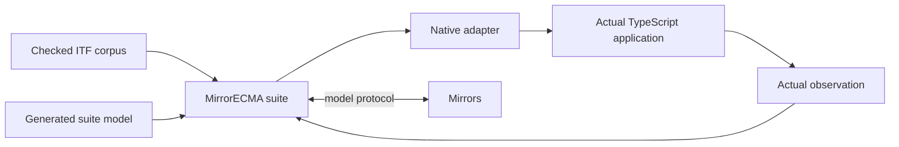

# Model-based testing of TypeScript with MirrorECMA

This tutorial uses the current application-integration model: a compiler-owned
asynchronous suite bundle, an immutable MirrorECMA suite, a checked trace corpus,
and a small native adapter that calls the real TypeScript application.

The default local path needs MirrorECMA and a compatible Mirrors compiler/server.
MirrorGate is optional and adds restricted authoring, execution, and physical
cleanup. New integrations should not assemble registry keys, decode descriptors,
or call the former Gate-aware MirrorECMA facade.

For responsibilities and trust boundaries, read the
[role-oriented integration guide](application-integration-guide.md). This page is
the runnable TypeScript walkthrough.

## 1. What the test establishes

A checked trace supplies model operations and expected states. The generated
suite model translates stable public operations into the Mirrors model protocol.
Your adapter applies those operations to the actual system under test (SUT) and
observes its actual state. Mirrors decides whether the observation matches.



A passing run establishes agreement for the selected traces and observations,
required matched coverage, and applicable cleanup. It is not an exhaustive proof.
Keep a deliberate production-code mutation as a control: the same suite and
observer must reject it at the expected model state.

## 2. Prepare installed tools

Prepare these before the application run:

- Node.js and an ESM TypeScript application;
- compatible installed `mirrorecma` package and CLI;
- `model_interface_gen` with `bundle-v1`, `check-bundle-v1`, and `preflight-v1`;
- compatible `mirror` with model-interface and checked-replay support; and
- TypeScript for the application's explicit build step.

An operator may prepare these from coordinated source checkouts, but normal
generation and replay consume pinned installed artifacts. They do not search
sibling repositories, rebuild framework packages, or install dependencies.
Checked corpus replay needs no Apalache or JDK.

Record actual SHA-256 values and package manifests in a toolchain lock. Do not
copy placeholder hashes into a real project.

## 3. Initialize the integration

From the application root:

```sh
mirrorecma init ./mbt
```

The command creates `mirror.project.json`, `mirror.toolchain.json`, and
`MIRROR-SETUP.md` without overwriting existing files. It does not create an
adapter and cannot invent or approve a behavioral model.

Arrange reviewed inputs, for example:

```text
model/
  Counter.tla
  Counter.mirror-interface.json
traces/
  counter.itf.json
src/
  counter.ts
mbt/
  mirror.project.json
  mirror.toolchain.json
  counter-adapter.mjs
.mirrors/
  Counter.mirror-interface.lock.json
  evaluator/                       # compiler-owned bundle
```

The evidence and corpus must carry the structural information required by the
compiler. A scaffold output is only a proposal; review and seal operation IDs,
input projections, observations, and model identity before generation.

## 4. Declare the Counter experiment

Edit `mbt/mirror.project.json`:

```json
{
  "schema": "mirrorecma.project/v1",
  "suiteId": "counter/v1",
  "model": {
    "source": "../model/Counter.tla",
    "contract": "../model/Counter.mirror-interface.json",
    "evidence": "../traces/counter.itf.json",
    "lock": "../.mirrors/Counter.mirror-interface.lock.json",
    "target": "mirrorecma-async-v1",
    "generatedDirectory": "../.mirrors/evaluator",
    "module": "../.mirrors/evaluator/Counter.suite.js",
    "export": "CounterModel"
  },
  "implementation": {
    "module": "./counter-adapter.mjs",
    "export": "createAdapter"
  },
  "replay": {
    "kind": "corpus",
    "config": {
      "specPath": "../model/Counter.tla",
      "initPredicate": "Init",
      "nextPredicate": "Next",
      "invariant": "TraceComplete",
      "lengthBound": 6,
      "paramVars": "parameters"
    },
    "traces": ["../traces/counter.itf.json"]
  },
  "acceptance": {
    "requiredActions": ["Tick"],
    "requiredPairs": [["Tick", "Tick"]]
  },
  "execution": {
    "mirror": { "kind": "local" },
    "timeouts": {
      "registrationMs": 60000,
      "actionMs": 10000,
      "receiveMs": 60000,
      "cleanupMs": 10000
    }
  },
  "toolchainLock": "./mirror.toolchain.json"
}
```

Paths resolve against the project file. Adjust predicates and bounds to the
actual model; they are not inferred. Trace order and repetition are significant.
Repetition can verify reset behavior but does not establish distinct behavior.

In `mirror.toolchain.json`, pin compiler/server bytes and the installed
MirrorECMA manifest. The complete schema and remote-server form are in
[MirrorECMA project tools](../../MirrorECMA/docs/project-tools.md). Explicit
`--compiler` or `--server` overrides must still match the selected pin.

## 5. Generate and compile the suite bundle

```sh
mirrorecma generate --project ./mbt/mirror.project.json
```

Generation resolves the sealed contract and publishes the compiler-owned bundle.
It does not generate a trace or implement Counter. The bundle includes the
asynchronous binding, `Counter.suite.ts`, private descriptor, sanitized public
manifest, provenance, and owned-file hashes.

Compile the generated TypeScript during application preparation:

```sh
./node_modules/.bin/tsc .mirrors/evaluator/Counter.suite.ts \
  --target ES2022 --module NodeNext --moduleResolution NodeNext \
  --strict --skipLibCheck --noEmitOnError
```

An existing `tsconfig` may own this step instead. Keep the model, contract,
evidence, corpus, lock, bundle, ownership manifests, project file, and toolchain
lock under version control. Never hand-edit generated files.

## 6. Implement the real Counter adapter

Assume the application contains:

```ts
export class Counter {
  #count = 0n;
  reset(): void { this.#count = 0n; }
  increment(stride: bigint): void { this.#count += stride; }
  get count(): bigint { return this.#count; }
}
```

Compile application TypeScript through its normal build. Then implement
`mbt/counter-adapter.mjs` against the emitted module:

```js
import { Counter } from "../dist/counter.js";

export async function createAdapter() {
  const counter = new Counter();
  return {
    actions: {
      Initialize: async () => counter.reset(),
      Tick: async ({ Stride }) => counter.increment(Stride),
    },
    observe: async () => ({ Count: counter.count }),
  };
}
```

`Initialize`, `Tick`, `Stride`, and `Count` are stable IDs from this example.
Use the names emitted for your model. Integers are `bigint`; use native `Set`
and string-key `Map` for declared collections. Generated conversion validates
complete inputs before an action and complete observations before reporting.

Actions must await real effects and complete with `undefined`. The observer must
read the real application. Do not duplicate the model or retain expected state
inside the adapter.

For staged resources, accept `context`, call `context.deferCleanup` immediately
after each acquisition, and return one final `dispose` for transferred ownership.

## 7. Check and replay

```sh
mirrorecma doctor --project ./mbt/mirror.project.json
mirrorecma check --project ./mbt/mirror.project.json
mirrorecma replay --project ./mbt/mirror.project.json
```

`check` verifies inputs, lock, bundle, provenance, and corpus without repair.
`replay` loads the trusted suite model, negotiates with Mirrors, and only then
imports and invokes the adapter factory.

Success requires matched conformance, met acceptance, and successful cleanup. A
matching corpus without `Tick -> Tick` fails with `coverage_unmet`; it is not a
model mismatch.

Confirm the test reaches production code: temporarily change `increment` to add
`stride - 1n`, rebuild only the application, and replay the unchanged project.
Expect a genuine mismatch at the first affected state. Restore the implementation
and verify the pass. Do not change the observer or model to fit the defect.

CLI exits are 0 for full success, 1 for genuine mismatch with successful cleanup,
and 2 for configuration, execution, coverage, timeout, cancellation, cleanup,
or persistence failures.

## 8. Use the suite API directly

```ts
import { defineSuite, runSuite } from "mirrorecma";
import { CounterModel } from "./.mirrors/evaluator/Counter.suite.js";

const suite = defineSuite({
  id: "counter/v1",
  model: CounterModel,
  replay: {
    kind: "corpus",
    config: {
      specPath: "./model/Counter.tla",
      invariant: "TraceComplete",
      lengthBound: 6,
      constInit: "CInit",
      paramVars: "parameters",
    },
    traces: ["./traces/counter.itf.json"],
  },
  acceptance: {
    requiredActions: ["Tick"],
    requiredPairs: [["Tick", "Tick"]],
  },
});

const result = await runSuite(suite, {
  mirror: "/approved/bin/mirror",
  implementation: async (context) => {
    const { createAdapter } = await import("./mbt/counter-adapter.mjs");
    const port = await createAdapter(context);
    return { port, dispose: () => port.dispose?.() };
  },
});
```

The suite is immutable and owns no live resource. Each run creates at most one
implementation after required match and reinitializes it for every trace. See
[checked application suites](../../MirrorECMA/docs/application-suites.md) for
remote references, cancellation, deadlines, cleanup, and result semantics.

## 9. Add MirrorGate isolation or managed authoring

Local replay executes trusted code in the evaluator. For restricted work,
generate a public adapter kit from `CounterModel.publicManifest` with
`mirrorgate/adapter-kit`. Give the author only approved behavior prose,
generated declarations, public structural checks, and admitted source. Keep the
model, traces, expected states, evaluator binding, credentials, and receipts private.

Configure an operator-approved `node-esm/v1` profile with explicit JavaScript
sources, entry point, Node hash, dependencies, and limits. TypeScript compilation
needs separate approved preparation; the profile installs nothing and runs no
submitted build hook. Require `hosting.public-environment-v1` for managed authoring.

Run the same suite through the Gate-owned integration:

```ts
import { evaluateSuite } from "mirrorgate-mirrorecma";

const outcome = await evaluateSuite(suite, {
  mirror: "/approved/bin/mirror",
  environment: approvedEnvironment,
  submission: approvedSubmission,
  receipt: { path: "/private/new-counter-receipt.json" },
});
```

Gate retains its owner through worker acquisition and physical cleanup. The
trusted receipt separates suite results, local disposal, Gate cleanup, and
persistence; the public projection excludes private model evidence. Follow
[MirrorGate's runtime guide](../../MirrorGate/docs/application-integration-runtime.md)
and [suite workflow](../../MirrorGate/integrations/mirrorecma/WORKFLOW.md).

## 10. CI and troubleshooting

In CI, verify pinned identities, build the real application and generated suite,
run `mirrorecma check`, replay the deterministic corpus, and verify a known faulty
implementation's expected mismatch. Run fresh Apalache generation separately.
When Gate is part of the claim, require its real Bubblewrap backend and verify
physical cleanup and disclosure negatives. An unavailable tier is not a pass.

| Symptom | Check |
| --- | --- |
| Adapter factory was never called | Inspect preflight, corpus hashes, and required negotiation; zero calls are correct on denial. |
| Generated module cannot be imported | Compile `<Model>.suite.ts`, use ESM `.js` imports, and point `model.module` at the emitted file. |
| `coverage_unmet` after matching replay | Select traces containing the required stable action/pair. |
| Observation codec failure | Return the generated native shape with `bigint`, native sets/maps, exact tuples, closed records, and declared variants. |
| First trace passes and the second fails | Ensure every initializer resets all modeled resources. |
| Timeout after disposal | A pending operation may leave local quiescence unconfirmed; JavaScript cannot preempt a CPU loop. |
| Remote cannot find a file | Configure explicit server-visible paths; nothing is uploaded implicitly. |
| Gate structural checks pass but MBT fails | Structural checks do not establish business semantics or observer fidelity. |

## Legacy integrations

Synchronous `mirrorecma-v1`, registry, dynamic-descriptor, and low-level replay
APIs remain supported for specialized callers. The former `evaluateSandboxed`
and model-reconstruction helpers live in Gate's documented legacy integration.
Do not use them to start a new application. Use an async suite bundle, project
commands or `defineSuite` / `runSuite`, and optional Gate-owned `evaluateSuite`.
