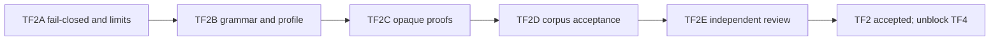

# TF2 parser acceptance recovery plan

> Status: **accepted on 2026-09-11; TF4 is unblocked**
>
> Parent ledger: [TLA+ frontend tasks](tla-frontend-tasks.md)
>
> Design authority: [general TLA+ frontend](tla-frontend-design.md)
>
> Frozen behavior profile: [TLA+ language profile](tla-language-profile.md)

## 1. Objective

Move TF2 from a compiling parser draft to an accepted lossless parser slice.
Acceptance requires a fail-closed parser, complete revision-1 syntax behavior,
uniform resource limits, durable corpus-driven tests, and an independent review.

Only these implementation files are in scope:

- `Core/Tla/Syntax.lean`;
- `Core/Tla/Parser.lean`; and
- `tools/TlaParserSpec.lean`.

The lexer/profile/corpus, module graph, compiler, Apalache loader, generated
targets, protocols, `lakefile.lean`, and `Shell.lean` remain outside TF2. A
profile or corpus problem is reported to the coordinating agent.

## 2. Starting state

The current draft has useful partial evidence:

- `Core/Tla/Syntax.lean` compiles;
- `Core/Tla/Parser.lean` compiles;
- all 31 accepted corpus source files return a successful parse in an ad hoc
  probe;
- all six parse-stage rejected fixtures return parse failures; and
- sampled CSTs retain the complete normalized source.

TF2 remains unaccepted because `tools/TlaParserSpec.lean` is absent and review
found four correctness families:

1. diagnostic truncation may leave `module? = some` alongside an error;
2. syntax depth is not enforced for every recursive expression form;
3. opaque proof scanning mistakes proof-local syntax for module declarations;
4. unbounded quantification and user-defined prefix/postfix operators are
   incomplete.

Additional review must check source/token-stream consistency and normalized
string values before the interface is frozen.

## 3. Sequencing



Each implementation handoff finishes and releases file ownership before the
next begins. Later specialists may modify earlier TF2 files only to satisfy a
newly failing acceptance case within their assigned package.

## 4. Assignment map

| Package | Assigned `specification_implementer` | Ownership | Gate |
| --- | --- | --- | --- |
| TF2A | `tf2_fail_closed` | `Core/Tla/Parser.lean`, initial `tools/TlaParserSpec.lean` | current draft compiles |
| TF2B | `tf2_grammar` | `Core/Tla/Syntax.lean`, `Core/Tla/Parser.lean`, extend parser spec | TF2A green |
| TF2C | `tf2_proof_regions` | parser proof handling, extend parser spec | TF2B green |
| TF2D | `tf2_corpus_acceptance` | parser spec only; parser edits require a returned finding and reassignment | TF2C green |
| TF2E | `tf2_acceptance_review` | read-only review | TF2D green |

The coordinating agent owns task status, cross-slice arbitration, aggregate
builds, and any later `lakefile.lean` registration.

## 5. TF2A — fail-closed outcomes and uniform resource accounting

### Required changes

1. Compute parser failure after diagnostic truncation is materialized, or treat
   `DiagnosticBuffer.truncated` directly as failure. Every outcome containing an
   error-severity diagnostic must have `module? = none`.
2. Introduce one nesting guard/helper rather than duplicating increment/decrement
   logic. It must restore nesting state on every normal and diagnostic path.
3. Apply the guard to every recursively nested syntax form, including:
   parentheses, tuples, sets, functions, records, bracket forms, prefix chains,
   `IF`, `CASE`, `LET`, `CHOOSE`, quantifiers, fairness, argument lists,
   comprehensions, `EXCEPT`, and nested declaration parameter/arity forms.
4. Keep structural fuel as a separate totality backstop. Fuel exhaustion is an
   error and never substitutes for `maxNestingDepth` enforcement.
5. Validate `parseStream` inputs: the token stream must have one final EOF and
   must reproduce the supplied `SourceUnit.normalizedText`. An inconsistent
   source/stream pair fails without a module.

### Required tests

Create the initial `tools/TlaParserSpec.lean` with focused tests for:

- diagnostic budgets `0`, `1`, and limit-plus-one;
- malformed source with `maxDiagnostics := 0` producing `module? = none`;
- `maxNestingDepth := 0` rejecting every nested syntax family;
- each family at the configured limit and limit-plus-one;
- repeated prefix and nested conditional/quantifier forms;
- inconsistent source/stream text;
- absent, duplicate, and non-final EOF; and
- deterministic repeated failures.

### Acceptance

```bash
lake env lean Core/Tla/Parser.lean
lake env lean tools/TlaParserSpec.lean
lake env lean --run tools/TlaParserSpec.lean
```

The executable prints `TLA PARSER SPEC GREEN`. A mutation that restores the old
truncation ordering or removes one nesting guard must make the suite fail.

## 6. TF2B — grammar and language-profile completion

### Profile-owned precedence

Replace the global precedence/fixity table with parser-profile data supplied to
the entry point. The default revision-1 profile owns its operator table. Tests
must construct a modified profile and show that parsing changes accordingly;
referencing a global table behind the profile does not satisfy this requirement.

Keep lexer spelling normalization separate from parser fixity/precedence. The
default `parseUnit` convenience path selects the frozen revision-1 combination.

### Quantifiers

Support both forms:

```tla
\A x \in S : P(x)
\A x : P(x)
\E x \in S, y \in T : P(x, y)
\E x, y : P(x, y)
```

`Bound.domain = none` represents an unbounded name. A comma group cannot mix
ambiguous syntax silently; malformed separators or missing `:` are errors.

### User-defined operators

Parse functional, infix, prefix, and postfix operator definitions and record
the correct `OperatorFixity`, normalized operator identity, parameter order, and
source ranges. Add application tests for each supported fixity. Built-in postfix
prime/index/selection remains distinct from a user-defined postfix operator.

The accepted `AcceptOperators.tla` fixture remains green. Add focused inline
cases for prefix and postfix definitions because the frozen corpus currently
does not independently exercise both claims.

### Normalized literal values

The CST retains original string spelling. The AST `Expression.string` must carry
the decoded string value, with validated escapes interpreted exactly once.
Round-trip source fidelity stays in the CST. Add ordinary, escaped quote,
backslash, tab, newline, carriage-return, and form-feed cases.

### Acceptance

- Existing accepted and parser-stage rejected fixtures retain their outcomes.
- Precedence/associativity renderings match expected summaries.
- Unbounded quantifier ASTs contain `domain = none`.
- Prefix/postfix definition and application ASTs have exact fixity and arity.
- String AST values are semantic values while CST text remains byte-identical.
- All TF2A tests remain green.

## 7. TF2C — bounded opaque proof regions

### Required behavior

Replace declaration-looking-token termination with a proof-aware bounded scan.
Revision 1 must correctly retain:

- theorem statements without a proof;
- `PROOF OMITTED`;
- `PROOF OBVIOUS` when admitted by the frozen profile;
- `BY` proof terminals when admitted by the profile; and
- structured proof regions ending at their matching top-level `QED`.

Proof-local `ASSUME`, `HAVE`, `TAKE`, `PICK`, `WITNESS`, `SUFFICES`, `CASE`,
`DEFINE`, `USE`, `HIDE`, `LET`, and `name == expression` text must remain inside
the opaque proof region. The following module declaration must still be found.

The scan tracks proof-step level and delimiters sufficiently to find the region
end. Unsupported or ambiguous proof syntax produces a profile-limit/error
diagnostic and no module. It never guesses that a proof-local definition is a
top-level declaration.

### Resource rules

- Proof scanning consumes explicit token/fuel/nesting budgets.
- Missing `QED`, excessive proof depth, and diagnostic truncation fail closed.
- Recovery retains all tokens in the CST.

### Acceptance

Add tests containing proof-local declarations followed by real top-level
declarations. Assert one opaque proof range, correct following declarations,
lossless CST, exact errors for malformed proof termination, and deterministic
limit behavior. All TF2A/TF2B tests remain green.

## 8. TF2D — corpus-driven durable acceptance suite

### Manifest ownership

The suite reads `test/fixtures/tla-frontend/manifest.json` through strict JSON
decoding. It must fail on an unknown outcome/stage, duplicate fixture ID, missing
source/summary, or a fixture not accounted for by a test branch.

### Accepted fixtures

For every accepted fixture/bundle:

- parse each source successfully;
- require `module?` only with no error diagnostics;
- assert module name, declaration kinds/names/arities/lines, dependencies,
  substitutions, and parser-owned renderings against the expected summary;
- assert CST token/trivia losslessness, full source coverage, nested ordered
  ranges, and deterministic repeat output; and
- compare declared ASCII alias-equivalence groups after AST normalization.

Graph, effective-variable, source-manifest, name-resolution, and level fields in
expected summaries belong to later stages; TF2 must explicitly ignore them by a
closed allowlist rather than accidentally claiming them.

### Rejected fixtures

- Lex-stage fixtures must fail before parsing and retain their expected code.
- Parse-stage fixtures must fail at parse with `module? = none`.
- Later-stage fixtures must parse successfully; TF2 must not preemptively reject
  valid syntax intended for module graph, name, substitution, or level analysis.
- `profile_limit` fixtures fail at their declared stage only.

### Adversarial tests

Include generated bounded families for:

- deep recursive syntax across every constructor;
- long declaration lists;
- diagnostic count/byte exhaustion;
- malformed delimiter/recovery combinations;
- proof-like declaration tokens;
- source/stream inconsistencies; and
- deterministic parser termination.

### Acceptance

The suite reports total fixture/branch counts and prints `TLA PARSER SPEC GREEN`.
Both elaboration and executable invocations pass. A negative mutation check must
prove that summary mismatches and wrongly accepted/rejected fixtures make the
suite nonzero.

## 9. TF2E — independent final review

The final reviewer is read-only and reports two axes:

### Standards

- repository Lean style;
- Core remains free of `Shell` imports;
- small parser interface and localized implementation;
- no duplicated limit logic that can omit a syntax form;
- no unused speculative public structures; and
- no `sorry`, `admit`, or axioms.

### Specification

- every TF2 design and profile branch is implemented or explicitly staged;
- successful outcomes contain no errors;
- error outcomes expose no module;
- CST is lossless and ranges are valid;
- normalized AST values/fixities/precedence are correct;
- every recursion path is bounded;
- proof-local syntax cannot escape its proof region; and
- all accepted/rejected corpus expectations are driven by the durable suite.

Any high or medium finding returns ownership to the appropriate TF2 package.
TF2 is accepted only after the reviewer reports no actionable findings.

## 10. Final gates

The coordinating agent reruns:

```bash
lake build Core.Tla.Parser
lake env lean tools/TlaParserSpec.lean
lake env lean --run tools/TlaParserSpec.lean
lake build Shell.Tla.ModuleResolver
lake env lean --run tools/TlaModuleResolverSpec.lean
lake build
```

`lake test` registration remains coordinating-agent work after TF2 is accepted.
The existing model-interface compiler and generated goldens must remain
unchanged throughout TF2.

## 11. Completion criteria

TF2 reaches acceptance only when:

1. TF2A–TF2D pass in dependency order;
2. `tools/TlaParserSpec.lean` is present, live, and corpus-driven;
3. the truncation/module invariant has a permanent regression;
4. all recursive syntax honors one nesting policy;
5. the default operator table is supplied by the parser profile;
6. bounded/unbounded quantifiers and all declared operator fixities work;
7. opaque proof regions do not leak proof-local syntax;
8. all corpus outcomes and parser-owned summaries match;
9. TF2E reports no actionable finding;
10. TF3's resolver remains green; and
11. the parent ledger is updated from `draft` to `accepted`, unblocking TF4.

## 12. Completion record

TF2A–TF2D were implemented by sequential `specification_implementer`
assignments. TF2E independently reported no actionable findings. The final
parser suite covers 57 fixtures (27 accepted and 30 rejected), 72 profile
branches, 98 fixture-branch links, fail-closed/resource behavior, grammar and
operator profiles, opaque proofs, structural summaries, and live negative
mutation checks.

The coordinating agent reran the focused parser, lexer, and module-resolver
gates, registered `tla_parser_spec` as a default Lake target, and added it to
`lake test`. TF2 changes no model-interface, StateComputer, generated-target, or
wire contract. TF4 may now consume the accepted parser and Core-owned graph.

A repository-wide `timeout 600 lake test` attempt reached its external wall-time
bound before the aggregate driver emitted buffered child output. The focused
gates and full `lake build` passed; a complete unbounded `lake test` rerun on the
user's high-end machine remains pending and is not claimed here.
