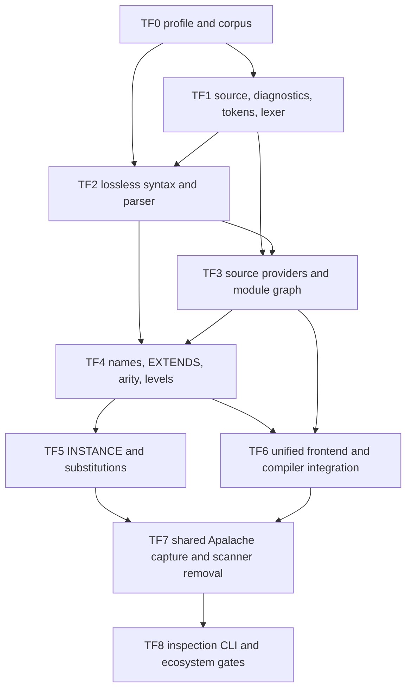

# General TLA+ frontend implementation tasks

> Status: **implementation plan; TF0–TF3b accepted on 2026-09-11; TF4 is
> unblocked**
>
> Design authority: [general TLA+ frontend](tla-frontend-design.md)
>
> Focused TF2 recovery: [parser acceptance tasks](tf2-acceptance-tasks.md)
>
> Scope rule: implement only the assigned task package. Findings outside an
> owner's files are reported to the coordinating agent rather than repaired
> opportunistically.

## 1. Objective

Deliver the proposed native TLA+ frontend in bounded, reviewable slices while
preserving current model-interface bytes and fail-closed behavior. The final
system must give every model-interface compiler command one parsed, resolved,
and elaborated captured source graph.

The motivating acceptance case is `DumpLedgerTransfer.tla`: twelve variables
inherited from `DumpLedger.tla` plus seven locally declared variables must be
recognized as nineteen effective variables without allowing an unexplained
twentieth evidence variable.

This ledger does not authorize changes to the Mirrors JSONL protocol,
StateComputer contracts, generated target profiles, MirrorECMA APIs, or
MirrorGate control/worker records.

## 2. Delivery graph



TF0 and TF1 may begin together. TF2 may define syntax against the frozen TF1
interface but cannot be accepted until TF1 passes. TF3 may prepare provider and
graph types against TF1, but parser-driven dependency discovery waits for TF2.
All later tasks are sequential integration work.

## 3. Shared constraints

Every task must preserve these constraints:

- Lean files use two-space indentation and neighboring naming conventions.
- No `sorry`, axioms, or unchecked partial success enters the frontend.
- Error recovery may construct diagnostic state, but a result containing an
  error diagnostic cannot enter successful elaboration or compilation.
- Every recursive or accumulating algorithm has explicit resource bounds.
- Source hashing remains normalized UTF-8 byte hashing; AST reprinting does not
  change source identity.
- Physical paths stay out of persisted and public artifacts.
- Existing self-contained model-interface locks and generated output remain
  byte-identical unless a separately approved schema migration requires change.
- Generated fixtures are refreshed only through `model_interface_gen`.
- Agents do not edit `lakefile.lean`, `Shell.lean`, aggregate documentation, or
  another task's files. The coordinating agent owns integration wiring.
- The untracked `Docs/NzSN-Formalism.code-workspace` remains untouched.

## 4. Assignment map

| Package | Assigned specialist | Files owned during package | Dependency |
| --- | --- | --- | --- |
| TF0 | `specification_implementer` / `tla_profile_corpus` | language profile and frontend corpus only | none |
| TF1 | `specification_implementer` / `tla_lexer` | `Core/Tla/{Source,Diagnostic,Token,Lexer}.lean`, lexer spec | TF0 decisions |
| TF2 | `specification_implementer` / `tla_parser` | `Core/Tla/{Syntax,Parser}.lean`, parser spec | TF1 interface |
| TF3 | `specification_implementer` / `tla_source_graph` | `Shell/Tla/{SourceProvider,ModuleResolver}.lean`, resolver spec | TF1, TF2 |
| TF3b | `specification_implementer` / `tla_graph_core_move` | `Core/Tla/Graph.lean`, resolver and spec imports | TF3 |
| TF4 | `specification_implementer` / `tla_elaboration` after TF2 acceptance | `Core/Tla/{Names,Elaboration,Level}.lean`, elaboration spec | TF2, TF3b |
| TF5 | `specification_implementer` / `tla_instance` after TF4 | INSTANCE/substitution additions in TF4-owned modules and focused spec | TF4 |
| TF6 | `specification_implementer` / `tla_compiler_integration` after TF5 | `Shell/Tla/Frontend.lean`, compiler integration and focused specs | TF3–TF5 |
| TF7 | `specification_implementer` / `tla_capture_migration` after TF6 | `Shell/Apalache/SpecSource.lean` migration and snapshot equivalence specs | TF5, TF6 |
| TF8 | `specification_implementer` / `tla_frontend_cli` after TF7 | inspection CLI, ecosystem docs/fixtures; coordinator wires aggregate gates | TF7 |

One specialist owns a file at a time. A later assignment may modify an earlier
file only after the earlier owner has completed and the coordinating agent has
accepted its handoff.

## 5. TF0 — language profile and conformance corpus

**Owner:** `tla_profile_corpus`

### Scope

Create:

- `Docs/model-interface-compiler/tla-language-profile.md`;
- `test/fixtures/tla-frontend/manifest.json`;
- accepted lexical/syntax fixtures under `test/fixtures/tla-frontend/accepted/`;
- rejected fixtures under `test/fixtures/tla-frontend/rejected/`; and
- expected structural summaries under `test/fixtures/tla-frontend/expected/`.

Do not implement Lean parsing code or edit build wiring.

### Required profile decisions

The document and manifest must distinguish:

- executable TLA+ module syntax;
- ASCII and Unicode spellings;
- nested comments and strings;
- declaration and expression grammar;
- `EXTENDS`, named/unnamed `INSTANCE`, substitutions, and `LOCAL`;
- proof-body treatment;
- PlusCal treatment;
- Apalache annotation treatment;
- standard-module identity; and
- intentional staged unsupported cases.

Fixtures must have stable IDs, expected stage/outcome, and an explanation. Tool
versions are placeholders until pinned by the coordinating agent; the corpus
must not claim an external differential result that was not run.

### Acceptance

- The manifest is strict valid JSON with unique fixture IDs and relative paths.
- Every language-profile branch has at least one accepted or rejected fixture.
- No fixture contains private application model material.
- DumpLedger-shaped generic `EXTENDS` and nineteen-variable fixtures exist
  without copying the private application model.
- Markdown/link/JSON checks pass.

## 6. TF1 — source, diagnostic, token, and lexer foundation

**Owner:** `tla_lexer`

### Scope

Create:

- `Core/Tla/Source.lean`;
- `Core/Tla/Diagnostic.lean`;
- `Core/Tla/Token.lean`;
- `Core/Tla/Lexer.lean`; and
- `tools/TlaLexerSpec.lean`.

Do not implement CST/AST parsing, source-provider IO, module traversal,
elaboration, or compiler integration.

### Interface

The slice must supply:

- normalized source text and compiler-independent `SourceIdentity`;
- half-open UTF-8 byte ranges plus one-based line/scalar-column positions;
- bounded structured diagnostics;
- lossless tokens with trivia and original spellings;
- explicit lexer limits; and
- a pure `lex` result that cannot represent success with error diagnostics.

Recognize module delimiters, identifiers, keywords, strings, numeric spellings,
punctuation, ASCII/Unicode operators, line comments, and nested block comments.
Preserve annotations as trivia; do not interpret them.

### Negative paths

Cover invalid UTF-8 construction boundaries where representable, unterminated
strings/comments, newline in strings, excessive nesting, oversized tokens,
invalid controls, range accounting across multibyte scalars, and deterministic
limit failures.

### Acceptance

- `lake env lean tools/TlaLexerSpec.lean` passes.
- Token/trivia concatenation reproduces normalized source bytes.
- Equivalent repeated runs produce equal tokens and diagnostics.
- Boundary tests exercise every lexer limit at limit and limit-plus-one.
- No existing module imports or tests change.

## 7. TF2 — lossless syntax and parser

**Owner:** `tla_parser`

### Scope

Create:

- `Core/Tla/Syntax.lean`;
- `Core/Tla/Parser.lean`; and
- `tools/TlaParserSpec.lean`.

Consume TF1 interfaces. Do not perform filesystem loading, module traversal,
name resolution, substitutions, level checking, or compiler integration.

### Required syntax

Represent lossless module/CST nodes and normalized AST declarations for:

- constants, variables, recursive operators, definitions, `LOCAL`, instances,
  assumptions, axioms, and theorems;
- literals, names, applications, tuples, records, sets, and functions;
- `IF/THEN/ELSE`, `CASE`, `LET/IN`, and `CHOOSE`;
- quantifiers and comprehensions;
- selection and `EXCEPT`;
- priming, `ENABLED`, `UNCHANGED`, fairness, and temporal operators; and
- proof bodies according to the TF0 staged profile.

Precedence and associativity live in explicit data. Bounded recovery may resume
at declaration/delimiter synchronization points, but parse success requires no
error diagnostics.

### Acceptance

- `lake env lean tools/TlaParserSpec.lean` passes.
- Every accepted TF0 syntax fixture parses to its expected summary.
- Every rejected fixture fails at the expected stage with bounded diagnostics.
- CST source ranges nest correctly and retain every token/trivia item.
- Precedence, associativity, and ASCII/Unicode alias cases are independently
  asserted.
- Deep nesting terminates with a limit diagnostic rather than stack failure.

## 8. TF3 — source providers and module graph

**Owner:** `tla_source_graph`

### Scope

Create:

- `Shell/Tla/SourceProvider.lean`;
- `Shell/Tla/ModuleResolver.lean`; and
- `tools/TlaModuleResolverSpec.lean`.

Use TF1 source identities and TF2 parsed dependency declarations. Do not modify
`Shell/Apalache/SpecSource.lean` or the model-interface compiler yet.

### Required adapters

- Borrowed-directory provider with bounded reads, canonical sibling module
  names, symlink/special-file rejection, identity rechecks, and no path escape.
- Inline-source-map provider with closed logical identities and no filesystem
  access.
- Explicit standard-module catalog lookup separated from local source loading.

### Graph rules

Retain edge kind, source range, substitutions, `LOCAL`, and source order.
Canonical output must handle direct/transitive dependencies, diamonds, missing
modules, duplicate names, filename/header mismatch, standard modules, and cycles.

### Acceptance

- `lake env lean tools/TlaModuleResolverSpec.lean` passes.
- Borrowed and inline adapters produce equivalent logical graphs for equal
  source maps.
- A diamond reads/parses one logical module once.
- Cycle diagnostics contain a bounded complete cycle path.
- All filesystem adversarial cases leave no accepted partial graph.
- Current production source loading remains untouched.

## 9. TF4 — declarations, names, `EXTENDS`, arity, and levels

**Owner:** a reused `specification_implementer` after TF2 and TF3 acceptance

### Scope

Create:

- `Core/Tla/Names.lean`;
- `Core/Tla/Elaboration.lean`;
- `Core/Tla/Level.lean`; and
- `tools/TlaElaborationSpec.lean`.

Implement direct declarations, scopes, operator arity, bound names, `LET`,
`LOCAL`, `EXTENDS` visibility, legal diamond reuse, ambiguity diagnostics, and
constant/state/action/temporal levels. Variable-bearing `INSTANCE` remains an
explicit unsupported error in this slice.

### Acceptance

- Self-contained variables retain declaration order.
- Transitive `EXTENDS` computes effective variables with exact origins/import
  paths.
- The generic transfer fixture reports twelve inherited plus seven local
  variables.
- A fabricated twentieth evidence name has no resolved declaration.
- Distinct declarations with the same visible name fail with related locations.
- Level and arity fixtures agree with the frozen TF0 expectations.

## 10. TF5 — `INSTANCE` and substitution semantics

**Owner:** a reused `specification_implementer` after TF4 acceptance

### Scope

Extend TF4-owned elaboration files and focused tests to support:

- named and unnamed instances;
- constant, variable, and operator substitutions;
- substitution arity and level constraints;
- qualified/unqualified visibility;
- chained instances; and
- declaration/source provenance through substitution.

Do not change compiler or emitter interfaces.

### Acceptance

- Unsubstituted, fully substituted, partially invalid, named, unnamed, chained,
  and `LOCAL INSTANCE` fixtures have explicit outcomes.
- Effective root variables exclude child variables replaced by parent symbols.
- Dependency sources remain in provenance even when all variables are
  substituted.
- No fallback concatenates dependency variable lists.
- Differential structural results match the pinned accepted corpus.

## 11. TF6 — unified frontend and compiler integration

**Owner:** a reused `specification_implementer` after TF3–TF5 acceptance

### Scope

Create `Shell/Tla/Frontend.lean` and migrate model-interface source analysis in:

- `Shell/ModelInterface/Compiler.lean`;
- focused scaffold/evidence/projection/compiler specs; and
- codec/types only if a separately reviewed proposal-schema revision requires
  them.

Emitters remain untouched.

### Required behavior

- `scaffold`, `project-trace`, `resolve`, and `check` consume one frontend
  result.
- Effective source variables exactly match raw evidence variables before
  parameter partition or projection.
- Source-only diagnostics name declaration origins.
- Evidence-only diagnostics do not invent origins.
- A dependency edit invalidates checks/provenance.
- Existing self-contained locks/generated output remain byte-identical.

### Acceptance

- All existing model-interface focused suites pass.
- New composed-source suites pass.
- DumpLedgerTransfer scaffold succeeds on nineteen-variable evidence and rejects
  a fabricated twentieth variable.
- `resolve/check` cannot accept a source/evidence pair rejected by scaffold.
- No target or protocol version changes.

## 12. TF7 — shared capture and scanner retirement

**Owner:** a reused `specification_implementer` after TF6 acceptance

### Scope

Migrate `Shell/Apalache/SpecSource.lean` so frontend analysis and Apalache
snapshot publication consume the same captured normalized source units. Remove
production use of the old dependency and variable scanners only after
equivalence gates pass.

### Acceptance

- Existing valid closures produce the same sorted source digests.
- Apalache receives exactly the bytes analyzed by the frontend.
- Borrowed mutation/symlink/missing-dependency tests remain green.
- Inline and borrowed source behavior remains compatible.
- `rg` finds no production caller of the retired scanners.
- Snapshot cleanup and cancellation behavior is unchanged.

## 13. TF8 — inspection CLI and ecosystem validation

**Owner:** a reused `specification_implementer` after TF7 acceptance

### Scope

Create the separate `tla_frontend` development executable with `parse`,
`resolve`, and `inspect` operations; add closed JSON inspection/diagnostic output;
update frontend/compiler documentation and public fixtures.

Do not add development commands to the operational `mirror` executable.

### Acceptance

- CLI help and malformed-argument tests are exact.
- Human and JSON diagnostics carry equivalent facts.
- Default output contains no physical path.
- `lake test` includes frontend gates.
- MirrorECMA generated Counter, MirrorCPP generated Counter, and MirrorGate
  applicable integration gates pass without interface changes.
- Live Apalache tiers and differential external-tool tiers report exact executed
  or unavailable status.

## 14. Coordinating-agent integration ownership

The coordinating agent owns files shared by multiple slices:

- `lakefile.lean` executable/test registration;
- `Shell.lean` aggregate imports;
- task/design/index status updates;
- cross-slice interface reconciliation;
- generated fixture refresh commands;
- cross-repository link maintenance; and
- aggregate validation.

After each handoff the coordinator must review:

1. owned-file scope;
2. public interface size and dependency direction;
3. error-path cleanup and resource bounds;
4. absence of partial-success admission;
5. proof/linter state;
6. focused test evidence; and
7. compatibility with already accepted slices.

Green claims without destination-tree edits and rerun evidence are not accepted.

## 15. Aggregate gates

The final delivery requires, from the Mirrors root:

```bash
lake build
lake test
```

Run focused frontend suites directly after building. The expected executable
names are finalized when the coordinator wires `lakefile.lean`:

```text
tla_lexer_spec
tla_parser_spec
tla_module_resolver_spec
tla_elaboration_spec
tla_frontend_spec
tla_frontend_cli_spec
```

Also require:

```bash
bash tools/interop/run.sh
```

with its documented external clients and live Apalache prerequisites. For the
Mirror-Framework path, run MirrorECMA's generated-interface checks and the
applicable MirrorGate required-backend suite. Report every skipped or unavailable
tier; a base interop pass is not a sandbox certification.

## 16. Completion criteria

The task group is complete only when:

1. TF0–TF8 are accepted in dependency order;
2. one frontend result supplies every model-interface command;
3. supported `EXTENDS` and `INSTANCE` semantics pass differential fixtures;
4. DumpLedgerTransfer's nineteen-variable scaffold/generate/preflight/harness
   path passes, including deliberate-fault rejection;
5. all existing self-contained generated output remains stable;
6. the old scanners have no production callers;
7. analysis and Apalache use one captured source closure;
8. frontend resource and filesystem negative paths pass;
9. no model/client/worker/control wire contract changed; and
10. destination status, aggregate gates, and cross-repository evidence are
    recorded in this ledger.

## 17. Wave-2 dispatch (2026-09-11)

### 17.1 Workspace state

Observed directly in the repository on 2026-09-11 after the TF3b handoff.

| Package | Artifacts present | State |
| --- | --- | --- |
| TF0 | language profile and `test/fixtures/tla-frontend/` | Accepted: 57 fixtures, 27 accepted/30 rejected outcomes, 72/72 profile branches, 27 expected summaries, source hashes, and local reference-parser expectations passed strict checks. External differential slots remain explicitly `not_run`. |
| TF1 | `Core/Tla/{Source,Diagnostic,Token,Lexer}.lean`, `tools/TlaLexerSpec.lean` | Accepted: the coordinator reran both required spec invocations; each printed `TLA LEXER SPEC GREEN`. The suite has 114 checks in 15 scenarios. |
| TF2 | `Core/Tla/{Syntax,Parser}.lean` and `tools/TlaParserSpec.lean` | Accepted after TF2A–TF2E: 57 fixtures, 72 branches, structural summaries, recovery/resource boundaries, proof opacity, operator/profile behavior, and mutation checks pass. The independent review reported no actionable findings. |
| TF3 | source providers, resolver, and resolver spec | Accepted through its injected `ParseModule` seam: the coordinator reran the module build and both spec invocations; the executable printed `TLA MODULE RESOLVER SPEC GREEN`. Actual parser composition remains a later frontend gate. |
| TF3b | `Core/Tla/Graph.lean` plus resolver/provider import moves | Accepted: pure graph and standard-module data now live in Core; resolution behavior and all existing assertions remain unchanged, and `Core/` has no `Shell` import. |

Cross-checks performed while preparing this dispatch: no `sorry` or `admit` in
the TF1–TF3b sources; no `Core/**` module imports `Shell/**`; `lakefile.lean` and
`Shell.lean` are unmodified, so no frontend module, spec, or executable is
registered in the build yet.

### 17.2 TF3b — Core-owned module graph (blocks TF4)

**Owner:** `specification_implementer` taking the TF3 handoff.

**Files:** `Core/Tla/Graph.lean` (new), `Shell/Tla/ModuleResolver.lean`,
`tools/TlaModuleResolverSpec.lean`.

`DependencyResolution`, `ModuleEdge`, `ModuleNode`, `ResolvedModuleGraph`, and
their pure helpers are declared in `Shell.Tla`
(`Shell/Tla/ModuleResolver.lean:43-131`), but the design names
`Core.Tla.ResolvedModuleGraph` in the frontend result (sections 7 and 12) and
places the elaborator in Core (sections 6 and 13). A pure
`Core/Tla/Elaboration.lean` cannot consume a `Shell` type, and inverting the
dependency would break the architecture rule that keeps effects in `Shell`.
This package is the coordinator's reconciliation of the TF3 cross-slice finding.

Move pure data and pure helpers only:

- create `Core/Tla/Graph.lean` holding `DependencyResolution`, `ModuleEdge`,
  `ModuleNode`, `ResolvedModuleGraph`, and the helpers `findNode?`,
  `sortedNodes`, `sourceIdentities`, `canonicalEdges`, and `standardNames`;
- keep `ResolverLimits`, `ResolverConfig`, `ResolverFailure`, the `GraphCode`
  constants, providers, and `resolve` in `Shell/Tla/ModuleResolver.lean`;
- adjust imports and `Shell.Tla.*` qualifications in the resolver and its
  specification; make no behavioural edit.

Acceptance:

- `lake build Shell.Tla.ModuleResolver` completes;
- `lake env lean tools/TlaModuleResolverSpec.lean` and
  `lake env lean --run tools/TlaModuleResolverSpec.lean` are green with no
  assertion deleted or weakened;
- `rg -n "^import Shell" Core/` is empty;
- resolution order, canonical ordering, limits, and diagnostic codes are
  unchanged.

### 17.3 TF4 dispatch brief — names, `EXTENDS`, arity, levels

**Owner:** `specification_implementer` reused after the TF3b handoff.

**Gate:** satisfied by accepted TF2 and TF3b.

**Files:** `Core/Tla/Names.lean`, `Core/Tla/Elaboration.lean`,
`Core/Tla/Level.lean`, `tools/TlaElaborationSpec.lean`.

Consume, do not re-derive: `Core.Tla.parseUnit` or the TF3 resolver's parse
seam, the moved `Core.Tla.ResolvedModuleGraph`, `Core.Tla.LanguageProfile`,
`Core.Tla.SourceUnit`/`SourceIdentity`, and `Core.Tla.Diagnostic`. Elaboration
is pure: no IO, no filesystem access, no second source read, and no re-lexing of
captured text.

Required behaviour, keyed to the frozen corpus:

- effective variables for `accepted/generic-transfer` produce the twelve
  `GenericBase` variables followed by the seven `GenericTransfer` variables,
  with `declaredIn`, `declaredName`, and `importPath` equal to
  `expected/acc-generic-transfer.json`;
- operator levels for `accepted/AcceptLevels` equal `expected/acc-levels.json`;
- rejected fixtures match their manifest `stage` and `reason`:
  `rej-arity-mismatch`, `rej-unknown-name`, `rej-duplicate-declaration`, and
  `rej-extends-ambiguity` at `nameResolution`; `rej-level-assume` at `level`;
  every `rej-instance-*` and `rej-substitution-*` fixture remains a
  `profile_limit` at `substitution` until TF5;
- `LOCAL` visibility, `LET`, bound names, and higher-order operator parameters
  follow the design's scope, arity, and level rules (sections 13.1–13.3);
- a name with no resolved declaration is an error even when a similarly spelled
  declaration exists elsewhere in the graph;
- diagnostics are structured, with a stable code, primary and related
  declaration locations, and bounded count and bytes.

Acceptance:

- `lake env lean tools/TlaElaborationSpec.lean` and
  `lake env lean --run tools/TlaElaborationSpec.lean` are green;
- the specification drives the corpus fixtures above and uses no private model
  material;
- a fabricated twentieth evidence name resolves to no declaration while the
  nineteen-variable set resolves in full;
- declaration, symbol, and diagnostic limits have boundary tests at the limit
  and at limit plus one;
- `Core/Tla` remains free of `Shell` and model-interface imports.

### 17.4 Sequencing and handoff contract

Dispatch order for wave 2 is TF3b → TF4 → TF5 → TF6 → TF7 → TF8. TF6 also waits
for the TF3 resolver handoff, and TF7 and TF8 keep the gates already recorded in
sections 12 and 13.

Every wave-2 handoff reports back in this ledger's terms:

1. the owned files actually changed, with `git status` evidence;
2. the exact commands run and their observed results, distinguishing rerun
   evidence from owner-reported claims;
3. the corpus fixtures exercised, and any expectation that could not be driven
   from the manifest;
4. cross-slice findings left unrepaired, addressed to the coordinator.

The coordinator reruns each package's acceptance commands before marking it
accepted, and owns `lakefile.lean` registration for `tla_lexer_spec`,
`tla_parser_spec`, `tla_module_resolver_spec`, `tla_elaboration_spec`,
`tla_frontend_spec`, and `tla_frontend_cli_spec`.

### 17.5 Outstanding items owned elsewhere

- **TF2 parser gate.** `tools/TlaParserSpec.lean` is present, accepted, and
  registered in `lakefile.lean`; TF4 may consume the parser interface.
- **Build wiring.** `lakefile.lean` and `Shell.lean` are untouched, so no
  frontend target is registered or gated yet.
- **Differential gates.** The `sany` and `apalache` corpus entries are
  `not_run`; the compatibility claims of design section 5 stay unverified until
  the coordinator records pinned tool versions.
- **Design open decisions.** Section 30 items 2 (proof-body treatment), 5
  (standard-module catalog sourcing), and 9 (scaffold proposal revision scope)
  affect TF4, TF5, and TF6 and are coordinator decisions rather than
  implementer choices.
