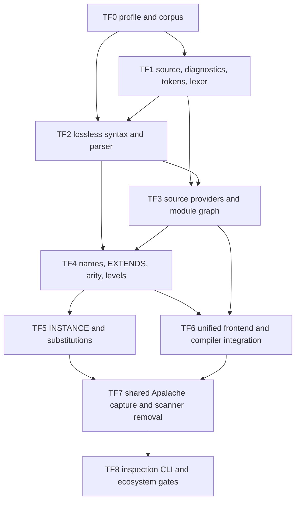
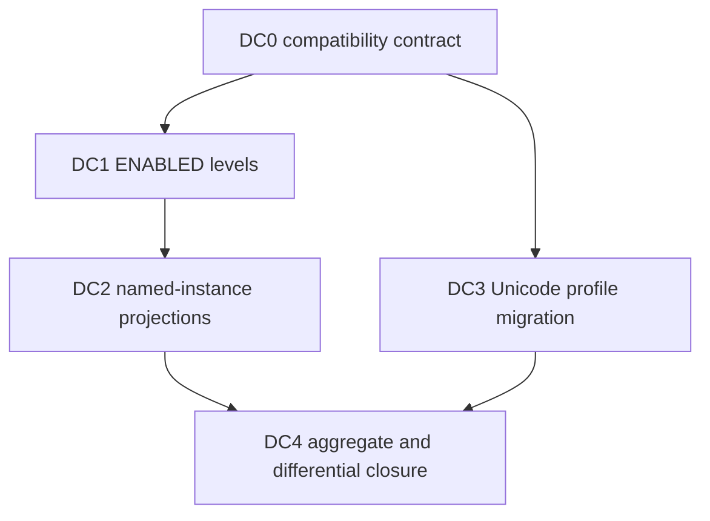

# General TLA+ frontend implementation tasks

> Status: **implementation plan; TF0–TF3b accepted on 2026-09-11; TF4–TF8
> implemented and accepted on 2026-09-12 for the Mirrors-local scope. The
> cross-language interop matrix and live Apalache tiers are green; the MirrorGate
> matrix remains unverified. The profile-2 corpus-wide differential run failed
> on 2026-09-13; DC0–DC4 closed its eleven findings under profile 3 on
> 2026-09-14. See sections 17.7–17.8 and 18.8 for the historical and current
> evidence.**
>
> Design authority: [general TLA+ frontend](tla-frontend-design.md)
>
> Focused TF2 recovery: [parser acceptance tasks](tf2-acceptance-tasks.md)
>
> Scope rule: implement only the assigned task package. Findings outside an
> owner's files are reported to the coordinating agent rather than repaired
> opportunistically.

## 1. Objective

Deliver the proposed native TLA+ frontend in bounded, reviewable slices while
preserving current model-interface bytes and fail-closed behavior. The final
system must give every model-interface compiler command one parsed, resolved,
and elaborated captured source graph.

The motivating acceptance case is `DumpLedgerTransfer.tla`: twelve variables
inherited from `DumpLedger.tla` plus seven locally declared variables must be
recognized as nineteen effective variables without allowing an unexplained
twentieth evidence variable.

This ledger does not authorize changes to the Mirrors JSONL protocol,
StateComputer contracts, generated target profiles, MirrorECMA APIs, or
MirrorGate control/worker records.

## 2. Delivery graph



TF0 and TF1 may begin together. TF2 may define syntax against the frozen TF1
interface but cannot be accepted until TF1 passes. TF3 may prepare provider and
graph types against TF1, but parser-driven dependency discovery waits for TF2.
All later tasks are sequential integration work.

## 3. Shared constraints

Every task must preserve these constraints:

- Lean files use two-space indentation and neighboring naming conventions.
- No `sorry`, axioms, or unchecked partial success enters the frontend.
- Error recovery may construct diagnostic state, but a result containing an
  error diagnostic cannot enter successful elaboration or compilation.
- Every recursive or accumulating algorithm has explicit resource bounds.
- Source hashing remains normalized UTF-8 byte hashing; AST reprinting does not
  change source identity.
- Physical paths stay out of persisted and public artifacts.
- Existing self-contained model-interface locks and generated output remain
  byte-identical unless a separately approved schema migration requires change.
- Generated fixtures are refreshed only through `model_interface_gen`.
- Agents do not edit `lakefile.lean`, `Shell.lean`, aggregate documentation, or
  another task's files. The coordinating agent owns integration wiring.
- The untracked `Docs/NzSN-Formalism.code-workspace` remains untouched.

## 4. Assignment map

| Package | Assigned specialist | Files owned during package | Dependency |
| --- | --- | --- | --- |
| TF0 | `specification_implementer` / `tla_profile_corpus` | language profile and frontend corpus only | none |
| TF1 | `specification_implementer` / `tla_lexer` | `Core/Tla/{Source,Diagnostic,Token,Lexer}.lean`, lexer spec | TF0 decisions |
| TF2 | `specification_implementer` / `tla_parser` | `Core/Tla/{Syntax,Parser}.lean`, parser spec | TF1 interface |
| TF3 | `specification_implementer` / `tla_source_graph` | `Shell/Tla/{SourceProvider,ModuleResolver}.lean`, resolver spec | TF1, TF2 |
| TF3b | `specification_implementer` / `tla_graph_core_move` | `Core/Tla/Graph.lean`, resolver and spec imports | TF3 |
| TF4 | `specification_implementer` / `tla_elaboration` after TF2 acceptance | `Core/Tla/{Names,Elaboration,Level}.lean`, elaboration spec | TF2, TF3b |
| TF5 | `specification_implementer` / `tla_instance` after TF4 | INSTANCE/substitution additions in TF4-owned modules and focused spec | TF4 |
| TF6 | `specification_implementer` / `tla_compiler_integration` after TF5 | `Shell/Tla/Frontend.lean`, compiler integration and focused specs | TF3–TF5 |
| TF7 | `specification_implementer` / `tla_capture_migration` after TF6 | `Shell/Apalache/SpecSource.lean` migration and snapshot equivalence specs | TF5, TF6 |
| TF8 | `specification_implementer` / `tla_frontend_cli` after TF7 | inspection CLI, ecosystem docs/fixtures; coordinator wires aggregate gates | TF7 |

One specialist owns a file at a time. A later assignment may modify an earlier
file only after the earlier owner has completed and the coordinating agent has
accepted its handoff.

## 5. TF0 — language profile and conformance corpus

**Owner:** `tla_profile_corpus`

### Scope

Create:

- `Docs/model-interface-compiler/tla-language-profile.md`;
- `test/fixtures/tla-frontend/manifest.json`;
- accepted lexical/syntax fixtures under `test/fixtures/tla-frontend/accepted/`;
- rejected fixtures under `test/fixtures/tla-frontend/rejected/`; and
- expected structural summaries under `test/fixtures/tla-frontend/expected/`.

Do not implement Lean parsing code or edit build wiring.

### Required profile decisions

The document and manifest must distinguish:

- executable TLA+ module syntax;
- ASCII and Unicode spellings;
- nested comments and strings;
- declaration and expression grammar;
- `EXTENDS`, named/unnamed `INSTANCE`, substitutions, and `LOCAL`;
- proof-body treatment;
- PlusCal treatment;
- Apalache annotation treatment;
- standard-module identity; and
- intentional staged unsupported cases.

Fixtures must have stable IDs, expected stage/outcome, and an explanation. Tool
versions are placeholders until pinned by the coordinating agent; the corpus
must not claim an external differential result that was not run.

### Acceptance

- The manifest is strict valid JSON with unique fixture IDs and relative paths.
- Every language-profile branch has at least one accepted or rejected fixture.
- No fixture contains private application model material.
- DumpLedger-shaped generic `EXTENDS` and nineteen-variable fixtures exist
  without copying the private application model.
- Markdown/link/JSON checks pass.

## 6. TF1 — source, diagnostic, token, and lexer foundation

**Owner:** `tla_lexer`

### Scope

Create:

- `Core/Tla/Source.lean`;
- `Core/Tla/Diagnostic.lean`;
- `Core/Tla/Token.lean`;
- `Core/Tla/Lexer.lean`; and
- `tools/TlaLexerSpec.lean`.

Do not implement CST/AST parsing, source-provider IO, module traversal,
elaboration, or compiler integration.

### Interface

The slice must supply:

- normalized source text and compiler-independent `SourceIdentity`;
- half-open UTF-8 byte ranges plus one-based line/scalar-column positions;
- bounded structured diagnostics;
- lossless tokens with trivia and original spellings;
- explicit lexer limits; and
- a pure `lex` result that cannot represent success with error diagnostics.

Recognize module delimiters, identifiers, keywords, strings, numeric spellings,
punctuation, ASCII/Unicode operators, line comments, and nested block comments.
Preserve annotations as trivia; do not interpret them.

### Negative paths

Cover invalid UTF-8 construction boundaries where representable, unterminated
strings/comments, newline in strings, excessive nesting, oversized tokens,
invalid controls, range accounting across multibyte scalars, and deterministic
limit failures.

### Acceptance

- `lake env lean tools/TlaLexerSpec.lean` passes.
- Token/trivia concatenation reproduces normalized source bytes.
- Equivalent repeated runs produce equal tokens and diagnostics.
- Boundary tests exercise every lexer limit at limit and limit-plus-one.
- No existing module imports or tests change.

## 7. TF2 — lossless syntax and parser

**Owner:** `tla_parser`

### Scope

Create:

- `Core/Tla/Syntax.lean`;
- `Core/Tla/Parser.lean`; and
- `tools/TlaParserSpec.lean`.

Consume TF1 interfaces. Do not perform filesystem loading, module traversal,
name resolution, substitutions, level checking, or compiler integration.

### Required syntax

Represent lossless module/CST nodes and normalized AST declarations for:

- constants, variables, recursive operators, definitions, `LOCAL`, instances,
  assumptions, axioms, and theorems;
- literals, names, applications, tuples, records, sets, and functions;
- `IF/THEN/ELSE`, `CASE`, `LET/IN`, and `CHOOSE`;
- quantifiers and comprehensions;
- selection and `EXCEPT`;
- priming, `ENABLED`, `UNCHANGED`, fairness, and temporal operators; and
- proof bodies according to the TF0 staged profile.

Precedence and associativity live in explicit data. Bounded recovery may resume
at declaration/delimiter synchronization points, but parse success requires no
error diagnostics.

### Acceptance

- `lake env lean tools/TlaParserSpec.lean` passes.
- Every accepted TF0 syntax fixture parses to its expected summary.
- Every rejected fixture fails at the expected stage with bounded diagnostics.
- CST source ranges nest correctly and retain every token/trivia item.
- Precedence, associativity, and ASCII/Unicode alias cases are independently
  asserted.
- Deep nesting terminates with a limit diagnostic rather than stack failure.

## 8. TF3 — source providers and module graph

**Owner:** `tla_source_graph`

### Scope

Create:

- `Shell/Tla/SourceProvider.lean`;
- `Shell/Tla/ModuleResolver.lean`; and
- `tools/TlaModuleResolverSpec.lean`.

Use TF1 source identities and TF2 parsed dependency declarations. Do not modify
`Shell/Apalache/SpecSource.lean` or the model-interface compiler yet.

### Required adapters

- Borrowed-directory provider with bounded reads, canonical sibling module
  names, symlink/special-file rejection, identity rechecks, and no path escape.
- Inline-source-map provider with closed logical identities and no filesystem
  access.
- Explicit standard-module catalog lookup separated from local source loading.

### Graph rules

Retain edge kind, source range, substitutions, `LOCAL`, and source order.
Canonical output must handle direct/transitive dependencies, diamonds, missing
modules, duplicate names, filename/header mismatch, standard modules, and cycles.

### Acceptance

- `lake env lean tools/TlaModuleResolverSpec.lean` passes.
- Borrowed and inline adapters produce equivalent logical graphs for equal
  source maps.
- A diamond reads/parses one logical module once.
- Cycle diagnostics contain a bounded complete cycle path.
- All filesystem adversarial cases leave no accepted partial graph.
- Current production source loading remains untouched.

## 9. TF4 — declarations, names, `EXTENDS`, arity, and levels

**Owner:** a reused `specification_implementer` after TF2 and TF3 acceptance

### Scope

Create:

- `Core/Tla/Names.lean`;
- `Core/Tla/Elaboration.lean`;
- `Core/Tla/Level.lean`; and
- `tools/TlaElaborationSpec.lean`.

Implement direct declarations, scopes, operator arity, bound names, `LET`,
`LOCAL`, `EXTENDS` visibility, legal diamond reuse, ambiguity diagnostics, and
constant/state/action/temporal levels. Variable-bearing `INSTANCE` remains an
explicit unsupported error in this slice.

### Acceptance

- Self-contained variables retain declaration order.
- Transitive `EXTENDS` computes effective variables with exact origins/import
  paths.
- The generic transfer fixture reports twelve inherited plus seven local
  variables.
- A fabricated twentieth evidence name has no resolved declaration.
- Distinct declarations with the same visible name fail with related locations.
- Level and arity fixtures agree with the frozen TF0 expectations.

## 10. TF5 — `INSTANCE` and substitution semantics

**Owner:** a reused `specification_implementer` after TF4 acceptance

### Scope

Extend TF4-owned elaboration files and focused tests to support:

- named and unnamed instances;
- constant, variable, and operator substitutions;
- substitution arity and level constraints;
- qualified/unqualified visibility;
- chained instances; and
- declaration/source provenance through substitution.

Do not change compiler or emitter interfaces.

### Acceptance

- Unsubstituted, fully substituted, partially invalid, named, unnamed, chained,
  and `LOCAL INSTANCE` fixtures have explicit outcomes.
- Effective root variables exclude child variables replaced by parent symbols.
- Dependency sources remain in provenance even when all variables are
  substituted.
- No fallback concatenates dependency variable lists.
- Differential structural results match the pinned accepted corpus.

## 11. TF6 — unified frontend and compiler integration

**Owner:** a reused `specification_implementer` after TF3–TF5 acceptance

### Scope

Create `Shell/Tla/Frontend.lean` and migrate model-interface source analysis in:

- `Shell/ModelInterface/Compiler.lean`;
- focused scaffold/evidence/projection/compiler specs; and
- codec/types only if a separately reviewed proposal-schema revision requires
  them.

Emitters remain untouched.

### Required behavior

- `scaffold`, `project-trace`, `resolve`, and `check` consume one frontend
  result.
- Effective source variables exactly match raw evidence variables before
  parameter partition or projection.
- Source-only diagnostics name declaration origins.
- Evidence-only diagnostics do not invent origins.
- A dependency edit invalidates checks/provenance.
- Existing self-contained locks/generated output remain byte-identical.

### Acceptance

- All existing model-interface focused suites pass.
- New composed-source suites pass.
- DumpLedgerTransfer scaffold succeeds on nineteen-variable evidence and rejects
  a fabricated twentieth variable.
- `resolve/check` cannot accept a source/evidence pair rejected by scaffold.
- No target or protocol version changes.

## 12. TF7 — shared capture and scanner retirement

**Owner:** a reused `specification_implementer` after TF6 acceptance

### Scope

Migrate `Shell/Apalache/SpecSource.lean` so frontend analysis and Apalache
snapshot publication consume the same captured normalized source units. Remove
production use of the old dependency and variable scanners only after
equivalence gates pass.

### Acceptance

- Existing valid closures produce the same sorted source digests.
- Apalache receives exactly the bytes analyzed by the frontend.
- Borrowed mutation/symlink/missing-dependency tests remain green.
- Inline and borrowed source behavior remains compatible.
- `rg` finds no production caller of the retired scanners.
- Snapshot cleanup and cancellation behavior is unchanged.

## 13. TF8 — inspection CLI and ecosystem validation

**Owner:** a reused `specification_implementer` after TF7 acceptance

### Scope

Create the separate `tla_frontend` development executable with `parse`,
`resolve`, and `inspect` operations; add closed JSON inspection/diagnostic output;
update frontend/compiler documentation and public fixtures.

Do not add development commands to the operational `mirror` executable.

### Acceptance

- CLI help and malformed-argument tests are exact.
- Human and JSON diagnostics carry equivalent facts.
- Default output contains no physical path.
- `lake test` includes frontend gates.
- MirrorECMA generated Counter, MirrorCPP generated Counter, and MirrorGate
  applicable integration gates pass without interface changes.
- Live Apalache tiers and differential external-tool tiers report exact executed
  or unavailable status.

## 14. Coordinating-agent integration ownership

The coordinating agent owns files shared by multiple slices:

- `lakefile.lean` executable/test registration;
- `Shell.lean` aggregate imports;
- task/design/index status updates;
- cross-slice interface reconciliation;
- generated fixture refresh commands;
- cross-repository link maintenance; and
- aggregate validation.

After each handoff the coordinator must review:

1. owned-file scope;
2. public interface size and dependency direction;
3. error-path cleanup and resource bounds;
4. absence of partial-success admission;
5. proof/linter state;
6. focused test evidence; and
7. compatibility with already accepted slices.

Green claims without destination-tree edits and rerun evidence are not accepted.

## 15. Aggregate gates

The final delivery requires, from the Mirrors root:

```bash
lake build
lake test
```

Run focused frontend suites directly after building. The expected executable
names are finalized when the coordinator wires `lakefile.lean`:

```text
tla_lexer_spec
tla_parser_spec
tla_module_resolver_spec
tla_elaboration_spec
tla_frontend_spec
tla_frontend_cli_spec
```

Also require:

```bash
bash tools/interop/run.sh
```

with its documented external clients and live Apalache prerequisites. For the
Mirror-Framework path, run MirrorECMA's generated-interface checks and the
applicable MirrorGate required-backend suite. Report every skipped or unavailable
tier; a base interop pass is not a sandbox certification.

## 16. Completion criteria

The task group is complete only when:

1. TF0–TF8 are accepted in dependency order;
2. one frontend result supplies every model-interface command;
3. supported `EXTENDS` and `INSTANCE` semantics pass differential fixtures;
4. DumpLedgerTransfer's nineteen-variable scaffold/generate/preflight/harness
   path passes, including deliberate-fault rejection;
5. all existing self-contained generated output remains stable;
6. the old scanners have no production callers;
7. analysis and Apalache use one captured source closure;
8. frontend resource and filesystem negative paths pass;
9. no model/client/worker/control wire contract changed; and
10. destination status, aggregate gates, and cross-repository evidence are
    recorded in this ledger.

## 17. Wave-2 dispatch (2026-09-11)

### 17.1 Workspace state

Observed directly in the repository on 2026-09-11 after the TF3b handoff; the
TF4–TF8 rows record the 2026-09-11/12 implementation and acceptance. Section
17.6 records which acceptance tiers were not executed.

| Package | Artifacts present | State |
| --- | --- | --- |
| TF0 | language profile and `test/fixtures/tla-frontend/` | Accepted: 57 fixtures, 27 accepted/30 rejected outcomes, 72/72 profile branches, 27 expected summaries, source hashes, and local reference-parser expectations passed strict checks. External differential slots remain explicitly `not_run`. |
| TF1 | `Core/Tla/{Source,Diagnostic,Token,Lexer}.lean`, `tools/TlaLexerSpec.lean` | Accepted: the coordinator reran both required spec invocations; each printed `TLA LEXER SPEC GREEN`. The suite has 114 checks in 15 scenarios. |
| TF2 | `Core/Tla/{Syntax,Parser}.lean` and `tools/TlaParserSpec.lean` | Accepted after TF2A–TF2E: 57 fixtures, 72 branches, structural summaries, recovery/resource boundaries, proof opacity, operator/profile behavior, and mutation checks pass. The independent review reported no actionable findings. |
| TF3 | source providers, resolver, and resolver spec | Accepted through its injected `ParseModule` seam: the coordinator reran the module build and both spec invocations; the executable printed `TLA MODULE RESOLVER SPEC GREEN`. Actual parser composition remains a later frontend gate. |
| TF3b | `Core/Tla/Graph.lean` plus resolver/provider import moves | Accepted: pure graph and standard-module data now live in Core; resolution behavior and all existing assertions remain unchanged, and `Core/` has no `Shell` import. |
| TF4 | `Core/Tla/{Names,Level,Elaboration}.lean` and `tools/TlaElaborationSpec.lean` | Accepted: both required spec invocations printed `TLA ELABORATION SPEC GREEN`; all 27 accepted fixtures elaborated and matched their frozen effective-variable/source summaries, all 30 rejected fixtures were driven, and the 12 TF4-owned rejections matched stage and reason. An independent review reported no actionable findings. |
| TF5 | `Core/Tla/{Names,Elaboration}.lean` and `tools/TlaElaborationSpec.lean` | Accepted 2026-09-12: both required spec invocations print `TLA ELABORATION SPEC GREEN`; 32 accepted fixtures elaborate and match their frozen summaries, 25 rejected fixtures are driven, and the instance probes cover named, unnamed, chained, `LOCAL INSTANCE`, nested re-export, implicit substitution, duplicate rejection with a related earlier-site location, arity/level rejection, standard-module instance facts, and qualified-constant rejection. The five staged fixtures were reclassified in the manifest with generated summaries (fixture files untouched), and the `elab.instance.staged` branch was retired. `tla_lexer_spec`, `tla_parser_spec`, and `tla_module_resolver_spec` stayed green. An independent review reran every gate above in a separate session on 2026-09-12 and reported no actionable findings. |
| TF6 | `Shell/Tla/Frontend.lean`, `tools/TlaFrontendSpec.lean`, and the model-interface compiler/scaffold integration | Accepted 2026-09-12: `lake build` succeeds on the incremental tree; `tla_lexer_spec`, `tla_parser_spec`, `tla_module_resolver_spec`, `tla_elaboration_spec`, `tla_frontend_spec`, `model_interface_spec`, `model_interface_scaffold_spec`, `model_interface_evidence_spec`, `model_interface_trace_projection_spec`, `model_interface_scaffold_cli_spec`, `model_interface_trace_projection_cli_spec`, and `fixtures_replay` all exit zero. One frontend result supplies scaffold, project-trace, resolve, and check; the composed-source suite proves 19 effective variables (12 inherited + 7 local), source-only origins, origin-free evidence-only diagnostics, no proposal or lock on refusal, and that a dependency edit invalidates captured provenance. On the real `DumpLedgerTransfer.tla` corpus the nineteen-variable trace scaffolds to a proposal with 17 observations and four unsealed input candidates per transition, while a fabricated twentieth variable is refused by scaffold, resolve, and check with `MIC-S-SOURCE-001` and no artifact written. The `mirrorecma-v1`, `mirrorecma-async-v1`, and `mirrorcpp-v1` golden `check` invocations and `preflight` stay clean, so existing locks and generated output are unchanged, and the diff carries no target or protocol version change. |
| TF7 | `Shell/Apalache/SpecSource.lean` and `tools/ApalacheCliSpec.lean` | Accepted 2026-09-12: borrowed and inline capture, module-name discovery, and `EXTENDS`/`INSTANCE` dependency discovery now run through `Shell.Tla.SourceProvider` and one `Core.Tla.parseSource` parse; the local token scanner (`codeOnlySource`, `sourceTokens`, `collectDependencies`, and the duplicated `knownStandardModules` list) is removed, while closure policy (budgets, cycle termination, snapshot materialization, temp-dir lifecycle) stays in this module. Inline materialization publishes the captured normalized bytes, so the file Apalache opens is the text the manifest hashes. `apalache_cli_spec` prints `APALACHE CLI GREEN` with its pre-existing scenarios unchanged and one new `unified-capture-equivalence` scenario: the borrowed manifest is sorted, every digest equals SHA-256 over the captured normalized bytes, the manifest agrees with an independent `SourceProvider.readRootFile` capture, a missing sibling dependency is refused, inline manifests keep source order and logical paths, published inline bytes hash to their manifest entries, CRLF sources normalize before publication, and the retired-scanner gate finds no `Shell/` caller besides the definition file. The suite's frozen snapshot digests were not edited, so closure digests still match the retired scanner's output. `Shell/ModelInterface/SpecVariables.lean` has no production caller; it remains only as the subject of `tools/ModelInterfaceEvidenceSpec.lean`. |
| TF8 | `Codec/TlaFrontendJson.lean`, `Shell/Tla/Frontend.lean`, `tools/TlaFrontendCli.lean`, `tools/TlaFrontendCliSpec.lean`, `test/fixtures/tla-frontend/cli/`, and `Docs/model-interface-compiler/tla-frontend-cli.md` | Accepted 2026-09-12 for the Mirrors-local scope: `tla_frontend` exposes `parse`, `resolve`, and `inspect` over one captured frontend analysis with the closed `mirrors.tla-frontend-inspection/v1` document, and the operational `mirror` executable gains no development command. `tla_frontend_cli_spec` prints `TLA FRONTEND CLI GREEN`: exact frozen usage and malformed-argument stderr for missing/unknown command, missing value, duplicate option, unsupported format, a section flag on `resolve`, and a non-`.tla` root; closed key sets for successful and failed `parse`/`resolve`/`inspect` documents; human/JSON diagnostic equivalence; no physical path in default output; byte-identical repeated `resolve`; nineteen effective variables (12 inherited + 7 local); and the byte-pinned `inspect --variables --format json` fixture. `lake test` runs the new gate after `tla_frontend_spec`. The MirrorECMA/MirrorCPP generated Counter, MirrorGate, `tools/interop/run.sh`, live-Apalache, and `sany` tiers were not executed here; section 17.6 records the exact status. |

At the TF3b handoff, cross-checks found no `sorry` or `admit` in the TF1–TF3b
sources and no `Core/**` module import of `Shell/**`. At that time,
`lakefile.lean` and `Shell.lean` were unmodified and no frontend executable was
registered; section 17.5 records the later coordinator-owned registrations.

### 17.2 TF3b — Core-owned module graph (blocks TF4)

**Owner:** `specification_implementer` taking the TF3 handoff.

**Files:** `Core/Tla/Graph.lean` (new), `Shell/Tla/ModuleResolver.lean`,
`tools/TlaModuleResolverSpec.lean`.

`DependencyResolution`, `ModuleEdge`, `ModuleNode`, `ResolvedModuleGraph`, and
their pure helpers are declared in `Shell.Tla`
(`Shell/Tla/ModuleResolver.lean:43-131`), but the design names
`Core.Tla.ResolvedModuleGraph` in the frontend result (sections 7 and 12) and
places the elaborator in Core (sections 6 and 13). A pure
`Core/Tla/Elaboration.lean` cannot consume a `Shell` type, and inverting the
dependency would break the architecture rule that keeps effects in `Shell`.
This package is the coordinator's reconciliation of the TF3 cross-slice finding.

Move pure data and pure helpers only:

- create `Core/Tla/Graph.lean` holding `DependencyResolution`, `ModuleEdge`,
  `ModuleNode`, `ResolvedModuleGraph`, and the helpers `findNode?`,
  `sortedNodes`, `sourceIdentities`, `canonicalEdges`, and `standardNames`;
- keep `ResolverLimits`, `ResolverConfig`, `ResolverFailure`, the `GraphCode`
  constants, providers, and `resolve` in `Shell/Tla/ModuleResolver.lean`;
- adjust imports and `Shell.Tla.*` qualifications in the resolver and its
  specification; make no behavioural edit.

Acceptance:

- `lake build Shell.Tla.ModuleResolver` completes;
- `lake env lean tools/TlaModuleResolverSpec.lean` and
  `lake env lean --run tools/TlaModuleResolverSpec.lean` are green with no
  assertion deleted or weakened;
- `rg -n "^import Shell" Core/` is empty;
- resolution order, canonical ordering, limits, and diagnostic codes are
  unchanged.

### 17.3 TF4 dispatch brief — names, `EXTENDS`, arity, levels

**Owner:** `specification_implementer` reused after the TF3b handoff.

**Gate:** satisfied by accepted TF2 and TF3b.

**Files:** `Core/Tla/Names.lean`, `Core/Tla/Elaboration.lean`,
`Core/Tla/Level.lean`, `tools/TlaElaborationSpec.lean`.

Consume, do not re-derive: `Core.Tla.parseUnit` or the TF3 resolver's parse
seam, the moved `Core.Tla.ResolvedModuleGraph`, `Core.Tla.LanguageProfile`,
`Core.Tla.SourceUnit`/`SourceIdentity`, and `Core.Tla.Diagnostic`. Elaboration
is pure: no IO, no filesystem access, no second source read, and no re-lexing of
captured text.

Required behaviour, keyed to the frozen corpus:

- effective variables for `accepted/generic-transfer` produce the twelve
  `GenericBase` variables followed by the seven `GenericTransfer` variables,
  with `declaredIn`, `declaredName`, and `importPath` equal to
  `expected/acc-generic-transfer.json`;
- operator levels for `accepted/AcceptLevels` equal `expected/acc-levels.json`;
- rejected fixtures match their manifest `stage` and `reason`:
  `rej-arity-mismatch`, `rej-unknown-name`, `rej-duplicate-declaration`, and
  `rej-extends-ambiguity` at `nameResolution`; `rej-level-assume` at `level`;
  every `rej-instance-*` and `rej-substitution-*` fixture remains a
  `profile_limit` at `substitution` until TF5;
- `LOCAL` visibility, `LET`, bound names, and higher-order operator parameters
  follow the design's scope, arity, and level rules (sections 13.1–13.3);
- a name with no resolved declaration is an error even when a similarly spelled
  declaration exists elsewhere in the graph;
- diagnostics are structured, with a stable code, primary and related
  declaration locations, and bounded count and bytes.

Acceptance:

- `lake env lean tools/TlaElaborationSpec.lean` and
  `lake env lean --run tools/TlaElaborationSpec.lean` are green;
- the specification drives the corpus fixtures above and uses no private model
  material;
- a fabricated twentieth evidence name resolves to no declaration while the
  nineteen-variable set resolves in full;
- declaration, symbol, and diagnostic limits have boundary tests at the limit
  and at limit plus one;
- `Core/Tla` remains free of `Shell` and model-interface imports.

### 17.4 Sequencing and handoff contract

Dispatch order for wave 2 is TF3b → TF4 → TF5 → TF6 → TF7 → TF8. TF6 also waits
for the TF3 resolver handoff, and TF7 and TF8 keep the gates already recorded in
sections 12 and 13.

Every wave-2 handoff reports back in this ledger's terms:

1. the owned files actually changed, with `git status` evidence;
2. the exact commands run and their observed results, distinguishing rerun
   evidence from owner-reported claims;
3. the corpus fixtures exercised, and any expectation that could not be driven
   from the manifest;
4. cross-slice findings left unrepaired, addressed to the coordinator.

The coordinator reruns each package's acceptance commands before marking it
accepted, and owns `lakefile.lean` registration for `tla_lexer_spec`,
`tla_parser_spec`, `tla_module_resolver_spec`, `tla_elaboration_spec`,
`tla_frontend_spec`, and `tla_frontend_cli_spec`.

### 17.5 Integration status and decision dispositions

- **TF2 parser gate.** `tools/TlaParserSpec.lean` is present, accepted, and
  registered in `lakefile.lean`; TF4 may consume the parser interface.
- **Build wiring.** `tla_lexer_spec`, `tla_parser_spec`,
  `tla_module_resolver_spec`, `tla_elaboration_spec`, `tla_frontend_spec`, and
  `tla_frontend_cli_spec` are default targets and run from `lake test`;
  `tla_frontend` is a default target but not a test gate. `Shell.lean` carries
  no frontend executable registration.
- **Differential gates.** Both reference tools are pinned and the corpus-wide
  gate has executed. Acceptance failed; §17.7 and its evidence links record the
  remaining comparisons. Execution is not a conformance pass.
- **Decision dispositions.** The language profile's
  [decision table](tla-language-profile.md#12-disposition-of-the-designs-open-decisions)
  records the revision-1 choices for design §30. Item 2 is resolved: proof
  bodies remain opaque. Item 5 has an adopted catalog policy and name set,
  with declaration-fact coverage continuing to grow through reviewed evidence.
  Item 9 is explicitly deferred: proposal v2 is future work, while revision-1
  evidence admission remains in use. These are not three unanswered blockers
  for the implemented TF4–TF6 slices.

### 17.6 TF8 validation and remaining tiers (2026-09-12)

This section preserves the 2026-09-12 run record. Its unavailable-tier and
`not_run` statements describe that run; §17.7 supersedes its differential status.

The coordinator reran the aggregate gate with
`APALACHE_MC=/home/nzsn/.local/bin/apalache/bin/apalache-mc`. `lake test`
exited zero and emitted `ALL LAKE TESTS GREEN`, including the lexer, 57-fixture
parser corpus (75 branches and 103 links), resolver, elaboration, unified
frontend, inspection CLI, model-interface, live Apalache/explorer, TCP/mTLS,
registry, async, and Counter gates. `lake build` also completed with 600 default
target jobs, and `git diff --check` is clean.

The real application acceptance case also ran from the dump-ledger checkout.
`DumpLedger.tla` and `DumpLedgerTransfer.tla` both parse; scaffold accepts the
checked-in 19-variable transfer ITF trace and emits 17 observations plus four
unsealed parameter-field candidates per transition. Adding
`fabricatedTwentieth` to the same evidence fails with
`source-only=[], evidence-only=[fabricatedTwentieth]` and writes no proposal.

The ecosystem validation produced:

- MirrorECMA generated Counter tutorial acceptance passed against this compiler;
- MirrorCPP generated binding tests 156-161 passed, and the full interop build
  later passed all 215 CTest cases;
- `tools/interop/run.sh` emitted `INTEROP MATRIX GREEN` for MirrorECMA,
  MirrorCPP, MirrorRust, and the Haskell client over stdio, TCP, and mTLS;
  MirrorECMA's Jest tier reported 417 passed and 7 skipped, and live Apalache
  exploration and generated Counter checks passed;
- the Haskell reference client was built locally with GHC 9.14.1 and validated
  TCP and pinned mTLS, including wrong-pin and rogue-client rejection.

Two external tiers remain unavailable and are not reported as passes:

- MirrorGate's required `bash scripts/test.sh` stops in `scripts/build.sh`
  before any MirrorGate build or test because it pins Node `v24.15.0`, while
  this host has `v24.19.0` and the remote Windows host has `v24.21.0`; its WSL
  Node launcher is not usable. This is an unavailable pinned environment, not
  a MirrorGate test failure. The gate must be rerun unchanged with Node
  `v24.15.0` before claiming MirrorGate's required sandbox matrix.
- The corpus-wide `sany` and `apalache` differential slots remain `not_run`;
  this repository has no harness that runs every fixture through the Mirrors
  frontend and pinned versions of both external parsers, then compares the
  acceptance result, rejection stage, and reviewed profile differences. Live
  Apalache integration, the green interop matrix, and the two real application
  parses establish their narrower behaviors but do not substitute for a
  complete 57-fixture differential run. Until that harness exists and runs,
  the project cannot claim corpus-wide external-parser conformance.


### 17.7 Differential execution and remaining findings (2026-09-13)

The earlier `not_run` differential entries retained in §17.1 and §17.6 are
historical; §17.5 summarizes current status. The
[differential harness](tla-differential-validation-design.md) initially executed the
57-fixture revision-1 corpus through Mirrors, pinned TLA+ Tools 1.8.0 / SANY 2.2, and
Apalache 0.61.0. The initial full run retained 171 completed observations.
Fourteen outcome comparisons are narrowly reviewed differences for seven
already documented revision-1 policies; remaining mismatches are not waived.

The [evidence index](../../test/fixtures/tla-frontend/differential/evidence/README.md)
records the historical and current repeated runs, normalized-report checksum, exact gate results,
and compressed raw artifacts. The [review](../../test/fixtures/tla-frontend/differential/evidence/triage.md)
identifies precedence/profile incompatibility, stale Unicode baseline rationale,
ENABLED level classification, and missing qualified named-instance operator
projections. These were the follow-up frontend/profile/observation tasks from the initial
harness delivery; the junction follow-up below closes only precedence.

The aggregate Lake suite passed with live Apalache and permitted loopback. The
separate required differential gate remains failed. Unsupported Apalache
structural fields, external stage mappings, lexical/CST equivalence, and richer
substitution expression identity remain explicitly uncertified. MirrorGate and
the full real-application correct/faulty harness were not rerun by this task.


### 17.8 Junction follow-up: profile 2 (2026-09-13)

[JP0–JP4](../../Drafts/tla-junction-precedence-tasks.md) are complete. The default
profile now gives conjunction and disjunction one shared precedence level and
rejects unparenthesized mixed infix chains. Parenthesized expressions and
reference-qualified prefix-list layouts have focused regression coverage.

The migrated corpus has 60 fixtures (33 accepted, 27 rejected), 75 branches,
and 106 fixture-branch links. Fourteen exact policy comparisons were renewed
only after independent review under profile 2. Checkpoints J and K each retain
180 completed observations and identical semantic payloads: 540 matches,
14 reviewed differences, 11 failures, and 285 unsupported comparisons.
There is no precedence exception. The remaining failures concern Unicode
acceptance (2), ENABLED level classification (1), and named-instance projections
(8). The required differential verdict remains **fail**.

Build, all frontend gates, and the aggregate Lake suite passed. Model-interface
lock and synchronous TypeScript, asynchronous TypeScript, and C++ golden bytes
are unchanged. Historical revision-1 checkpoints remain intact; see the
[evidence index](../../test/fixtures/tla-frontend/differential/evidence/README.md)
for the new portable archives and exact checksums. This follow-up does not
complete the unrelated MirrorGate or real-application acceptance tiers.

## 18. Differential closure plan: Unicode, `ENABLED`, and named instances

> Status: **implementation plan; not dispatched or accepted.** This plan closes
> the eleven unresolved comparisons retained by profile-2 checkpoints J and K.
> It does not certify currently unsupported comparison surfaces or the separate
> MirrorGate and real-application tiers.

### 18.1 Objective and fixed evidence

Close the three demonstrated causes without weakening the differential gate:

- two outcome comparisons for `rej-unicode-spelling`, where Mirrors rejects the
  exercised `∧`, `∈`, and `≤` aliases but both pinned references accept them;
- one level comparison for `Enabled == ENABLED Increment`, where Mirrors emits
  `temporal` and SANY emits `state`; and
- eight structural comparisons across four named-instance fixtures, where
  Mirrors resolves and uses `I!ChildOp` but omits the qualified operator and its
  substituted level from the elaborated result.

Checkpoints J and K are the immutable starting evidence. New work writes new
checkpoints and leaves every historical report, archive, and checksum intact.
An adapter-side reconstruction, an automatic expectation update, or a broad
review exception is not closure: the production frontend or reviewed language
profile must supply the result compared by the gate.

### 18.2 Delivery graph and ownership



| Package | Assigned owner | Files owned during package | Dependency |
| --- | --- | --- | --- |
| DC0 | `test-automator` | focused differential calibration inputs/tests and a compatibility note only | checkpoints J/K |
| DC1 | `specification_implementer` | `Core/Tla/Level.lean`, the `ENABLED` fact in `Core/Tla/Elaboration.lean`, and focused level/elaboration specs | DC0 |
| DC2 | `specification_implementer` after DC1 handoff | named-instance result construction in `Core/Tla/{Names,Elaboration}.lean`, inspection codec only if its existing projection cannot carry the facts, and focused specs | DC1 |
| DC3 | `specification_implementer` | lexer/profile/parser alias tables, language profile, manifest, affected fixtures/generated summaries, and focused specs | DC0; may be prepared independently but must not overlap an active owner |
| DC4 | `test-automator` | differential execution/evidence and focused compatibility tests; coordinator owns aggregate ledger/status edits | DC1–DC3 |

One owner edits a file at a time. DC1 precedes DC2 because both may touch
`Core/Tla/Elaboration.lean`. The coordinator accepts each handoff and owns any
shared `lakefile.lean`, aggregate documentation, generated-fixture command, or
cross-package interface reconciliation. Owners preserve unrelated work and
report out-of-scope findings instead of repairing them opportunistically.

Each handoff records the exact changed files, commands and exit results, corpus
fixtures exercised, and remaining findings. A green focused suite without the
destination-tree diff and rerun evidence is not acceptance.

### 18.3 DC0 — freeze the compatibility contract

**Owner:** `test-automator`.

Create a tight reference matrix before production edits:

- run each currently staged Unicode operator spelling as an isolated minimal
  module through pinned TLA+ Tools 1.8.0 / SANY 2.2 and Apalache 0.61.0;
- distinguish aliases accepted by both pins, aliases accepted by only one pin,
  and spellings rejected by both; retain native diagnostics and source hashes;
- calibrate `ENABLED` over the smallest accepted constant-, state-, action-, and
  temporal-shaped operands needed to recover the reference level rule, including
  the existing `ENABLED Increment` case;
- capture SANY operator name, arity, level, origin, and locality for direct,
  explicitly substituted, implicitly substituted, `LOCAL`, and chained named
  instances; and
- prove the existing Mirrors probes reproduce all eleven checkpoint-J/K
  discrepancies before changing an expectation.

The Unicode implementation contract admits only spellings supported by the
recorded matrix. At minimum, the exercised `∧`, `∈`, and `≤` spellings must
become aliases of their existing canonical operators. A spelling rejected by a
pinned reference remains staged with its focused negative case; the matrix does
not imply blanket acceptance of arbitrary non-ASCII characters.

**Acceptance:** the matrix is deterministic across two runs, all raw artifacts
are indexed, and DC1–DC3 receive exact expected facts rather than inferred
rules. No production or active corpus expectation changes in DC0.

### 18.4 DC1 — correct `ENABLED` level semantics

**Owner:** `specification_implementer` after DC0 acceptance.

Replace the unconditional temporal classification with the calibrated
syntax-directed rule. Update both sources of the current invariant:

- the built-in `ENABLED` entry in `languageOperatorFacts`; and
- the `applicationLevel` special case that currently forces every `ENABLED`
  application to `temporal` regardless of its operand.

Keep parsing, name resolution, and the four-level lattice unchanged. Add focused
tests at the rule's calibrated operand boundaries and a regression asserting
that `Enabled == ENABLED Increment` is state-level while `Increment` remains
action-level and `Spec` remains temporal. Exercise the same source through the
elaborator, inspection JSON, and differential driver so a shallow unit-only fix
cannot pass.

**Acceptance:**

- `lake env lean tools/TlaElaborationSpec.lean` and its `--run` form pass;
- the frontend CLI emits `Enabled` at `state` for `AcceptActions.tla`;
- the focused SANY comparison is exact and the former single level finding is
  absent without a registry exception;
- assumption checking and substitution-level checking retain their existing
  boundary outcomes; and
- no parser, protocol, target, or model-interface schema changes.

### 18.5 DC2 — materialize qualified named-instance operator facts

**Owner:** `specification_implementer` after DC1 acceptance.

Make the production elaborated result expose every visible operator contributed
by a named instance. Reuse the existing instance frames, qualified resolver,
and level evaluator that already validate `I!Op`; do not derive a second view in
`TlaDifferentialDriver.lean`.

For each projected operator, retain:

- its qualified visible name, such as `I!ChildOp`;
- child declaration origin and source range;
- arity, fixity, `LOCAL` visibility, and a deterministic import/instance path;
- a distinct resolved identity when substitution gives the instance copy a
  distinct level; and
- the level computed under explicit, implicit, and chained substitution frames.

Keep constants and variables of named instances inaccessible through `I!c`, as
required by the current profile. Preserve unnamed-instance and `EXTENDS`
behavior, diamond deduplication, declaration ordering, symbol/resource bounds,
and effective-variable computation. If `ResolvedOperator.name` cannot express
visible versus declared identity without ambiguity, make that distinction in
`Core/Tla/Names.lean` and project the existing inspection-v1 keys from it; do
not silently overload provenance fields.

The focused regression set must include the four current findings:

| Fixture | Required qualified fact |
| --- | --- |
| `rej-instance-definition-only` | `I!ChildOp`, arity 0, constant level |
| `rej-instance-variable-substituted` | `I!ChildOp`, arity 0, action level |
| `rej-instance-implicit-substitution` | `I!ChildOp`, arity 0, action level |
| `rej-substitution-constant-by-state` | `I!ChildOp`, arity 0, state level |

Despite their stable historical IDs and paths, these four fixtures are accepted
profile-2 cases. Add negative controls for `I!constant`, a child `LOCAL`
operator, a `LOCAL INSTANCE` viewed outside its owner, duplicate qualified
names, and the qualified-operator limit at limit plus one.

**Acceptance:**

- the elaboration and frontend focused suites pass in direct and `--run` forms;
- inspection `operators` and `levels` contain the same qualified facts SANY
  exposes, while `RootOp` retains its existing substituted level;
- all eight former resolution/level findings disappear without adapter synthesis
  or registry exceptions;
- existing model-interface variable facts, locks, and generated target bytes are
  unchanged; and
- repeated elaboration produces byte-identical inspection JSON.

### 18.6 DC3 — adopt verified Unicode aliases as profile 3

**Owner:** `specification_implementer` after DC0 acceptance and with exclusive
ownership of shared profile/corpus files.

Introduce a reviewed default profile 3. Move every alias admitted by the DC0
matrix from the staged list into the canonical operator table. Preserve the
original UTF-8 spelling in lossless tokens while normalizing its AST identity
to the existing ASCII operator. Keep invalid or unapproved Unicode fail-closed
with the existing bounded diagnostic behavior.

Reclassify `rej-unicode-spelling` as accepted without rewriting its source.
Retain its stable fixture ID/path for evidence continuity, generate its expected
summary through the frontend tooling, and add ASCII/Unicode equivalence checks
for `∧` versus `/\`, `∈` versus `\in`, and `≤` versus `<=`. Update the
language-profile decision and compatibility rationale from the DC0 evidence.
Audit every active profile identity and profile-keyed cache/fixture field so no
profile-2 fallback survives in the default pipeline.

Profile migration changes the identity under which existing reviewed policy
differences were approved. It does not automatically renew them: DC4 must
re-observe and independently review each exact difference under profile 3.

**Acceptance:**

- lexer and parser focused suites prove lossless bytes, canonical alias
  equivalence, multibyte ranges, malformed-neighbor handling, and deterministic
  resource limits;
- the complete corpus parses/elaborates against regenerated summaries with all
  branch links and counts reconciled;
- Mirrors, pinned SANY, and pinned Apalache accept the Unicode fixture, removing
  both outcome findings without a Unicode review exception;
- still-staged spellings retain explicit negative fixtures justified by DC0;
  and
- model-interface locks and generated target bytes remain unchanged.

### 18.7 DC4 — aggregate and differential closure

**Owner:** `test-automator` for execution and evidence. An independent
`reviewer` checks raw evidence, registry scope, and repeatability before the
coordinator updates acceptance status.

Run, from the repository root, the focused frontend suites followed by:

```bash
lake build
PATH="$PWD/.golden-build/tla-differential/jdk/jdk-25.0.4+7/bin:$PATH" \
APALACHE_MC="$PWD/.golden-build/tla-differential/toolchain/apalache-0.61.0/bin/apalache-mc" \
lake test
python3 -m unittest discover -s tools/tla-differential/tests -q
DV_LIVE_REFERENCES=1 python3 tools/tla-differential/tests/test_references.py -v
python3 tools/tla-differential/run.py --required --output .golden-build/tla-differential/profile3-final-1
python3 tools/tla-differential/run.py --required --output .golden-build/tla-differential/profile3-final-2
```

The two output directories are new and distinct. Capture source, harness,
binary, toolchain, raw-artifact, and semantic hashes using the established
evidence format. Renew an existing reviewed difference only after independent
review binds its exact profile, source, tool, and fact; remove stale or unused
entries. No entry may cover Unicode, `ENABLED`, or qualified named-instance
facts.

**Acceptance:**

1. Both required runs exit zero with every required observation complete.
2. Their normalized semantic payloads are byte-identical.
3. The unresolved-finding count is zero; all eleven checkpoint-J/K findings are
   exact matches, not reviewed differences.
4. Unsupported surfaces remain labeled unsupported rather than counted as
   matches or silently dropped.
5. The seven pre-existing intentional policies are re-observed and narrowly
   reviewed for profile 3, with no stale registry entry.
6. `lake build`, `lake test`, all six frontend gates, live calibration, and
   differential negative controls pass.
7. Model-interface locks and synchronous TypeScript, asynchronous TypeScript,
   and C++ generated bytes remain unchanged.
8. The evidence index and this ledger record exact commands, results, checksums,
   skipped external tiers, and the independent review.

Passing DC4 closes the corpus-wide differential requirement only. Overall TF8
completion still requires separately recorded MirrorGate and real-application
acceptance evidence described in §§16–17.

### 18.8 DC0–DC4 acceptance record (2026-09-14)

The coordinating agent accepts DC0–DC4. DC0 calibrated the complete staged
Unicode set, four `ENABLED` boundaries, and the four named-instance cases in two
independently indexed 44-row live matrices under Temurin 25.0.4+7, pinned TLA+
Tools 1.8.0, and Apalache 0.61.0. Their semantic payloads are byte-identical,
SHA-256
`5d4eaf5a6aa896bf9eb0ffc8bf2b56e5aba7bd3a2c5791a68ea8a5f1bc370848`.

DC1 classifies an accepted `ENABLED` application as state-level and rejects a
temporal operand at the level stage. DC2 materializes qualified named-instance
operators from captured and standard-catalog modules with source ordering,
origin, range, arity, fixity, locality, instance/import path, substituted level,
and resource bounds preserved. DC3 adopts `∧`, `∈`, and `≤` as aliases in
`mirrors-tla-frontend-profile-3`, retains lossless source spellings, and keeps
unapproved Unicode fail-closed. The active corpus has 61 fixtures: 34 accepted,
27 rejected, 76 profile branches, and 107 fixture-branch links. The lexer,
parser, elaboration, frontend, and inspection CLI suites pass in direct and
`--run` forms; generated model-interface locks and synchronous TypeScript,
asynchronous TypeScript, and C++ bytes remain unchanged.

The seven existing intentional policy differences were independently reviewed
and renewed as fourteen outcome-only entries. No entry covers Unicode,
`ENABLED`, named-instance facts, structural facts, or an unsupported comparison.
The current registry SHA-256 is
`54fc9662b7dd6961ff59db9b0e07b94e45363ad86633d9e2e15c772b24a49430`;
the independent renewal record SHA-256 is
`b9887fdf5775a1e2ad7a158fe483e25e3dc2c446d1bd75027f53a89ebd8104c3`.

The accepted required runs are [checkpoint Q](../../test/fixtures/tla-frontend/differential/evidence/checkpoint-q-profile3-final-1-poststatus/README.md)
and [checkpoint R](../../test/fixtures/tla-frontend/differential/evidence/checkpoint-r-profile3-final-2-poststatus/README.md).
Each completed 183/183 observations with 564 exact matches, fourteen reviewed
differences, 292 explicitly unsupported comparisons, and zero unresolved or
incomplete findings. Their semantic payloads are byte-identical, SHA-256
`b239480873912e7cabc79bde8266613b6aece19fb1acdede15afe9aca2459c11`.
The packaged evidence hashes are:

| Checkpoint | Report SHA-256 | Raw archive SHA-256 | Artifact index SHA-256 |
| --- | --- | --- | --- |
| Q | `452801df6d4e390c34dca865107cf4e1090a53f8d7a453e0a9bbfaebe20239f9` | `ed9d9e9ee588c17b9585feedc6000dec3c68f24398b4cc26765ffc84672e7b1d` | `b4033ecb38b1d4a950640389ebf74ca8242a7f1125b557b22c32f542cc916666` |
| R | `462140c5da18a915b914e64e8309fa986fcba4c17be83a1b5146947efe708650` | `cf6aa189e6b0b23c29794c08b4e5c6ed064166a19d2e1f44cd6896911e2551b0` | `90bab5501234c26da982a5226806a1579ed23e47fad69f6fde1d11714ea7ce4c` |

The final commands and observed results were:

```bash
lake build
# exit 0; 603 default target jobs

PATH="$PWD/.golden-build/tla-differential/jdk/jdk-25.0.4+7/bin:$PATH" \
APALACHE_MC="$PWD/.golden-build/tla-differential/toolchain/apalache-0.61.0/bin/apalache-mc" \
lake test
# exit 0; ALL LAKE TESTS GREEN

PATH="$PWD/.golden-build/tla-differential/jdk/jdk-25.0.4+7/bin:$PATH" \
python3 -m unittest discover -s tools/tla-differential/tests -q
# exit 0; 60 tests passed, four opt-in live tests skipped

PATH="$PWD/.golden-build/tla-differential/jdk/jdk-25.0.4+7/bin:$PATH" \
DV_LIVE_REFERENCES=1 python3 tools/tla-differential/tests/test_references.py -v
# exit 0; 5/5 passed

PATH="$PWD/.golden-build/tla-differential/jdk/jdk-25.0.4+7/bin:$PATH" \
python3 tools/tla-differential/run.py --required \
  --output .golden-build/tla-differential/profile3-final-1-dc4-poststatus
# exit 0; published as checkpoint Q

PATH="$PWD/.golden-build/tla-differential/jdk/jdk-25.0.4+7/bin:$PATH" \
python3 tools/tla-differential/run.py --required \
  --output .golden-build/tla-differential/profile3-final-2-dc4-poststatus
# exit 0; published as checkpoint R
```

The aggregate output is retained in checkpoint Q as
`aggregate-lake-test.log`, SHA-256
`0fd912476cf07cb50773303817c78a5eb7d31084949e4a53916dc0c022e9fbff`.
The aggregate required loopback access because Apalache's explorer starts a
JSON-RPC server; the sandboxed attempt failed with `Operation not permitted`,
while the permitted-loopback rerun above passed. The independent reviewer
verified the registry scope, all 183 observations, both semantic payloads, both
artifact indexes and archives, all 649 raw references per checkpoint, current
source/tool/executable identities, and the aggregate/offline/live results.

DC4 closes the corpus-wide differential requirement. The 292 unsupported
comparison surfaces remain explicitly uncertified. MirrorGate's required matrix
and the full real-application correct/faulty harness were not rerun by DC0–DC4,
so their status remains as recorded in §§17.6–17.8.
