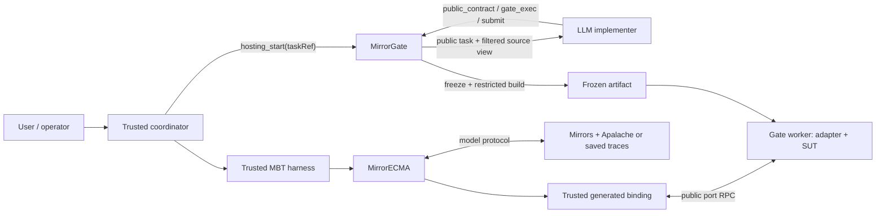

# Using the Mirror-Framework for model-based testing and LLM-assisted development

The **Mirror-Framework** is the combination of these repositories:

- **Mirrors** executes TLA+ models, generates model interfaces, and compares
  expected model states with implementation observations.
- **MirrorECMA** is the TypeScript client. It supplies negotiated replay,
  generated bindings, and reusable model-based testing (MBT) harnesses.
- **MirrorGate** admits source and tools, runs an LLM implementer, freezes and
  builds its submission, executes the implementation in a Linux sandbox, and
  owns worker cleanup.

This guide shows how to use the three parts as one workflow. It covers ordinary
MBT of existing TypeScript code and the managed workflow in which an LLM writes
code before the same MBT harness evaluates it.

The framework is a composition of versioned tools and libraries, rather than
one executable. Pin mutually compatible commits of all three repositories in
development and CI. MirrorGate packages are currently development artifacts;
this guide does not assume that they have been published to a public registry.

## What the workflow proves

An MBT run checks one implementation against behavior exercised by model traces:

1. Mirrors obtains a trace from a checked-in ITF file or from Apalache.
2. A generated binding converts each model action into a typed public operation.
3. The adapter invokes the real system under test (SUT).
4. The adapter observes the real SUT state.
5. Mirrors compares that observation with the expected model state.

A passing run establishes agreement for the executed traces and observations.
It is not a proof over every model state. Preserve useful traces as deterministic
regressions, generate additional traces for exploration, and enforce deliberate
action and scenario coverage.

When an LLM writes the implementation, MirrorGate adds isolation and lifecycle
evidence. It does not change the model semantics or the verdict. Public authoring
tests help the LLM develop the code, while the trusted MBT harness remains the
acceptance oracle.

## Choose a workflow

| Need | Workflow | MirrorGate authoring |
| --- | --- | --- |
| Test existing code in the application process | Local MBT harness | Not used |
| Test already supplied source or an artifact in isolation | Gate-backed MBT | `authoring: false` |
| Ask an LLM to implement or repair code, then test it | Managed LLM + MBT | `authoring: true` with an approved agent profile |

All three paths can call the same application-owned harness. Only the deferred
implementation provider changes: it creates a local object or acquires a
MirrorGate worker that implements the same generated public port.

### Two kinds of code generation

The workflow contains two separate generation steps:

| Generator | Output | Review rule |
| --- | --- | --- |
| Mirrors `model_interface_gen` | Deterministic typed port, binding, metadata, lock, and ownership manifest | Compiler-owned; regenerate with the CLI and review the diff |
| LLM implementer | Handwritten SUT code, adapter, build script, and public tests | Confined by Gate; accept only after build, MBT, and cleanup succeed |

Generate the model interface before starting the LLM. Give the LLM the approved
public port contract, while keeping the generated evaluator binding trusted.
Never ask the LLM to edit compiler-owned output as a substitute for implementing
the port.

## Trust boundary

Keep these inputs in the trusted evaluation environment:

- the authoritative TLA+ model and private invariants;
- private traces, expected states, and replay configuration;
- the compiler-generated binding and negotiation authority;
- Gate policy, credentials, runtime audits, receipts, and full diagnostics; and
- the harness code that decides pass or failure.

Give the implementer only what it needs to implement the public behavior:

- a bounded task description;
- public operation, input, output, and observation declarations;
- approved starter files;
- fixed build and adapter-entry requirements; and
- approved `gate_exec` tools for editing, compiling, and running public tests.

Do not send expected states, private trace coordinates, raw model messages, or a
private mismatch oracle to the submitted adapter. The adapter must report actual
observations from the SUT. It must not compute answers from an expected trace.



The Mirrors transport and MirrorGate control/worker transports are separate.
Closing an evaluation connection must not be treated as permission to stop an
independently owned Mirrors server.

## Prerequisites

The examples below use sibling source checkouts:

```bash
export MIRRORS_ROOT=/absolute/path/to/Mirrors
export MIRRORECMA_ROOT=/absolute/path/to/MirrorECMA
export MIRRORGATE_ROOT=/absolute/path/to/MirrorGate
```

Build Mirrors and its interface compiler:

```bash
cd "$MIRRORS_ROOT"
lake build mirror model_interface_gen
export MIRROR_BIN="$MIRRORS_ROOT/.lake/build/bin/mirror"
export MODEL_INTERFACE_GEN="$MIRRORS_ROOT/.lake/build/bin/model_interface_gen"
```

Prepare MirrorECMA:

```bash
cd "$MIRRORECMA_ROOT"
pnpm install --frozen-lockfile
pnpm run build
pnpm run check:examples
```

For Gate-backed execution, use Linux with working unprivileged user namespaces,
Bubblewrap 0.9 or newer, Python 3.12, Node 24.15.0, and Rust 1.96.0. Prepare the
development distribution from the MirrorGate root:

```bash
cd "$MIRRORGATE_ROOT"
cargo fetch --manifest-path runtimes/rust/Cargo.toml --locked
npm ci --ignore-scripts
bash scripts/build.sh
```

MirrorGate fails closed if the required isolation backend is unavailable. Its
full gate is `bash scripts/test.sh`; run it when changing Gate, its policy, its
runtime installation, or its host environment.

## 1. Define model behavior independently of the implementation

Start with a small stateful feature. Identify:

- initialization behavior;
- operations and legal inputs;
- state or outputs that can be observed from the real implementation;
- failure/rejection behavior that matters to the requirement; and
- bounds that make trace generation useful.

Write the TLA+ model before adapting it to the current implementation. A model
that merely repeats the code is unlikely to find disagreements. Use stable wire
action labels, commonly stored in `action_taken`, and put operation stimuli in a
declared parameter variable such as `parameters`.

The Counter example maps its model as follows:

| Model behavior | Public operation | Actual implementation behavior |
| --- | --- | --- |
| initialize count | `Initialize` | reset stored count to zero |
| apply a stride | `Tick({Stride})` | add the supplied stride |
| compare state | observation `{Count}` | read the stored count |

See the [TypeScript MBT manual](mirrorecma-typescript-mbt-user-manual.md) for a
complete Counter walkthrough and the
[MirrorECMA generated Counter example](https://github.com/NzSN/MirrorECMA/tree/main/examples/generated-counter)
for runnable source.

## 2. Create and review the model-interface contract

The interface compiler needs:

- the TLA+ root module;
- a reviewed companion contract;
- structural type evidence, normally typed ITF evidence; and
- the names of any parameter variables removed from observations.

For a new model, the compiler can create an initial proposal:

```bash
"$MODEL_INTERFACE_GEN" scaffold \
  --spec "$PWD/specs/MyModel.tla" \
  --evidence "$PWD/mbt/my-model.itf.json" \
  --param-var parameters \
  --proposal "$PWD/mbt/MyModel.mirror-interface.proposal.json"
```

`scaffold` creates a proposal, not an approved contract. Review and seal:

- which labels are initializers and which are actions;
- every input projection;
- all compared observations;
- stable public IDs and logical source identity; and
- target support for the resulting types.

Save the reviewed contract as, for example,
`mbt/MyModel.mirror-interface.json`. Do not let an LLM submission replace the
trusted contract or decide which observations constitute acceptance.

If the raw trace representation cannot be expressed by a generated target, use
an explicit compiler-owned projection plan and `project-trace`. Review its lossy
mapping and receipt; do not hide unsupported values with ad hoc conversion in
the adapter.

## 3. Resolve, generate, and preflight

Resolve the semantic lock:

```bash
"$MODEL_INTERFACE_GEN" resolve \
  --spec "$PWD/specs/MyModel.tla" \
  --contract "$PWD/mbt/MyModel.mirror-interface.json" \
  --evidence "$PWD/mbt/my-model.itf.json" \
  --param-var parameters \
  --lock "$PWD/mbt/MyModel.mirror-interface.lock.json"
```

For synchronous local TypeScript, generate `mirrorecma-v1`. For asynchronous
code or a MirrorGate public-port provider, generate `mirrorecma-async-v1`:

```bash
"$MODEL_INTERFACE_GEN" generate \
  --lock "$PWD/mbt/MyModel.mirror-interface.lock.json" \
  --target mirrorecma-async-v1 \
  --out "$PWD/mbt/generated"
```

Generated files are compiler-owned. Implement the emitted port in a handwritten
adapter outside that directory. Keep the model, contract, evidence, lock,
generated source, and ownership manifest under version control.

Verify freshness without repairing files:

```bash
"$MODEL_INTERFACE_GEN" check \
  --spec "$PWD/specs/MyModel.tla" \
  --contract "$PWD/mbt/MyModel.mirror-interface.json" \
  --evidence "$PWD/mbt/my-model.itf.json" \
  --param-var parameters \
  --lock "$PWD/mbt/MyModel.mirror-interface.lock.json" \
  --target mirrorecma-async-v1 \
  --out "$PWD/mbt/generated"

"$MODEL_INTERFACE_GEN" preflight \
  --lock "$PWD/mbt/MyModel.mirror-interface.lock.json" \
  --trace "$PWD/mbt/my-model.itf.json" \
  --require-all-actions
```

`check` byte-compares the inputs, lock, manifest, and output. Regenerate
intentionally during development; CI should reject stale generated artifacts.
`preflight` checks trace/lock compatibility and declared action coverage. Runtime
coverage is separate and must show that the real adapter handlers ran.

## 4. Build one reusable MBT harness

Put model selection, generated identity, replay settings, and report behavior in
an import-safe application module. Let the caller supply a deferred
implementation factory.

A typical layout is:

```text
specs/
  MyModel.tla
mbt/
  MyModel.mirror-interface.json
  MyModel.mirror-interface.lock.json
  my-model.itf.json
  generated/                    # compiler-owned
  suite.ts                      # trusted reusable harness
  local-provider.ts             # local SUT adapter
  my-model.mbt.test.ts          # test-runner wrapper
evaluation/
  gate-provider.ts              # trusted MirrorGate integration
src/
  ...                           # application/SUT source
```

The harness should call
`runClientWithTracesNegotiatedWithReport` for saved traces or
`runClientNegotiatedWithReport` for live generation. Register an
`AsyncAdapterFactory` under the exact generated key:

```ts
import {
  AsyncCompiledAdapterRegistry,
  runClientWithTracesNegotiatedWithReport,
  semanticDigestFromHex,
  type ApalacheConfig,
  type AsyncAdapterFactory,
  type ReplayDeadlines,
  type Transport,
} from "mirrorecma";
import {
  MyModelAsyncStateComputerContractVersion,
  MyModelAsyncTargetProfile,
  MyModelModelInterface,
  MyModelSemanticDigest,
} from "./generated/MyModelMirror.generated.js";

interface MyModelSuiteContext {
  readonly mirror: string | Transport;
  readonly modelConfig: ApalacheConfig;
  readonly tracePaths: readonly string[];
  readonly signal?: AbortSignal;
  readonly deadlines?: Partial<ReplayDeadlines>;
}

export async function runMyModelSuite(
  context: MyModelSuiteContext,
  factory: AsyncAdapterFactory,
) {
  const key = {
    semanticDigest: semanticDigestFromHex(MyModelSemanticDigest),
    adapterId: "my-application/v1",
    targetProfile: MyModelAsyncTargetProfile,
    stateComputerContractVersion: MyModelAsyncStateComputerContractVersion,
  };
  return runClientWithTracesNegotiatedWithReport(
    context.mirror,
    context.modelConfig,
    [...context.tracePaths],
    {
      execution: "async",
      mode: "compiled",
      request: "verify",
      policy: "require",
      metadata: MyModelModelInterface,
      ...key,
      registry: new AsyncCompiledAdapterRegistry([{ key, factory }]),
    },
    { signal: context.signal, deadlines: context.deadlines },
  );
}
```

The generated symbol prefix follows the model name. Treat this excerpt as a
shape to adapt to the generated file, and let TypeScript check the actual
exports. The complete working implementation is
[MirrorECMA's reusable Counter suite](https://github.com/NzSN/MirrorECMA/blob/main/examples/mbt-counter/suite.ts).

Keep SUT construction inside the registered factory. Mirrors must return a
validated `matched` result before the factory runs. Use `policy: "require"` so a
missing or mismatched interface cannot silently fall back to an unverified
adapter. The factory or returned binding must also own disposal of resources it
creates.

Wrap this module rather than duplicating its semantics:

- a source test awaits it and lets a mismatch fail the test;
- a CLI prints the bounded report and exits nonzero for non-pass;
- a trusted Gate evaluation handler supplies a remote implementation factory;
- an optional evaluation service calls the same approved suite by reference.

## 5. Verify the harness locally first

Before adding LLM authoring, connect the generated port to the real local SUT.
This separates model/adapter defects from Gate deployment problems.

For the framework's reusable Counter example:

```bash
cd "$MIRRORECMA_ROOT"
export MIRROR_BIN="$MIRRORS_ROOT/.lake/build/bin/mirror"
pnpm run test:mbt-counter
pnpm run example:mbt-counter
pnpm run example:mbt-counter:broken  # expected to exit 1
pnpm run smoke:mbt-counter
```

The deliberately broken implementation is an important control. If the same
model traces do not reject a known defect, inspect whether:

- the adapter calls production code rather than a duplicate test model;
- observations read actual SUT state;
- the trace reaches the faulty operation;
- initialization resets every modeled resource; and
- all relevant model variables are present in the observation contract.

For live exploration, configure `APALACHE_MC` and call the live negotiated
runner. The Counter example provides:

```bash
cd "$MIRRORECMA_ROOT"
APALACHE_MC=/absolute/path/to/apalache-mc pnpm run example:counter:live
```

Keep saved regression replay as the regular fast gate. Make live Apalache an
explicit additional tier, with intentional bounds and trace counts.

## 6. Define the public implementation contract for the LLM

The LLM cannot implement an interface it never sees, but it does not need the
private model or generated evaluator binding. Derive a public authoring package
containing only:

1. operation names and typed inputs;
2. observable output/state fields;
3. required initialization and error behavior;
4. the submitted adapter entry point and export shape;
5. fixed build inputs and expected artifact files; and
6. public examples/tests that reveal no private oracle.

For the current Node worker, the submitted artifact supplies an adapter entry
accepted by the approved runtime profile. The Counter application's public brief
requires `adapter.mjs` with `createAdapter()`, an action map, and an `observe`
function. Use the deployed runtime/profile contract instead of inventing an
unreviewed entry shape in the prompt.

The generated binding stays in the trusted evaluator. It uses its generated
public-port binder to invoke the submitted adapter through MirrorGate's worker
protocol. The LLM should implement the application adapter, not Mirrors'
`StateComputer` protocol.

## 7. Configure MirrorGate

MirrorGate policy is trusted operator configuration. A control request selects
approved IDs; it cannot provide host paths, commands, mounts, credentials, or
limit increases.

For managed LLM authoring, use a `mirrorgate.control-policy/v2` catalog that
defines:

- a source-only approved root and allowed host UID;
- an optional filtered `sourceView`;
- fixed authoring tools;
- a fixed build plan and artifact path;
- a Node or Rust runtime profile;
- complete resource limits;
- an audited agent profile; and
- the policy's allowed agent-profile IDs.

The [MirrorGate policy guide](https://github.com/NzSN/MirrorGate/blob/main/docs/sandbox/control-policy-v1.md)
defines the closed schema. The
[control-v2 contract](https://github.com/NzSN/MirrorGate/blob/main/docs/agent-hosting-control-v2.md)
defines managed hosting admission.

### Use a filtered source view

A filtered source view lets the LLM edit a selected copy without mounting the
whole repository. The following is only the approved-root fragment of a complete
policy-v2 catalog:

```json
{
  "id": "application-source",
  "path": "/srv/my-application",
  "kinds": ["source"],
  "allowedUids": [1000],
  "sourceView": {
    "schema": "mirrorgate.source-view/v1",
    "workspaceRoot": "/srv/mirror-workspaces",
    "includePaths": [
      "package.json",
      "pnpm-lock.yaml",
      "src",
      "test/public",
      ".mirrors/public"
    ]
  }
}
```

Before starting Gate, create `workspaceRoot` as a real directory owned by the
supervisor UID with mode `0700`. Every include path must already exist. Included
directories are recursive and may receive new files during authoring. Globs,
exclusions, symlinks, missing paths, and overlapping selectors are rejected.

Do not include private models, traces, harnesses, credentials, receipts, or
evaluator configuration. If those files share a repository, select only the
public application subtrees. A safer layout places trusted evaluation material
under a separate root entirely.

Gate creates `workspaceRoot/session-<sessionId>`, pins source and destination
identities, and detects changes during copying. Failed and unsubmitted views are
removed. A successfully committed view is retained for trusted promotion; Gate
does not silently copy it back into the original checkout.

### Start or attach to the controller

An owned application can let the trusted integration launch Gate. A shared
controller can run on a private Unix socket:

```bash
install -d -m 0700 /approved/mirrorgate-control
"$MIRRORGATE_ROOT/bin/mirrorgate" control \
  --unix-socket /approved/mirrorgate-control/gate.sock \
  --policy-file /approved/my-policy.json
```

The socket is local and mode `0600`. Attached clients verify its path/owner and
Gate verifies the peer UID. Closing one owner connection cleans that owner's
sessions; it does not stop the shared daemon.

## 8. Configure the application workflow

Use the Gate-owned `mirrorgate-mirrorecma` integration. It composes the existing
Gate control client with a generic MirrorECMA harness; it does not move model
interpretation into Gate.

An application plan fixes:

- `taskRef`, Gate policy/runtime IDs, source or prebuilt submission, and limits;
- optional agent profile and public task;
- generated model metadata and public-port binder;
- the approved suite ID/revision, model revision, context, and run function; and
- a disclosure policy for the bounded public result.

For code generation, the submission must be source with `authoring: true` and an
approved `agent`. For existing source, omit `agent` and use `authoring: false`.
Prebuilt artifacts use the same deferred evaluation seam.

Use the runnable
[installed Counter configuration](https://github.com/NzSN/MirrorGate/blob/main/integrations/mirrorecma/examples/counter/config.example.json)
as the concrete starting point. It shows the owned Gate launcher, submission,
public task, private model configuration, saved traces, and disclosure policy.
Replace all `/approved` and `/private` placeholders with operator-owned paths and
use IDs from the installed policy.

Application code converts the reviewed lock and generated module into a trusted
Gate model definition, then supplies the reusable suite:

```js
import { readFileSync } from "node:fs";
import {
  MODEL_INTERFACE_DESCRIPTOR_SCHEMA,
  decodeSemanticDescriptor,
} from "mirrorecma";
import {
  createSandboxCompiledModel,
  evaluateImplementation,
} from "mirrorgate-mirrorecma";
import * as generated from "./MyModelMirror.generated.js";
import { runMyModelSuite } from "./suite.js";

const lock = JSON.parse(
  readFileSync(new URL("./MyModel.mirror-interface.lock.json", import.meta.url), "utf8"),
);
const { contract, semanticDigest, provenance, provenanceDigest, ...descriptor } = lock;
const model = createSandboxCompiledModel({
  metadata: generated.MyModelModelInterface,
  descriptor: decodeSemanticDescriptor({
    ...descriptor,
    schema: MODEL_INTERFACE_DESCRIPTOR_SCHEMA,
  }),
  adapterId: "my-application/v1",
  publicManifest: generated.MyModelPublicManifest,
  targetProfile: generated.MyModelAsyncTargetProfile,
  stateComputerContractVersion:
    generated.MyModelAsyncStateComputerContractVersion,
  bindPublicPort: generated.bindMyModelAsyncPublicPort,
});

const outcome = await evaluateImplementation({
  ...approvedGateAndSubmissionConfiguration,
  model,
  suite: {
    id: "my-model-suite",
    revision: approvedSuiteRevision,
    modelRevision: approvedModelRevision,
    context: approvedReplayContext,
    run: runMyModelSuite,
  },
  disclosure: approvedDisclosurePolicy,
});
```

Here `lock`, the configuration values, and the revisions are trusted application
inputs. The generated public manifest is supplied to Gate for worker admission;
the descriptor and generated binder remain in the evaluator. See the
[working Counter plan](https://github.com/NzSN/MirrorGate/blob/main/integrations/mirrorecma/examples/counter/evaluate.mjs)
for the complete imports, lock decoding, configuration mapping, and return type.

Normal application evaluation is then one command:

```bash
node /installed/my-application/run.mjs /approved/my-application-config.json
```

The application should call `evaluateImplementation(plan, options)`. That API
retains one Gate owner connection through authoring, submission, preparation,
required model negotiation, worker execution, and cleanup. It returns a trusted
receipt and a separately projected public result.

## 9. Register the managed LLM workflow with a coordinator

For an agent-facing workflow, register MirrorGate's standard stdio MCP hosting
tool in the trusted coordinator:

```text
mirrorgate-hosting-tool --config /absolute/operator-owned/hosting.json
```

An installed application may instead expose its configured entry point:

```bash
node /installed/my-application/tool.mjs \
  /approved/my-application-config.json \
  --receipt /private/my-application-receipt.json
```

The receipt option is a trusted process-launch argument. It is not an MCP tool
argument, and the target must not already exist. Keep receipts outside every
authoring/build/runtime mount.

The tool exposes only:

| Tool | Argument | Purpose |
| --- | --- | --- |
| `hosting_start` | `{taskRef}` | Start the one approved task configuration |
| `hosting_status` | `{runRef}` or `{taskRef}` | Recover/query bounded progress and outcome |
| `hosting_cancel` | `{runRef}` | Cancel and join authoritative cleanup |

The user or coordinator cannot pass prompt text, executables, credentials,
paths, mounts, or policy overrides through these calls. The natural-language
task and public files are fixed in the operator configuration before the tool
starts.

One normal interaction is:

1. The user asks the trusted coordinator to run the configured `taskRef`.
2. The coordinator calls `hosting_start` once and records the returned `runRef`.
3. MirrorGate starts a fresh implementer under the approved profile.
4. The implementer calls only its `public_contract`, approved `gate_exec`, and
   `submit` tools.
5. The coordinator polls `hosting_status`. If the start reply was lost, it
   recovers by `taskRef`; it does not repeat the mutation.
6. Explicit `submit` commits the source. An ordinary chat statement such as
   "done" does not commit it.
7. After hosting cleanup is confirmed, the trusted callback prepares and tests
   the exact committed submission with the approved MBT harness.
8. Public status reports a bounded categorical result and separate cleanup
   state. Trusted diagnostics and receipts stay local.

The standard hosting adapter supports one attempt per configured task instance.
To iterate after a terminal run, create a fresh approved task/session (and, when
needed, promote or reseed the retained source view) rather than trying to reopen
the submitted session. Control v1/v2 does not provide resume.

## 10. What happens after `submit`

Submission is a security and reproducibility boundary:

1. Gate revokes further authoring writes and freezes the selected source once.
2. The source hash binds the committed content. For filtered views it also binds
   the source-view identity, selector, selected manifest, and frozen snapshot.
3. Gate runs the fixed build plan in the build sandbox with frozen `/source` and
   a fresh writable `/output`.
4. Gate freezes the artifact and records its identity.
5. Mirrors and MirrorECMA complete required model-interface negotiation in the
   trusted evaluator.
6. Only a successful exact match permits Gate worker authorization/acquisition.
7. The worker loads the submitted adapter/SUT inside the execution sandbox.
8. The harness invokes public operations and receives actual observations.
9. Mirrors decides the model outcome; Gate releases the worker and joins cleanup.

A model pass with failed or unconfirmed cleanup is not an overall pass. A build
failure, agent timeout, missing explicit submission, interface mismatch, worker
failure, MBT mismatch, and cleanup failure remain distinct outcomes in the
trusted receipt.

## 11. Handle failures and iteration

The trusted evaluator should retain enough evidence to reproduce a failure:

- exact Mirrors, MirrorECMA, and MirrorGate revisions;
- model, contract, evidence, lock, target profile, and generated-manifest hashes;
- saved trace or live-generation configuration;
- committed source and artifact identities;
- public task/profile/policy revision;
- primary model/build/worker failure; and
- independent cleanup outcome.

Disclosure to the LLM or an external caller is an application policy. Prefer
stable public categories and approved observation IDs. Do not serialize raw
exceptions, host paths, expected states, private trace positions, controller
handles, credentials, stdout/stderr, or trusted receipts into agent-visible
status.

When a mismatch is safe to disclose, translate it into a new public requirement
or public regression test and start a fresh authoring task. Never mount the
private harness merely to make iteration convenient. A private failure can also
be reviewed by a trusted human without disclosing its oracle to the implementer.

## 12. CI pipeline

For an application, use a layered pipeline:

```bash
# Deterministic interface freshness and trace admission
"$MODEL_INTERFACE_GEN" check \
  --spec "$PWD/specs/MyModel.tla" \
  --contract "$PWD/mbt/MyModel.mirror-interface.json" \
  --evidence "$PWD/mbt/my-model.itf.json" \
  --param-var parameters \
  --lock "$PWD/mbt/MyModel.mirror-interface.lock.json" \
  --target mirrorecma-async-v1 \
  --out "$PWD/mbt/generated"

"$MODEL_INTERFACE_GEN" preflight \
  --lock "$PWD/mbt/MyModel.mirror-interface.lock.json" \
  --trace "$PWD/mbt/my-model.itf.json" \
  --require-all-actions

# Application-specific examples
pnpm run check
pnpm run test:mbt
```

Also run:

- a known-correct implementation, which must pass;
- a deliberate implementation fault, which must be detected;
- cleanup/cancellation negative cases for resources owned by the SUT;
- live Apalache exploration as a separately provisioned tier; and
- a real MirrorGate/Bubblewrap acceptance run on hosts that claim isolation.

When changing the framework itself, run `lake test` in Mirrors, the appropriate
MirrorECMA `pnpm run ci` gate, MirrorGate's `bash scripts/test.sh`, and the
[cross-client interop matrix](../tools/interop/INTEROP.md). Report any unavailable
live or platform-specific tier instead of treating it as a pass.

## 13. Current implementation limits

- MirrorGate's implemented security backend is Linux/Bubblewrap. Windows and
  macOS backends are not implemented.
- Current worker runtimes are Node and Rust. MirrorECMA is the TypeScript client;
  other Mirror clients can use Gate through their native control integration.
- Aggregate cgroup quotas are not implemented. The documented process/resource
  limits still apply, but they are not a claim of aggregate tenant accounting.
- The optional evaluation service is authenticated loopback HTTP. Remote/TLS
  service deployment is not implemented.
- A source view is an exact allowlist copy, not a Git branch, merge system, or
  automatic promotion mechanism.
- LLM isolation depends on the complete host configuration: policy, source
  selection, public prompt, tool wrappers, build/runtime mounts, credentials,
  and real sandbox availability.

## Reference implementations

- [MirrorECMA reusable MBT harness design](https://github.com/NzSN/MirrorECMA/blob/main/docs/mbt-harness-design.md)
- [MirrorECMA reusable Counter suite](https://github.com/NzSN/MirrorECMA/tree/main/examples/mbt-counter)
- [Generated Counter tutorial](https://github.com/NzSN/MirrorECMA/tree/main/examples/generated-counter)
- [MirrorGate installed Counter workflow](https://github.com/NzSN/MirrorGate/tree/main/integrations/mirrorecma/examples/counter)
- [MirrorGate local evaluation contract](https://github.com/NzSN/MirrorGate/blob/main/integrations/mirrorecma/WORKFLOW.md)
- [MirrorGate coordinating-agent tool](https://github.com/NzSN/MirrorGate/blob/main/integrations/agent-host/README.md)
- [MirrorGate managed workflow design](https://github.com/NzSN/MirrorGate/blob/main/docs/managed-workflow-design.md)
- [MirrorGate supervisor and source-view design](https://github.com/NzSN/MirrorGate/blob/main/docs/sandbox/supervisor-design.md)
- [Model-interface compiler designs](model-interface-compiler/README.md)
- [Generated model-interface specification](generated-model-interface-spec.md)

Use the local Counter paths first. They exercise the same boundaries described
here and provide both a passing implementation and a known fault before you add
an application-specific model, harness, Gate policy, or LLM profile.
