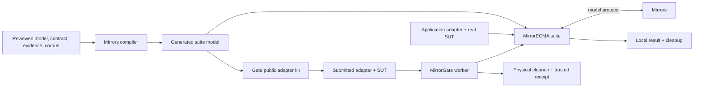

# Using the Mirror Framework

The Mirror Framework combines three repositories:

- **Mirrors** resolves TLA+ models, generates trusted suite bundles, executes
  model traces, and compares expected model states with implementation observations.
- **MirrorECMA** defines immutable application suites, replays checked corpora,
  evaluates matched coverage, owns local binding lifetime, and supplies project
  commands for the supported TypeScript workflow.
- **MirrorGate** optionally generates a public implementation kit, prepares and
  runs submitted code under Linux/Bubblewrap, and owns worker and physical cleanup.

The supported first path is Node ESM, `mirrorecma-async-v1` generated bindings,
and an ordered checked trace corpus. Start with the
[role-oriented integration guide](application-integration-guide.md). This guide
shows how the pieces fit together and where application-specific work remains.

The framework is a composition of versioned tools and packages, not one
executable. Pin compatible identities in `mirror.toolchain.json`. Package
publication is separate from the locally accepted implementation; an operator
may prepare compatible private packages and executables without using source
checkouts during each run.

## What an application author writes

An ordinary application integration supplies:

1. a reviewed model, sealed interface contract, structural evidence, and checked traces;
2. acceptance requirements naming stable transition IDs;
3. an adapter whose actions call the real system under test and whose observer
   reads its real state; and
4. domain-specific setup and cleanup that cannot be inferred by the framework.

It does **not** reconstruct a semantic descriptor, register a digest/profile
tuple, convert generated collections by hand, drive Gate control transitions,
or aggregate framework cleanup on the default path. Those responsibilities are
inside the compiler bundle, MirrorECMA suite runner, and optional Gate integration.



Expected model states, private traces, descriptors, credentials, and trusted
receipts remain evaluator-side. A restricted worker receives only the sanitized
public port and application behavior needed to implement the adapter.

## Choose an execution path

| Need | Supported entry point | Gate required |
| --- | --- | --- |
| Test trusted application code locally | `mirrorecma replay` or `runSuite` | No |
| Test approved source or an artifact in isolation | `evaluateSuite` with an approved submission | Yes |
| Ask a managed author to implement or repair the adapter | `evaluateSuite` with an approved agent request | Yes |

All paths use the same `SuiteDefinition`, checked corpus, model negotiation, and
acceptance rules. The implementation provider changes; model comparison does not.

## 1. Declare the experiment

Prepare compatible installed tools and packages once, then initialize a project:

```sh
mirrorecma init ./mbt
```

The command creates inert templates without inventing a model, contract,
observer, corpus, or tool identity. Complete `mbt/mirror.project.json` with:

- the reviewed TLA+ source, sealed interface contract, and typed evidence;
- the compiler-owned lock and generated output directory;
- the compiled generated suite module and exported `<Model>Model` handle;
- an ordered nonempty corpus and required stable action/pair coverage;
- a deferred application adapter module; and
- explicit model server, timeout, and toolchain-lock selections.

Complete `mirror.toolchain.json` with operator-reviewed compiler, server, and
package identities. Overrides must satisfy those pins. The tools never search
sibling repositories or silently substitute an executable from `PATH`.

Relative project paths resolve against the project file. For remote replay,
retain separate local verification paths and server-visible paths; the tools do
not implicitly upload a private model or corpus. See
[MirrorECMA project tools](../../MirrorECMA/docs/project-tools.md) for the closed
schemas and a complete configuration example.

## 2. Generate the trusted suite bundle

Run generation only after the interface contract has been reviewed and sealed:

```sh
mirrorecma generate --project ./mbt/mirror.project.json
```

This invokes the pinned compiler to resolve the reviewed inputs and publish an
additive `mirrorecma-async-v1` suite bundle. The bundle contains the established
generated binding, a `<Model>.suite.ts` companion, canonical descriptor,
sanitized public manifest, provenance, and ownership hashes. It does not generate
traces, approve a scaffold proposal, implement behavior, or install packages.

Compile the generated TypeScript during normal application preparation. For an
ESM project with TypeScript already installed:

```sh
./node_modules/.bin/tsc .mirrors/evaluator/Example.suite.ts \
  --target ES2022 --module NodeNext --moduleResolution NodeNext \
  --strict --skipLibCheck --noEmitOnError
```

Use the actual generated filename. An existing application build may own this
step. Never edit compiler-owned bundle files; regenerate and review them. See
[suite bundles](model-interface-compiler/suite-bundles.md) for exact ownership.

## 3. Implement the real application adapter

The local native adapter shape is deliberately small:

```js
export async function createAdapter() {
  const service = await startActualService();
  return {
    actions: {
      Initialize: async () => { await service.reset(); },
      Enqueue: async ({ Item }) => { await service.enqueue(Item); },
      Complete: async () => { await service.complete(); },
    },
    observe: async () => ({
      Pending: service.pendingItems(),
      Completed: service.completedItems(),
    }),
    dispose: async () => { await service.stop(); },
  };
}
```

Use the stable operation, input, and observation IDs emitted for your model.
Actions complete with `undefined`; await real side effects before returning.
The observer must inspect the actual SUT, not reconstruct expected model state.
Every trace initializer must reset the relevant application state.

The native profile uses `bigint`, arrays for sequences and tuples, native `Set`,
string-key `Map`, closed records, declared variants, strings, booleans, and
`null`. The generated local bridge validates and recursively converts these
values. Do not add application collection-conversion loops.

For resources acquired in a library factory, call `context.deferCleanup` as
each resource is acquired and use its returned once-only wrapper if the final
disposer adopts that resource. Unregistered resources that never become part of
a returned implementation remain the application's responsibility.

## 4. Check and replay locally

```sh
mirrorecma doctor --project ./mbt/mirror.project.json
mirrorecma check --project ./mbt/mirror.project.json
mirrorecma replay --project ./mbt/mirror.project.json
```

`doctor` is read-only. `check` never repairs stale files. `replay` performs no
package installation, compilation, trace generation, or sibling-checkout search.
Required model negotiation and corpus preflight occur before the adapter factory
is imported or invoked.

Fresh trace generation is a separate explicit operation with its own predicates,
bounds, tool identities, and provenance. Missing checked traces never trigger an
implicit live-generation fallback.

For direct library integration, use the same suite abstraction:

```ts
import { defineSuite, runSuite } from "mirrorecma";
import { QueueModel } from "./.mirrors/evaluator/Queue.suite.js";

const suite = defineSuite({
  id: "queue/v1",
  model: QueueModel,
  replay: {
    kind: "corpus",
    config: {
      specPath: "./model/Queue.tla",
      initPredicate: "Init",
      nextPredicate: "Next",
      invariant: "Safety",
      lengthBound: 20,
      paramVars: "parameters",
    },
    traces: ["./traces/enqueue-complete.itf.json"],
  },
  acceptance: {
    requiredActions: ["Enqueue", "Complete"],
    requiredPairs: [["Enqueue", "Complete"]],
  },
});

const result = await runSuite(suite, {
  mirror: "/approved/bin/mirror",
  implementation: async (context) => {
    const { createAdapter } = await import("./queue-adapter.js");
    const port = await createAdapter(context);
    return { port, dispose: () => port.dispose?.() };
  },
});
```

`defineSuite` is inert and immutable. `runSuite` derives exact registration,
defers construction until required match, collects authoritative matched
coverage, and joins local disposal. See
[checked application suites](../../MirrorECMA/docs/application-suites.md).

## 5. Prepare a restricted implementation with MirrorGate

MirrorGate generates a public kit from the suite model's sanitized manifest:

```js
import { generateAdapterKit, checkAdapterKit } from "mirrorgate/adapter-kit";

await generateAdapterKit(Model.publicManifest, {
  directory: "./public",
  behavior: approvedBehavior,
});
await checkAdapterKit(Model.publicManifest, { directory: "./public" });
```

The kit owns declarations, codec helpers, structural checks, and hashes. It seeds
but never owns `adapter.mjs` or `PUBLIC-CONTRACT.md`. Structural checks prove
shape and codec obligations, not business behavior or observer honesty.
Submitted-code imports and checks must run through admitted Gate tools for
restricted work.

Select the operator-approved `node-esm/v1` profile with an entry point, explicit
source files, pinned Node runtime, and approved dependency roots. It copies
admitted JavaScript; it does not install packages, execute hooks, or compile
submitted TypeScript. Require `hosting.public-environment-v1` so authors receive
logical paths, public tools, and limits without host paths or credentials. See
[MirrorGate's runtime guide](../../MirrorGate/docs/application-integration-runtime.md).

## 6. Evaluate the same suite through Gate

```ts
import { evaluateSuite } from "mirrorgate-mirrorecma";

const outcome = await evaluateSuite(suite, {
  mirror: "/approved/bin/mirror",
  environment: approvedEnvironment,
  submission: approvedSubmission,
  timeouts: approvedTimeouts,
  receipt: { path: "/private/new-suite-receipt.json" },
});
```

For managed authoring, add an operator-approved agent request. An already hosted
workflow passes its original in-process owner instead of reconnecting or adopting
a session. The Gate owner remains responsible through preparation, execution,
physical cleanup, and receipt persistence—even when model negotiation rejects.

Normal callers do not construct `createSandboxCompiledModel`, decode a lock into
a descriptor, or drive Gate control. Those former interfaces remain only as
documented advanced or `/legacy` exports. See the
[Gate suite workflow](../../MirrorGate/integrations/mirrorecma/WORKFLOW.md).

## 7. Interpret results correctly

A suite passes only when every selected observation matches, required matched
coverage is established, the corpus completes, and applicable cleanup succeeds.
A matching replay with missing coverage is `failed` / `coverage_unmet`, not a
behavioral mismatch. Cancellation, timeout, adapter exceptions, codec failures,
and uncertain cleanup also do not count as model mismatches. Gate-confirmed
physical cleanup is stronger than cooperative local JavaScript disposal.

Trusted receipts keep model, acceptance, primary failure, local cleanup,
physical cleanup, and persistence evidence separate. Author-facing output is a
bounded allowlist. Project CLI exit codes are 0 for full success, 1 for a genuine
model mismatch with satisfied cleanup, and 2 for other non-success.

## 8. CI and acceptance controls

In CI:

1. verify exact package and executable identities;
2. compile application and generated TypeScript during preparation;
3. run `mirrorecma check` without repair;
4. replay the checked corpus;
5. retain a deliberately faulty real implementation and its pinned mismatch;
6. run fresh generation as a separate pinned tier when required; and
7. run Gate's required real backend when isolation or managed authoring is claimed.

Checked replay needs no Apalache/JDK. An unavailable sandbox, tool, or remote
verification capability is not a pass. The migrated suites under
`../MirrorECMA/examples/application-validation/` demonstrate correct and faulty
local/Gate execution; the [execution record](application-integration-progress.md)
states their accepted scope.

## Advanced and legacy APIs

Low-level replay and registry APIs remain supported for client-library work,
specialized transports, synchronous profiles, dynamic descriptors, and migration.
Do not start an ordinary application with `CompiledAdapterRegistry`,
`AsyncCompiledAdapterRegistry`, handwritten registry keys,
`createSandboxCompiledModel`, `evaluateImplementation`, or `evaluateSandboxed`.
Use suite bundles, `defineSuite` / `runSuite`, project tools, and optional
`evaluateSuite` instead.

References: [TypeScript tutorial](mirrorecma-typescript-mbt-user-manual.md),
[client implementation guide](client-implementation-guide.md),
[runtime distribution](model-interface-runtime-distribution-design.md), and
[application integration design](application-integration-design.md).
