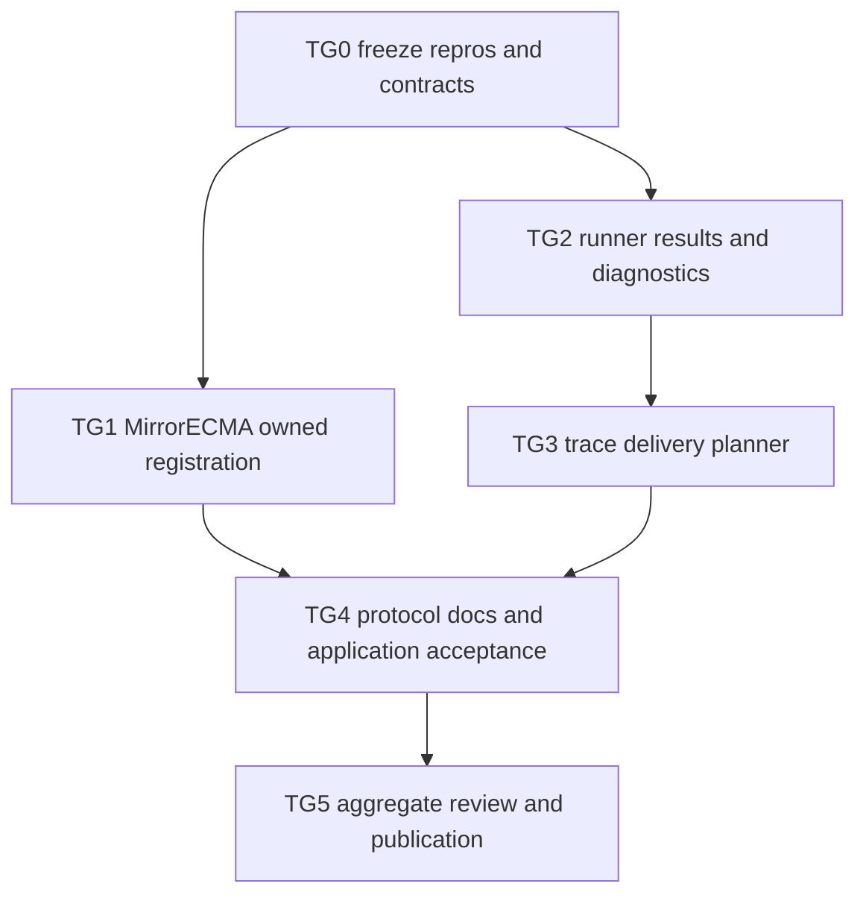

# Trace-generation transport hardening tasks

> Status: **TG0–TG3 implemented and independently accepted; TG4 integration
> behavior is green but its aggregate package and TG5 publication remain
> blocked by the separately excluded MirrorRust validation failures. The
> WorkQueue `Sequences.Head`/`Tail` catalog blocker is resolved by profile 4**.
>
> Design authority:
> [trace-generation transport hardening](trace-generation-transport-hardening-design.md).

## 1. Objective and scope

Implement the design in bounded cross-repository packages while preserving the
65,535-byte protocol limit and all in-limit wire bytes. The framework work is:

- MirrorECMA registration ownership and cleanup;
- Mirrors trace-generation failure preservation;
- Mirrors exact-byte trace-result delivery planning for sync and async results;
- focused protocol documentation and cross-client validation.

Application model repair and async-profile selection are acceptance consumers,
not framework implementation packages. Do not edit DumpLedger model, witness,
contract, generated binding, or trace fixtures under this plan.

## 2. Delivery graph



TG1 and TG2 may proceed independently after TG0. TG3 waits for TG2 because it
consumes the runner's path-durability result. TG4 begins only after both client
cleanup and server delivery are accepted.

## 3. Ownership map

| Package | Owner | Files owned during package | Prerequisite |
| --- | --- | --- | --- |
| TG0 | `test-automator` | focused repro tests/fixtures and evidence note only | none |
| TG1 | `specification_implementer` in `../MirrorECMA` | `src/client.ts`, client lifecycle helper if needed, focused tests | TG0 |
| TG2 | `specification_implementer` | `Shell/Apalache/{Runner,Cli}.lean`, private result/failure types, focused Apalache specs | TG0 |
| TG3 | `specification_implementer` | `Shell/Transport/*`, trace-delivery module, `Shell/Mirror/Session.lean`, focused transport/session/job specs | TG2 |
| TG4 | `test-automator` | focused integration tests and protocol/client documentation; application checkout is read-only validation input | TG1, TG3 |
| TG5 | `reviewer` then coordinating agent | read-only review, status/evidence records, integration wiring owned by coordinator | TG4 |

One owner edits a file at a time. Later packages may modify earlier-owned files
only after explicit handoff. The coordinating agent owns shared build wiring,
aggregate documentation indexes, cross-repository reconciliation, and final
acceptance. Every owner preserves unrelated work and reports out-of-scope
findings instead of repairing them opportunistically.

The DumpLedger checkout is currently dirty application work. Validation there
must not stage, rewrite, regenerate, or clean its files unless separately
authorized by its owner.

## 4. Shared constraints

- Keep the v1 JSONL payload limit at 65,535 UTF-8 bytes.
- Preserve byte-identical encoding for every in-limit existing fixture.
- Keep `gen_traces_done`, `register_error`, `job_result`, and existing field
  names; this plan does not authorize a protocol version change.
- Use exact final compact JSON bytes for all fit decisions.
- A success containing only paths requires shared-filesystem scope and paths
  known to survive owned cleanup.
- Network clients never receive path-only success as a substitute for inline
  traces.
- Every owned resource reaches one bounded cleanup path on success and failure.
- Preserve the primary operation error when cleanup also fails.
- Bound and sanitize process output before placing it on the wire.
- Generated targets and application-generated files remain compiler-owned.
- Do not weaken existing framing, cleanup, protocol, or interop assertions.

## 5. TG0 — freeze red-capable repros and compatibility bytes

**Owner:** `test-automator`.

Create focused tests before production changes:

1. MirrorECMA public `runClientGenTraces` spawns a blocking fixture, rejects an
   oversized registration, and demonstrably remains alive without external
   termination. Record the exact line byte count and child identity.
2. Repeat the case for `runClientExplore`.
3. A scripted transport throws from registration `send`; record close count and
   primary/cleanup errors.
4. Build synthetic `TraceGenResult` values whose exact full messages are 65,535
   and 65,536 bytes, plus a result whose path-only form also exceeds the cap.
5. Cover synchronous `gen_traces_done` and asynchronous `job_result` encodings.
6. Inject Apalache failure output containing stdout, stderr, exit status, a run
   directory, multibyte text, and data beyond the proposed diagnostic budget.
7. Freeze existing in-limit Counter registration and result bytes.

Use generic synthetic TLA+/ITF content. DumpLedger files may be measured as
read-only evidence, but no private/application model material enters framework
fixtures.

**Acceptance:** each test is deterministic, fast, and red on the current
defect it owns. The report distinguishes reproduced measurements from the
historical response sizes that are no longer present in surviving artifacts.
No production or existing golden file changes in TG0.

## 6. TG1 — MirrorECMA owned registration lifecycle

**Owner:** `specification_implementer` in `../MirrorECMA`.

Implement the design's private owned-registration exchange:

- encode and validate a complete registration before spawning an owned target;
- put post-acquisition `send` inside the cleanup-owned exchange;
- close exactly once after send, receive, decode, cancellation, or application
  failure;
- preserve the primary error when cleanup fails;
- migrate `runClientGenTraces` and `runClientExplore` to the shared lifecycle;
- retain the public functions, result types, and successful wire bytes; and
- reconcile with `runLegacyReplay` by reuse or proven parity, without nested
  competing cleanup loops.

Required regression cases:

- oversized public-API call allocates no child;
- synchronous send failure closes once;
- owned blocking child exits without an external timeout;
- custom transport closes once;
- send failure plus close failure returns the same send-error object;
- success plus close failure reports cleanup failure;
- readiness failure behavior remains unchanged; and
- normal `runClientGenTraces` and exploration smoke cases remain byte-identical.

**Acceptance commands:**

```bash
pnpm run build
pnpm run check
pnpm test -- --runInBand test/owned-transport-cleanup.test.ts test/replay-report.test.ts
pnpm run test
pnpm run check:examples
```

All commands exit zero. A rerun of the original oversized public-API repro exits
without `timeout`, and no spawned child remains.

## 7. TG2 — preserve runner results and failure evidence

**Owner:** `specification_implementer` in Mirrors.

Refactor `syncOracles.generateTraceFiles` so one private result owns:

- the `Codec.TraceGenResult` wire values;
- whether returned paths are durable after cleanup; and
- the original categorized generation failure when no result exists.

Read and decode ITF contents before deleting the owned session directory.
Replace the `.error _ -> none` conversion with an `Except` flow. Add the shared
bounded Apalache failure formatter specified by the design and preserve primary
failure precedence across `releaseSpec` and directory cleanup.

Required regressions:

- destination absent: inline data survives cleanup and paths are marked
  ephemeral;
- nonempty external destination: copied paths survive and are marked durable;
- copy/read/decode errors are not reported as successful partial results;
- Apalache stdout/stderr and exit category survive in bounded diagnostics;
- run-directory paths are sanitized;
- multibyte truncation ends on a scalar boundary and declares truncation;
- generation failure plus cleanup failure keeps generation primary; and
- success plus cleanup failure reports cleanup failure.

**Acceptance commands:**

```bash
lake build
lake env lean tools/ApalacheCliSpec.lean
lake env lean --run tools/ApalacheCliSpec.lean
```

Focused tests pass with injected failures and a live Apalache tier when
available. Existing successful trace content and destination-copy behavior are
unchanged.

## 8. TG3 — exact-byte trace delivery planning

**Owner:** `specification_implementer` after TG2 handoff.

Implement the design's delivery seam:

- add the private `DeliveryScope` fact to `Shell.Transport.Transport`;
- set stdio to `sharedFilesystem` and TCP/TLS to `remote`;
- create a pure trace-delivery planner over scope, path durability, and exact
  encoded result bytes;
- route synchronous trace results through full/path-only/error selection;
- route asynchronous trace `job_result` through full/terminal-error selection;
- keep non-trace messages on the existing `sendMirror` path; and
- prove every selected outbound message fits before transport send.

Required boundary matrix:

| Full result | Scope and paths | Expected |
| --- | --- | --- |
| 65,535 bytes | any | byte-identical full success |
| 65,536 bytes | shared + durable, paths fit | path-only success |
| over limit | shared + ephemeral | bounded `register_error` |
| over limit | remote | bounded terminal error |
| over limit | shared + durable, paths do not fit | bounded terminal error |

Also assert async terminal idempotence: repeated query/await of one oversized
trace job returns the same job id and error outcome without rerunning Apalache.

**Acceptance commands:**

```bash
lake build
lake env lean tools/TransportSpec.lean
.lake/build/bin/transport_spec
lake env lean tools/AsyncSpec.lean
lake env lean --run tools/AsyncSpec.lean
lake env lean tools/ApalacheCliSpec.lean
lake env lean --run tools/ApalacheCliSpec.lean
```

All focused suites pass. Negative controls that restore unconditional inline
encoding or mislabel TCP/TLS as shared-filesystem make the matrix red.

## 9. TG4 — documentation, interop, and application acceptance

**Owner:** `test-automator` after TG1 and TG3 acceptance.

Update the normative docs to state:

- `spec.sources` is portable only when the final registration fits one v1 line;
- `destPath` is server-side and path-only fallback requires shared-filesystem
  scope plus a durable copy;
- remote oversized results fail explicitly under v1;
- applications with promise-returning operations select
  `mirrorecma-async-v1`; and
- direct Apalache generation is an explicit workflow, not hidden client
  fallback.

Exercise the cross-repository behavior:

1. In-limit Counter sync generation returns byte-identical inline traces.
2. Oversized stdio result with durable destination returns paths and empty
   inline traces; MirrorECMA consumes the paths.
3. Oversized stdio result without durable destination fails promptly with the
   categorized error.
4. Oversized TCP and mTLS results return bounded terminal errors and keep the
   server alive for a subsequent session.
5. Async oversized job results remain queryable and idempotently terminal.
6. Invalid Apalache invocation exposes bounded useful detail.
7. The generated async DumpLedgerTransfer correct and faulty cases replay from
   checked-in files; the test does not regenerate or edit application artifacts.
8. The current application contract is recorded as 21 source variables, 25
   actions, one initializer, and 19 observations.

**Acceptance commands:**

```bash
# MirrorECMA
pnpm run ci
pnpm run smoke:generated-counter

# Mirrors
lake build
lake test
bash tools/interop/run.sh

# Read-only application validation from /home/nzsn/Repos/dump-ledger
pnpm run typecheck
pnpm run check:model-interface
pnpm run build
pnpm run test:mbt
```

Use explicit compatible `MIRRORS_ROOT`, `MIRRORS_REF`, `MODEL_INTERFACE_GEN`,
`MIRROR_BIN`, and `APALACHE_MC` values required by each documented gate.
Report loopback/live-tool unavailability separately. Do not claim application
completion from a dirty checkout or from owner-reported results alone.

## 10. TG5 — aggregate review and publication

**Owner:** independent `reviewer` followed by the coordinating agent.

The reviewer checks both repositories and the read-only application evidence:

1. every TG0 repro is green after the fixes and would fail if its defect were
   restored;
2. no owned child, Apalache process, socket session, or temp directory survives
   its terminal path;
3. the exact-boundary matrix covers both sync and async results;
4. in-limit protocol fixtures and generated model-interface bytes are stable;
5. no path-only result crosses a remote transport;
6. diagnostics are bounded, sanitized, useful, and preserve primary errors;
7. public docs match implemented path/delivery semantics; and
8. aggregate commands have captured exit codes and destination-tree status.

The coordinating agent records accepted handoffs, exact commits, skipped tiers,
and remote parity. Commit and push remain separate explicit user actions.

**Final acceptance:** MirrorECMA and Mirrors focused and aggregate gates pass;
the cross-language interop matrix is green; the application generated async
correct/faulty replay passes from checked-in traces; all formerly hanging or
oversized cases terminate with a representable result; no protocol or generated
target version changes.

## 11. Checklist

- [x] TG0: red-capable repros and compatibility bytes frozen.
- [x] TG1: MirrorECMA owned registration lifecycle accepted.
- [x] TG2: runner result lifetime and bounded failure evidence accepted.
- [x] TG3: sync/async exact-byte delivery planner accepted.
- [ ] TG4: integration behavior is green; aggregate acceptance is blocked as
  recorded in §12.
- [ ] TG5: transport implementation review passed; publication waits for the
  aggregate blockers in §12.

## 12. Implementation and review record (2026-09-15)

The coordinating agent accepts TG0–TG3. An independent reviewer found no
remaining transport-hardening defect after two follow-up corrections:

- MirrorECMA now acquires the async iterator inside the cleanup-owned exchange;
  iterator construction failure closes exactly once and remains primary over a
  simultaneous cleanup failure.
- Mirrors now attempts captured-spec release and session-directory removal
  independently; operation failure remains primary and bounded path-free
  secondary cleanup evidence is retained.

Observed package evidence:

- TG0 froze 70,209-byte trace-generation and 70,128-byte exploration
  registrations, exact 65,535/65,536-byte sync and async result boundaries,
  oversized path-only controls, and bounded Apalache diagnostic inputs.
- TG1 passed 37 focused lifecycle tests, all 23 MirrorECMA Jest suites with 436
  passed and 7 ordinary skips before the TG4 environment-gated suite was added,
  build, typecheck, example checking, and the real blocking-child survivor
  audit.
- TG2 passed the Apalache CLI and TG0 diagnostic suites; all cleanup and
  diagnostic-erasure repros are green.
- TG3 passed the exact-byte matrix, compiled `transport_spec` including TCP and
  mTLS, live `async_spec`, live `apalache_cli_spec`, and the TG0 reproduction
  suite. The compiled executable is authoritative because raw
  `lean --run tools/TransportSpec.lean` cannot link the native TLS FFI.
- TG4's real-process MirrorECMA suite passed 4/4: stdio durable path-only
  consumption, stdio ephemeral refusal, TCP and mTLS bounded refusal with
  subsequent-session reuse, and async same-job query/await idempotence with one
  generation. Full MirrorECMA Jest passed 436 tests with 11 skips, including
  the environment-gated suite when its explicit binaries were supplied.
- Mirrors `lake test` emitted `ALL LAKE TESTS GREEN`. The current-revision
  interop run passed MirrorECMA, MirrorCPP 215/215, and the affected MirrorRust
  stdio/server/transport suites. The preceding Rust-1.95 run completed Haskell
  TCP/mTLS and emitted `INTEROP MATRIX GREEN`.
- The read-only DumpLedger validation passed typecheck, model-interface check,
  build, and MBT 24/24. Its current contract has 21 source variables, 25
  actions, one initializer, and 19 observations; generated async correct and
  faulty replay use checked-in traces. No DumpLedger file was edited by this
  task.

The WorkQueue catalog blocker is resolved by profile 4: Mirrors now carries
reviewed unary constant-level facts for `Sequences.Head` and `Sequences.Tail`,
the accepted standard-module fixture and generated summary cover both, two
required differential runs pass with zero findings, and MirrorECMA's WorkQueue
smoke and full CI gate pass.

TG4 and TG5 are not accepted because the complete exact-toolchain aggregate is
still blocked by the separately excluded MirrorRust scope:

1. Strict interop revision checking rejects the current MirrorRust checkout
   `65b6c834d53d63357e4155962fd4cb607315c33e`; the published baseline is
   `1c8af5bb8c4e3a07927560304b83dc2d38addf2a`.
2. With the current MirrorRust checkout and pinned Rust 1.96.0, the standalone
   `registry_discovery_parses_valid_entries_and_skips_invalid_ones` test exits
   101 at `tests/registry.rs:41` (`left: 0`, `right: 2`), including a dedicated
   permitted-loopback rerun outside the command sandbox. Other affected Rust
   stdio, server, and transport tests pass under 1.96.0.

MirrorRust pin/registry repair is intentionally outside the currently authorized
scope. After it is accepted separately, rerun TG4's complete exact-pin matrix
and TG5 review before marking this task group fully published.
