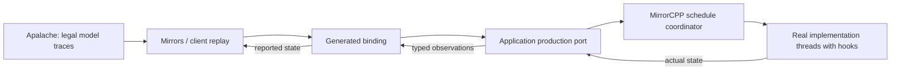

# Proposal: deterministic production model-based testing

Date: 2026-09-30

Current summary (2026-10-07): DPM-0–DPM-5 are accepted for declared C++, Node-worker
and Rust-thread profiles. See [current scheduling](../Docs/deterministic-scheduling.md)
and the exact retained pilot/package records linked below. The framework's
[October 7 M5 profile](../Plans/q3-published-roadmap-2026-10-07.md) has its own frozen
scope; neither result implies full WriteSentry, new Gate backends or unrestricted
thread preemption. The decision-request/interface sketches are proposal history.

Historical status (2026-10-04): DPM-0 design and the DPM-1 portable MirrorCPP coordinator
and concurrent fixture are implemented and locally accepted. See the
[DPM-0/DPM-1 design and acceptance record](../Plans/deterministic-production-mbt-dpm0-dpm1.md).
DPM-2 generated replay, the bounded DPM-3 native pilot, DPM-4 finite local
exploration and DPM-5 installed acceptance now pass for their declared profiles.
See the [detailed execution plan](../Plans/deterministic-production-mbt-dpm2-dpm5.md)
and [final scoped acceptance](../Plans/dpm2-dpm5-qualified-20261004/README.md).
These results do not extend full WriteSentry qualification or the selected M5 candidate.

Update (2026-10-05): DPM-0–DPM-5 also pass for MirrorECMA's Node-worker and
MirrorRust's cooperative-thread profiles. See the
[language plan](../Plans/dpm-mirrorecma-mirrorrust.md) and
[retained installed acceptance](../Plans/dpm-languages-evidence-20261005/README.md).
These are additional experimental client profiles with the same explicit limits.

## 1. Decision requested

Add a reusable deterministic production-MBT module to the Mirror Framework. For the first C++ slice, MirrorCPP should own the client-side schedule coordinator and replay integration. Applications should supply instrumented production ports, declared scheduling checkpoints, and the mapping between concrete execution and model actions.

The model-interface compiler continues to generate typed ports, dispatch, codecs, and identity metadata. Apalache supplies model checking and model traces. Neither a generated binding nor a successful symbolic model check establishes control over real operating-system threads.

This proposal requests an architectural capability and an acceptance program. The interface sketches below are historical; the linked DPM-0/DPM-1 record and MirrorCPP public scheduling header define the implemented first profile.

## 2. Motivation and inspected baseline

At the original September 30 inspection, the examined WriteSentry binding
delegated to the portable `ProtocolModel`. That evidence described selected
abstract protocol executions.

**Baseline refresh, 2026-10-04.** WriteSentry
`62b62298c5c764dc63cde10968c2555a79df1d3c` now has an application-specific
native phase scheduler, compile-time production hooks, a model correspondence
and a recorded bounded `native-runtime-phase/v3` qualification. Its portable
port remains available, but no longer describes the full native testing scope.
This proposal addresses reusable framework coordination. The new MirrorCPP
portable mutex/condition-variable hook cannot replace WriteSentry's trap-safe
POD/atomic handshake directly. The accepted DPM-3 bridge schedules command
proxies outside trap paths and retains that native handshake. Its four-case
pilot is separate from WriteSentry's historical full native qualification.

The original inspected baseline was:

- Mirrors HEAD: `b009cafebc8f057901ce98c66cc9772898c04d57`. The working tree contains concurrent compiler-improvement work; this proposal does not treat those edits as qualified capabilities.
- WriteSentry: `9dd4b57844603878d93fdecc2ee43f7f1abe0ee2`.
- MirrorCPP pinned by WriteSentry: `d8ed4455e8f73a9144215f62f1dc6963d6d792e7`.
- Recorded protocol MBT: 14 selected scenarios, 212 compared snapshots, all 18 base action kinds, eight reached flag classes, and three deliberate mutations detected by the real comparison server.
- Existing WriteSentry context hooks inject suspend/resume/get/set outcomes into the suspended-target primitive. They are not a complete scheduler for registry, write, trap, and lifecycle interleavings.

The reusable framework work is coordinating real execution, recording schedules, replaying them, and reporting honest coverage. Every application should not have to build its own thread-gating controller, timeout handling, replay log, and execution cleanup.

References:

- [Framework ownership](../Docs/framework-map.md).
- [Application integration design](../Docs/application-integration-design.md).
- [Generated interface contract](../Docs/generated-model-interface-spec.md).
- [Client execution contract](../Docs/client-implementation-guide.md).
- [Compiler improvement plan from WriteSentry](../Plans/model-interface-compiler/writesentry-integration-improvements.md).
- [WriteSentry MBT evidence and scope](../../WriteSentry/tests/mbt/README.md).
- [Current WriteSentry port](../../WriteSentry/tests/mbt/generated_port.h).
- [Win32 context test seam](../../WriteSentry/src/self_watch_internal.h).

## 3. Goals and initial scope

1. Execute actual implementation routines under a declared, repeatable schedule of logical threads and checkpoints.
2. Reuse generated bindings and existing model comparison rather than creating a second model interpreter or adopting oracle state.
3. Preserve implementation-owned observations, exact model identities, callback failure behavior, and cleanup ownership.
4. Supply reusable replay and bounded exploration support with explicit coverage and failure evidence.
5. Demonstrate that the scheduling interface works for two different applications: a small concurrent fixture and a production WriteSentry slice.

The initial profile is cooperative scheduling of an explicitly declared set of threads within an instrumented C++ test execution. Coverage is measured at declared checkpoints. Instruction-level preemption, uncontrolled external threads, distributed scheduling, weak-memory exhaustiveness, and universal control of arbitrary native programs are outside this initial profile.

The proposal does not add a Windows Gate backend, publish a new package, or establish that the historical `Specs/WriteSentry.tla` refines the current Windows implementation. Those are separate claims requiring their own evidence.

## 4. Ownership and module interfaces

| Owner | Responsibility |
| --- | --- |
| Mirrors | Model resolution, valid trace generation, bounded property checking, state comparison, and language-neutral contracts for any scheduling metadata |
| MirrorCPP | Reusable schedule coordinator, cooperative hook interface, concrete replay/exploration orchestration, trace alignment evidence, and local execution cleanup |
| Model-interface compiler | Generate the existing typed binding and, if separately specified, validated scheduling declarations or integration artifacts; do not infer application behavior |
| Application integration | Logical-thread mapping, production checkpoints, actual operations, state observations, reset/teardown, controllable environmental outcomes, and model correspondence |
| MirrorGate, when selected | Existing process policy, worker lifecycle, isolation, resource enforcement, cancellation, and physical cleanup; scheduling remains a distinct client-side responsibility |

The coordinator runs beside the implementation. A remote model-checking endpoint can generate traces and compare reports, but it cannot directly park and release the application's native threads through the existing model protocol.



The coordinator should be a deep module: one small interface owns permit management, thread registration, checkpoint arrivals, repeatable replay, time bounds, event recording, and cleanup. Application authors declare their execution seam rather than maintaining those algorithms themselves.

## 5. Proposed execution interface

The high-level operation is conceptually:

```text
run_schedule(binding_factory, production_port_factory,
             checkpoint_mapping, schedule, execution_policy)
    -> replay_result
```

This is an interface sketch, not a currently callable function. Construction should accept factories so configuration/admission can finish before creating the SUT. The result includes observed execution, comparison outcome, scheduling diagnostics, coverage, and cleanup outcome.

The application supplies a checkpoint hook that identifies a logical actor, stable checkpoint, operation instance, and execution generation. The coordinator owns whether that actor may proceed. A runtime thread identifier alone is insufficient because identifiers can be reused between runs.

Scheduling declarations should specify:

- The supported scheduling profile and logical actors, including controlled helper threads.
- Stable checkpoint identifiers and their before/after-event meaning.
- How model actions and input choices select actors and execution intervals.
- Which concrete events represent an abstract transition, and which are documented stuttering steps.
- Where observations are valid and how their abstraction is computed from actual implementation state.
- Bounds on model steps, actor count, checkpoint executions, and permitted preemptions, together with timeout/cancellation policy.
- Unsupported or uncontrolled effects, and the conditions under which deterministic replay is refused.

A reviewed mapping needs its own artifact identity, implementation build identity, scheduling profile identity, and linked model semantic digest. Instrumentation metadata must follow an explicitly versioned contract; it must not silently change the meaning of existing generated bindings or their digests.

## 6. Controlled replay semantics

1. Validate model/binding identity, mapping compatibility, schedule shape, and execution policy before starting application work. Reuse existing negotiation rules where negotiated execution is selected.
2. Construct a fresh production port and initialize implementation-owned state. Register the controlled actors and establish the declared initial observation point.
3. For each model stimulus, invoke the generated action callback. The application port asks the coordinator to advance the mapped actor through the declared execution interval.
4. The selected actor executes real implementation code and reports reaching its next checkpoint or completing its operation. Other controlled actors remain at permitted checkpoints.
5. Establish the mapping's declared observation conditions. Observe actual state, encode it through the generated binding, and compare it with the oracle using existing Mirrors behavior.
6. Record the permit, actual checkpoint arrival, operation identity, observation, and result. On termination, cancel or finish owned work and perform verified teardown.

A production operation may span several model actions. For example, a worker starts one actual `ArmSelfWatch` invocation and retains its real stack across several checkpoints. Subsequent model actions advance that invocation; they must not recreate its phases by updating a parallel protocol simulation.

The existing synchronous binding remains serialized: one callback advances an execution interval and returns at a valid observation point. Real worker threads can remain inside longer operations across callbacks. This design does not require reentrant use of the generated binding or a silent conversion to an asynchronous computer contract. If a supported application cannot meet this interface, define a separately versioned extension before implementation.

## 7. Hook and observation obligations

- Place hooks at implementation events with reviewed semantics. The compiler cannot derive their correctness from TLA+ alone.
- Declare where cooperative waiting is safe. In WriteSentry, context fakes must remain POD/lock-free while a target is suspended; a general blocking checkpoint cannot simply be inserted into that region.
- Keep internal lock ownership, operating-system suspension, and the coordinator's parked state distinct. A parked actor may still own application locks.
- Read consistent state without requiring a lock held by a parked actor. Document the observation protocol and all actors or effects it cannot stabilize.
- Compute observations from the real SUT. Expected states and previous oracle reports must not become implementation state or substitute for observation.
- Document synchronization introduced by instrumentation and the relationship between the instrumented test build and deployment build. Declared-point scheduling does not establish coverage of every instruction interleaving or weak-memory execution.

Not every abstract trace is necessarily executable by a concrete implementation. A missing checkpoint mapping, an uncontrolled model choice, or an unrealizable requested schedule is an explicit non-pass scheduling result. It must not be counted as exercised coverage or automatically labelled a production defect. State comparison and schedule realizability are separate evidence.

## 8. Coverage and exploration

Separate three claims:

| Claim | Evidence required |
| --- | --- |
| Bounded model property checking | Successful Apalache checking of the declared `Init`/`Next`, constraints, properties, and step bound |
| Concrete execution replay | Actual SUT execution followed the recorded checkpoint schedule and produced independently observed states |
| Complete coverage within a declared scheduling scope | Exhausted all declared schedules/input choices under explicit bounds, or a justified reduction, with every omission and non-pass accounted for |

Apalache checks executions symbolically. Its example traces do not automatically enumerate all concrete parameter assignments, and replaying a few examples does not inherit the symbolic check's universal quantification. See [Apalache bounded checking and output options](https://apalache-mc.org/docs/apalache/running.html) and [counterexample enumeration](https://apalache-mc.org/docs/apalache/principles/enumeration.html).

Start with explicit trace replay. Add bounded exploration after reproducible execution is qualified. Exploration should report declared bounds, actual input assignments, unique base-model states, transitions, checkpoint schedules, action counts, and all unsupported/unrealizable/failed cases. Canonical state identities must exclude instrumentation-only counters and reflect semantic map/set equality.

Coverage percentages require a known denominator or a separately justified exploration-completeness result. Action-name coverage and visited-snapshot totals alone cannot establish transition or interleaving completeness. Any partial-order reduction must preserve the properties and dependency semantics for the chosen profile; unsupported reductions remain disabled.

## 9. Failure and cleanup contract

Preserve distinct outcomes for:

- A real server `step_mismatch`.
- Binding input/configuration/observation failure.
- Invalid schedule or unsupported checkpoint mapping.
- Unrealizable schedule, unexpected checkpoint, or uncontrolled actor.
- Blocked execution, timeout, or cancellation.
- Application failure and incomplete cleanup.

An actual deadlock claim needs sufficient observed dependency information. A timeout alone establishes timeout, not deadlock.

Cleanup must revoke permits, release or cancel owned waits, finish/join actors when supported, and dispose the binding through its existing owner. Reuse Gate's supervisor when that execution path is selected; do not create a competing process-lifecycle owner. If in-process teardown cannot finish, retain an explicit cleanup failure and use an approved isolated-process test profile for enforceable termination. Never report remaining live actors as cleaned up.

Evidence should preserve the primary failure and the cleanup result separately. Repeatable replay must be possible from the recorded schedule and frozen artifacts, without requiring copied oracle state.

## 10. WriteSentry acceptance pilot

The production pilot must first establish a model correspondence. The historical protocol model treats hardware sweeps atomically and uses a TLS cache; production includes per-target programming/readback, partial coverage, admission checks, and retained cleanup ownership. `SnapshotEntry` also rejects an odd first sequence before proceeding through payload reads. The application cannot assume every historical phase corresponds one-to-one to native execution.

Choose a reviewed production slice and either supply a sound abstraction/refinement mapping or update a dedicated production model. Keep the existing protocol corpus as separate abstract-protocol evidence.

Pilot acceptance must include:

1. Actual production routines execute under controlled two-thread schedules, with stable logical-thread identities and observations derived from real state.
2. A stable registry snapshot and a write overlapping a registry update both execute reproducibly, including symmetric thread directions where supported by the mapping.
3. Lifecycle reservation, hardware verification, partial coverage, and cleanup behaviors have explicit mapped coverage or explicit exclusions.
4. Deliberate mutations in actual production behavior are detected. Mutating only `ProtocolModel` cannot qualify this pilot.
5. The same recorded checkpoint schedule reproduces the relevant outcome across repeated fresh runs and records any uncontrolled nondeterminism.
6. Unsupported historical traces remain visible as non-pass scheduling cases. The production claim names the exact supported model, action set, bounds, build, and checkpoint mapping.

Integer-key-map support and build-helper improvements can proceed independently. The existing lossless observation view permits an initial scheduling pilot; those compiler improvements alone do not supply production scheduling or model correspondence.

## 11. Delivery slices and gates

| Slice | Deliverable | Acceptance gate |
| --- | --- | --- |
| DPM-0 | Scheduling profile, mapping/evidence contracts, ownership and compatibility decisions | Reviewed semantics, failure ordering, identities, and observation rules |
| DPM-1 | MirrorCPP coordinator and cooperative hook interface | A small real concurrent fixture repeats schedules; blocked/unexpected/cancelled runs retain correct cleanup evidence |
| DPM-2 | Generated-binding replay integration | Serialized callbacks advance worker intervals; codecs, poisoning, and comparison failures retain existing behavior |
| DPM-3 | Production WriteSentry port and reviewed model mapping | Controlled native slice passes and mutations of production behavior yield real comparison failures |
| DPM-4 | Bounded exploration and coverage reporting | Known small fixture exhausts the declared scope; incomplete exploration never reports complete coverage |
| DPM-5 | Installed consumer, compatibility documentation and capability publication evidence | Fresh consumer runs without sibling-checkout assumptions; published claims match qualified profiles |

DPM-1 and DPM-3 provide two different adapters for the scheduling seam before expanding language support. MirrorECMA/Rust extensions should share the language-neutral scheduling/evidence concepts while retaining their own execution and cancellation contracts.

Required negative gates include unsupported mappings, duplicate/recycled actor identities, unexpected checkpoints, non-controllable choices, reentrant binding use, timeouts, cancellation at each execution phase, and teardown failure. Weakening codec validation or fabricating states to make a schedule pass is unacceptable.

Use the existing Mirrors and client test suites. During implementation, follow the current repository model-checking policy: required fresh model checks go through the Mirrors CLI against the designated remote endpoint, recording the actual backend identity. Recorded traces support offline replay; they do not replace a required fresh qualification. This proposal runs no model checker and changes no remote deployment.

## 12. Evidence and definition of done

Each acceptance record should include exact model/source closure, semantic digest, mapping/checkpoint manifest, implementation and instrumented-build hashes, framework/client/backend identities, logical actors, concrete inputs, schedule decisions, observations, declared bounds, coverage scope, failures, and cleanup evidence.

The capability is ready to advertise when:

- The framework supplies the reusable coordinator through a reviewed interface.
- Two distinct applications exercise that interface, including actual production WriteSentry code.
- Repeated replay follows recorded checkpoint schedules and catches production mutations.
- Model validation, replay conformance, scheduling coverage, and cleanup remain distinguishable claims.
- Installed consumers can use the qualified scheduling profile with accurately documented limitations.

The resulting claim is deterministic production MBT at declared checkpoints within explicit bounds. It is not an automatic proof that arbitrary multithreaded production code obeys every execution of a TLA+ specification.

## 13. Prior work

[Microsoft Research's CHESS work](https://www.microsoft.com/en-us/research/wp-content/uploads/2016/02/chess-ec2-submission.pdf) demonstrates systematic scheduling through instrumented concurrency interfaces, bounded preemption, and recorded schedule replay. It motivates the execution-control requirement; it is not an implementation dependency or evidence that the Mirror Framework already supplies this capability.

Acceptance of this proposal should lead to a scoped design and implementation plan in the owning repositories. Saving the proposal does not implement the capability or qualify a release.
